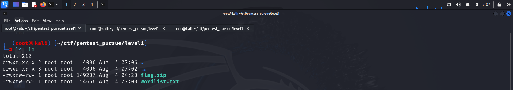
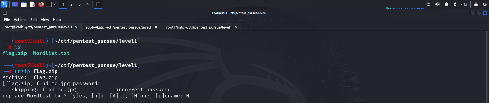
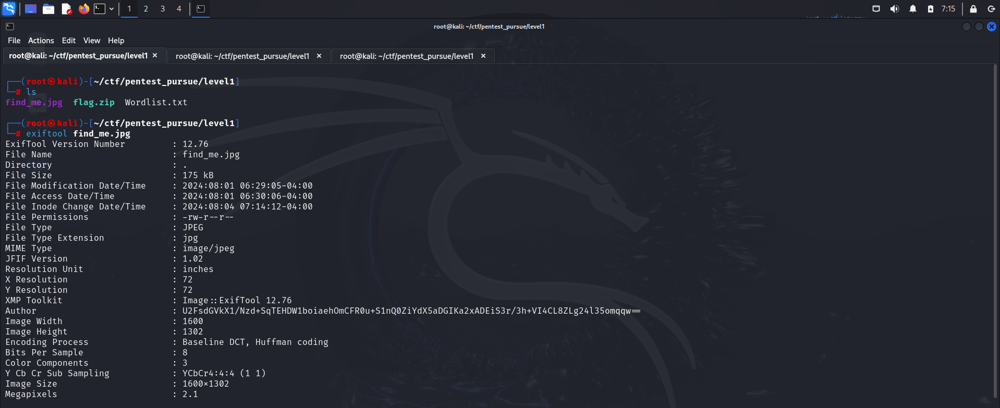
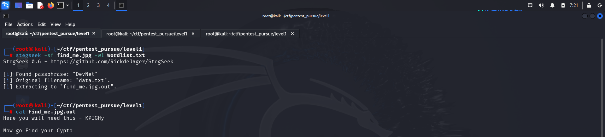
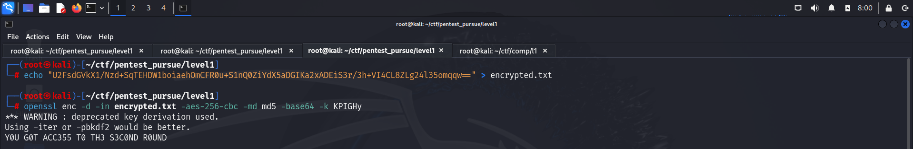
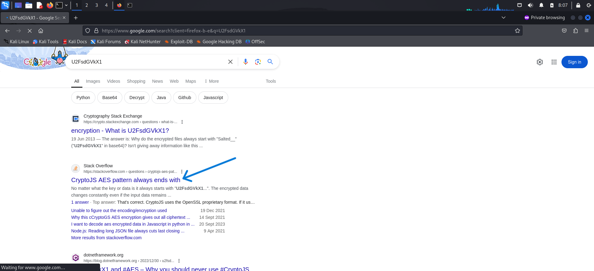
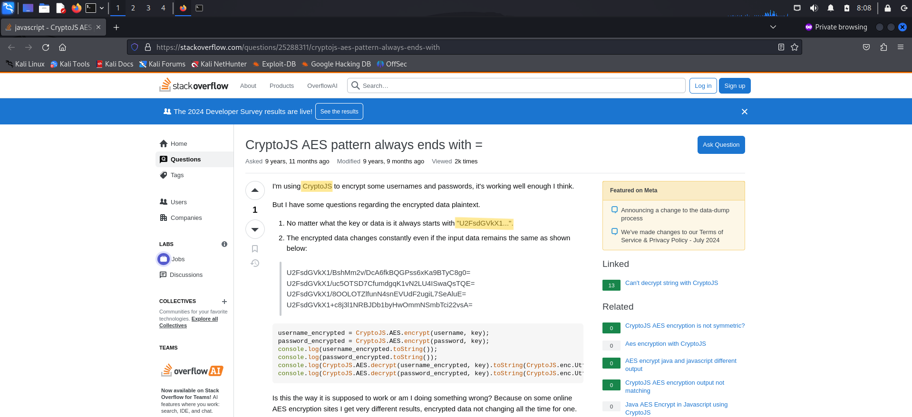
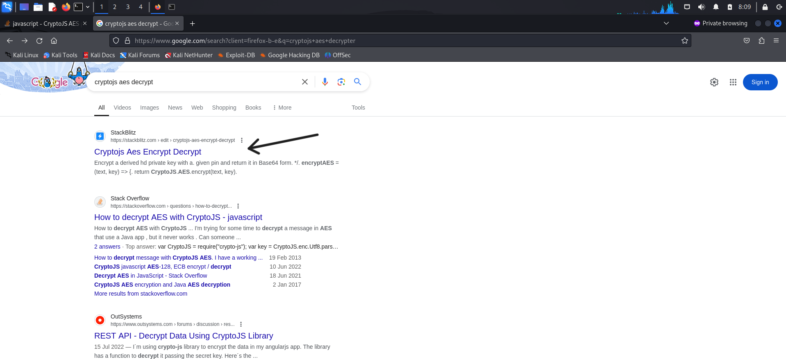
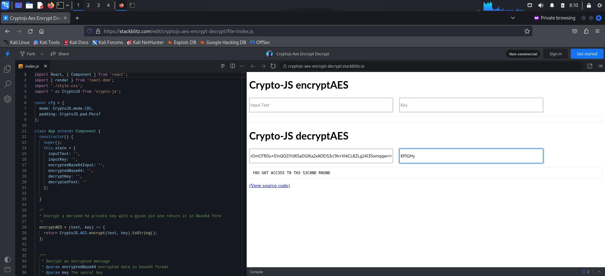

> To access the files used in this ctf, click [here](https://github.com/RIZZZIOM/Pentest-Pursue-ctf.git)

---

We have 2 files:
- flag.zip
- wordlist.txt

I downloaded both the files onto my system

I then tried extracting the contents from the zip.

However, it required a password. So I used **fcrackzip** to brute force the password

I then viewed the image meta data and found an encrypted author name.

The image itself could also contain some data so I used **stegseek** to crack the password and extract any data present inside.

The `Now go Find your Crypto` suggested that there was some sort of cryptography for which, the given key could be used.

I quickly copied the `AUTHOR` information from the **exiftool** output and asked **chatgpt** about it.
Through it I found out that the text was encrpyted using **openssl**'s **aes-256-cbc** algorithm.

> [!NOTE] Chatgpt's response
> This appears to be a string that has been encrypted using a method that outputs Base64-encoded ciphertext. The string `U2FsdGVkX1/` suggests that it might have been encrypted using OpenSSL with the AES (Advanced Encryption Standard) algorithm, as OpenSSL uses this prefix for encrypted data.

Hence these are the things I knew about the data:
- It could be decrypted using **openssl**
- It was encrypted using **aes-256-cbc**
- It was encoded using **base64**
- The key could be made using the password found inside **data.txt**

Now the only thing I had to figure out is the digest used for the key for decrypting it. The key derivation process converts a password into an encryption key suitable for the specified encryption algorithm. This process ensures that the same password consistently produces the same key, which is necessary for successful encryption and decryption. Hence for this, I try different digests like **md5** (most common), **sha1**, **sha256**, **sha512**

And with this I was successfully able to clear the first round ;)

PS: If you are not comfortable with using command line tools to decrypt the key, you can use the encryption identifier from the encrypted text to google relevant sites.

---

