LINK TO MACHINE: https://app.hackthebox.com/machines/Cap

# SCANNING

I performed an **nmap** aggressive scan to find open ports and the services running on them.

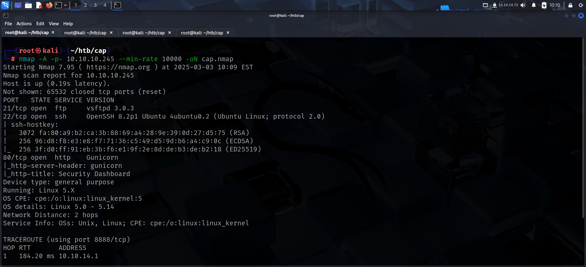

# FOOTHOLD

The **nmap** scan identified an **http** server running so I accessed it using my browser and got a dashboard.

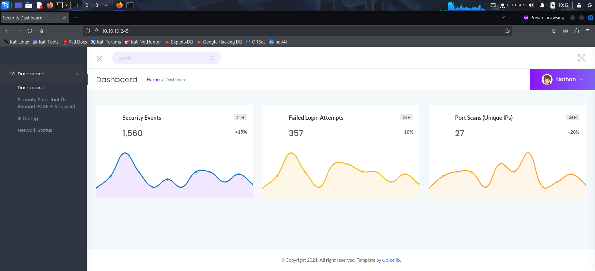

I explored the application and in the meantime, performed a scan to find directories using **ffuf**.

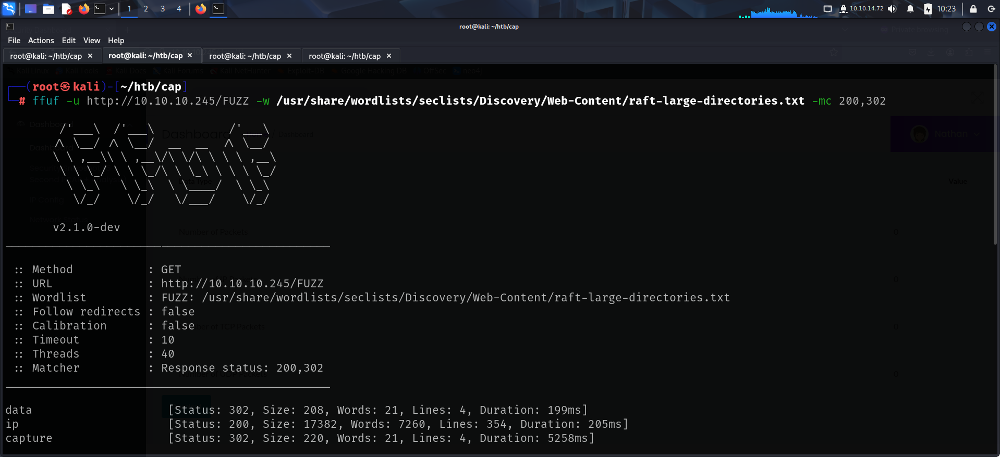

The *data* directory seemed interesting. It contained various capture files.

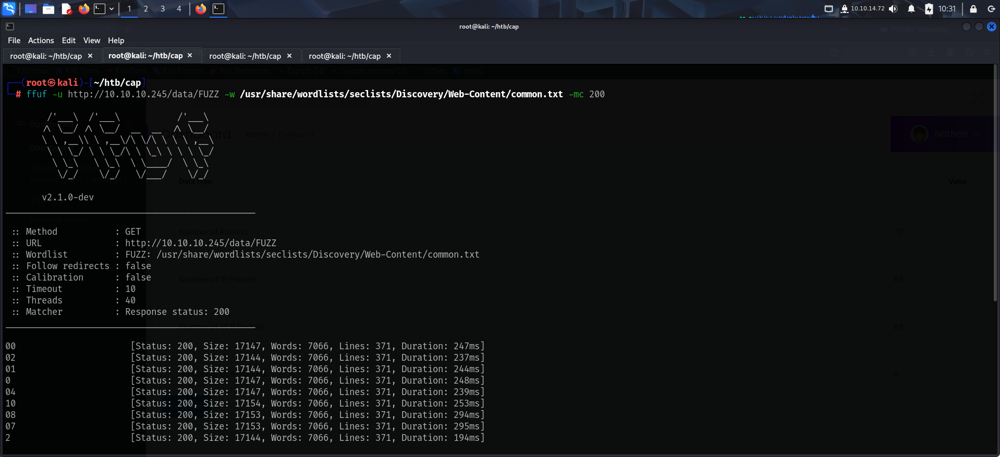

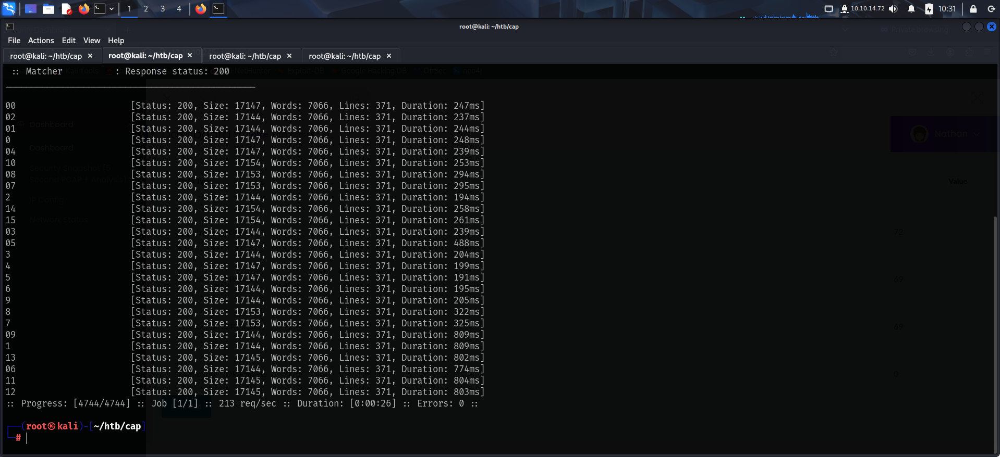

I downloaded the packet capture files.

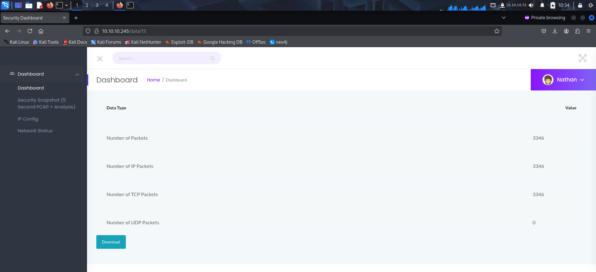

The file *0.pcap* contained the **ftp** credentials.

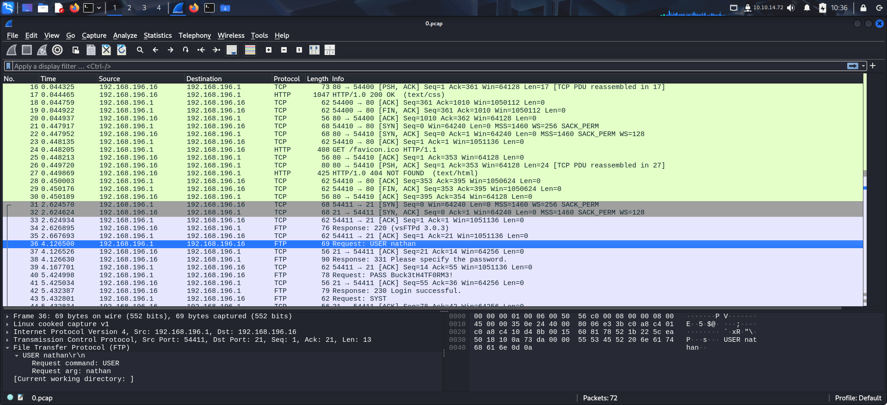

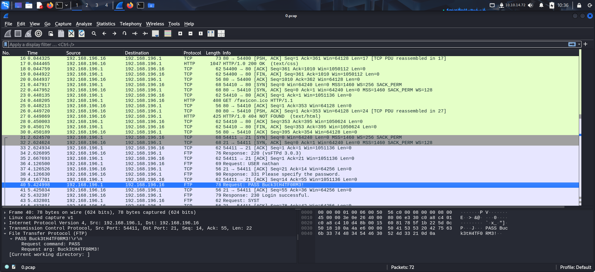

I used those credentials to log into the **ftp** server and found the user flag there.

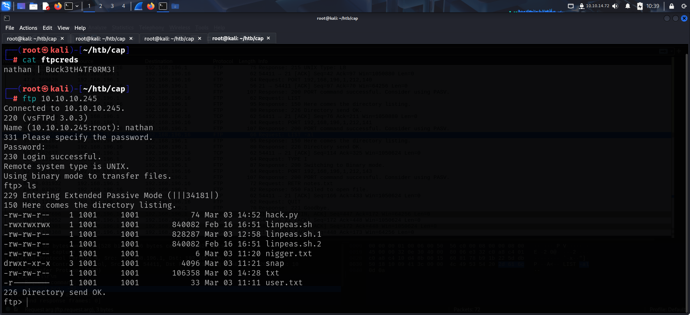

I downloaded the user flag on my system and read the contents.

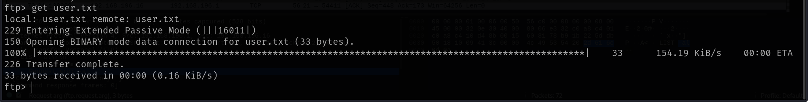

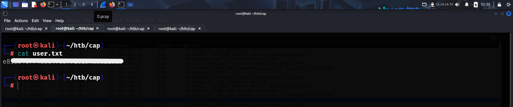

I checked if the existing credentials could also be used for **ssh** and found that the credentials had been reused.

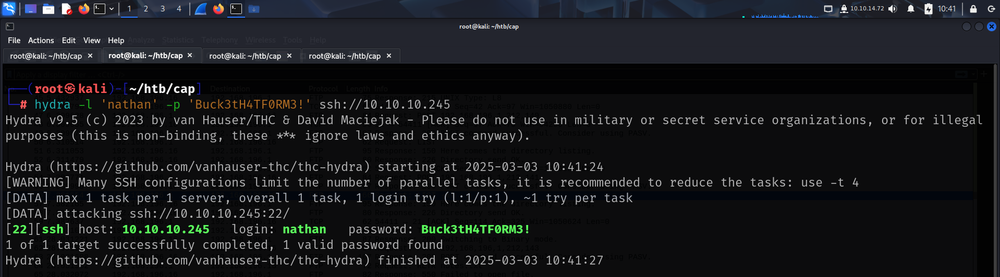

I log into the server using **ssh**.

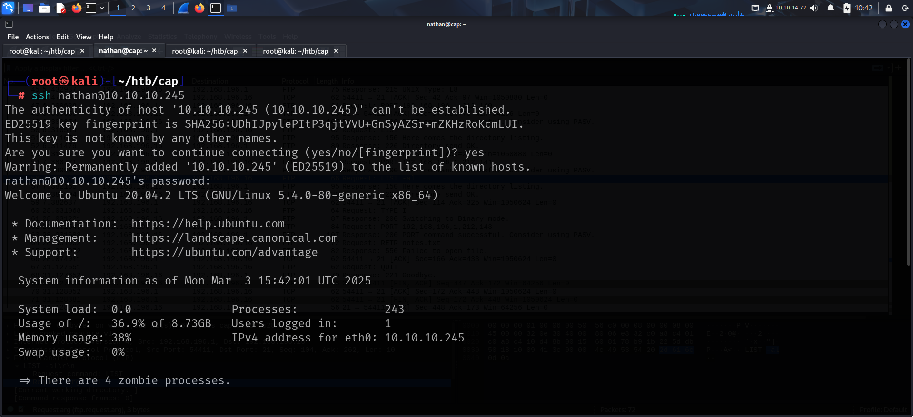

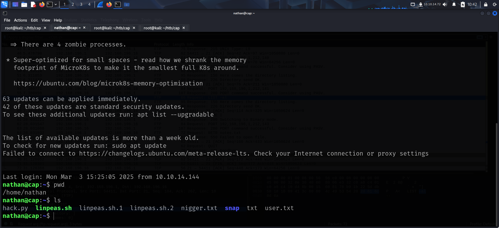

# PRIVILEGE ESCALATION

I viewed binaries with **capabilities** and found **python**.

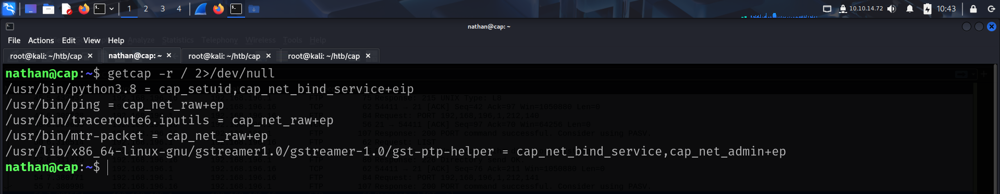

I searched **GTFObins** and found a way to exploit this for privilege escalation.

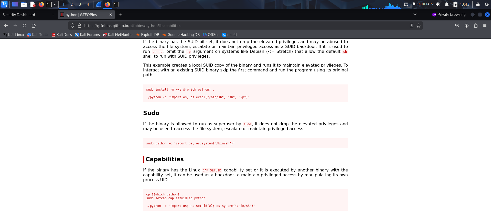

I followed the commands and got **root** access. I then captured the root flag from */root*

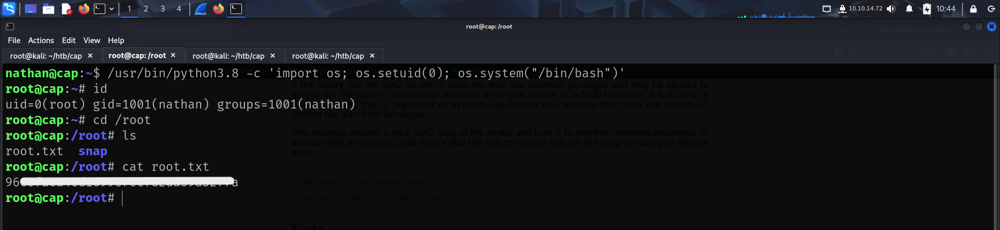

That's it from my side! Until next time :)

---
