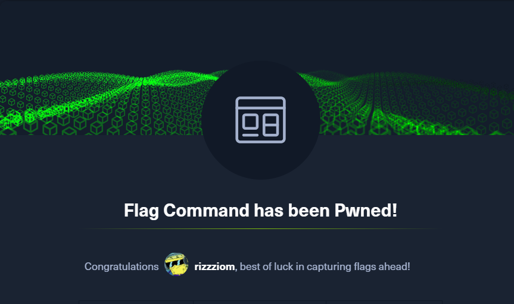
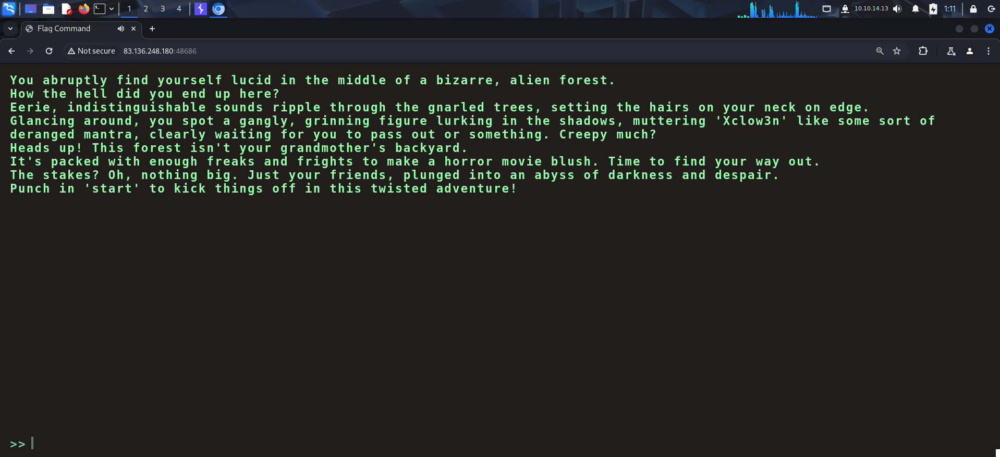
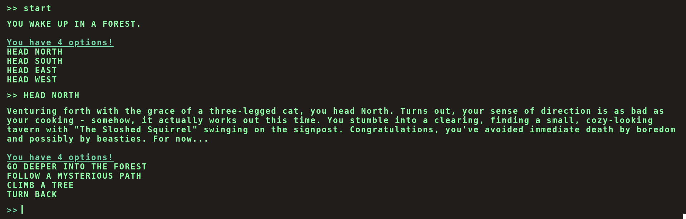
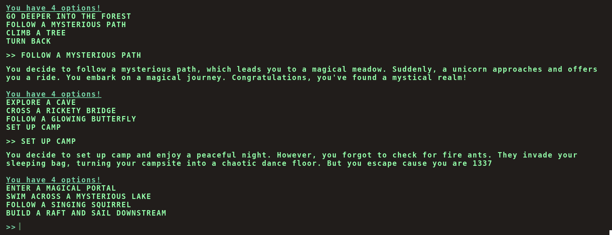
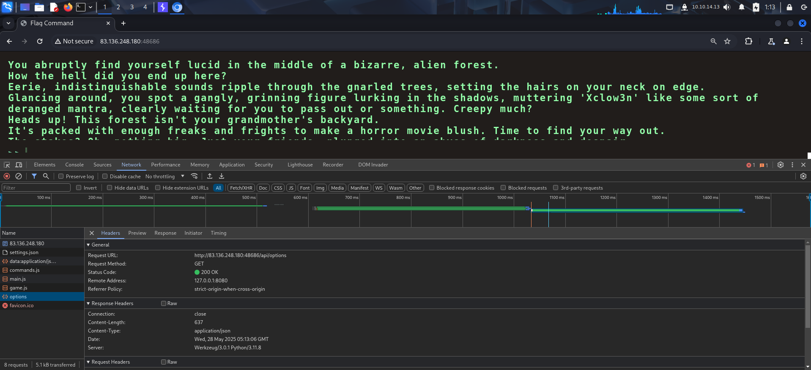
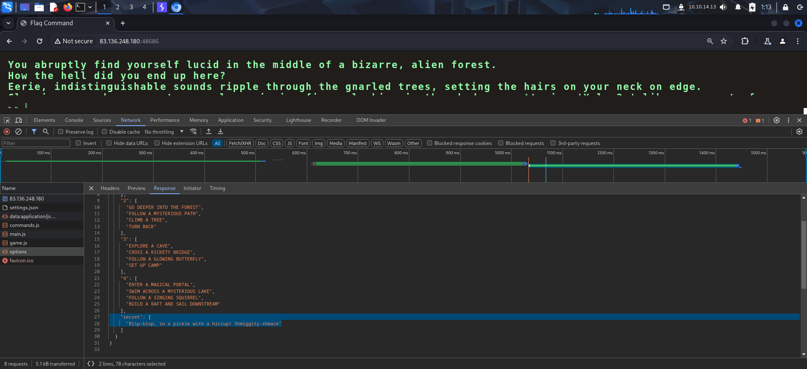
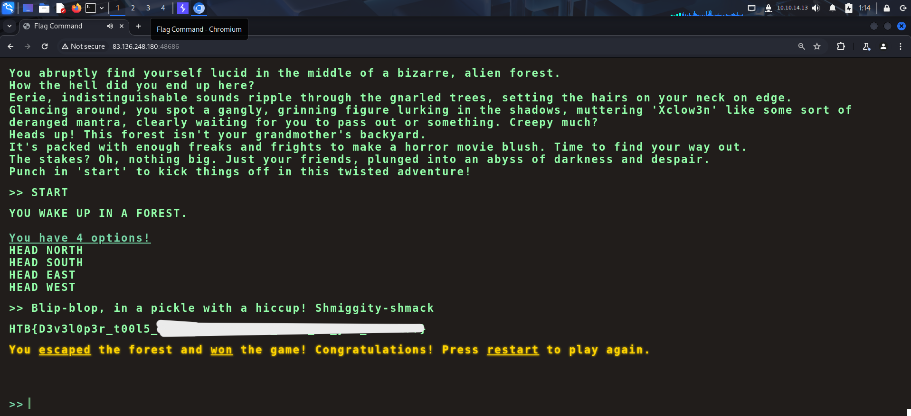

Link to challenge:
- https://app.hackthebox.com/challenges/Flag%2520Command

I accessed the challenge website and was given a scenario.

I started the game and tried selecting few options to understand the working of the application.

After few choices, my player died and I had to restart the game. The game took fixed prompts as inputs and threw error when something unexpected was entered.

So I reloaded the page and viewed my **Network** tab to see the requests made by the application.

Here, I found the `/api/options` endpoint that fetched the available options.

The response for the request returned all available options in the game where I found a secret command.

I entered the secret command and captured the flag.

---
