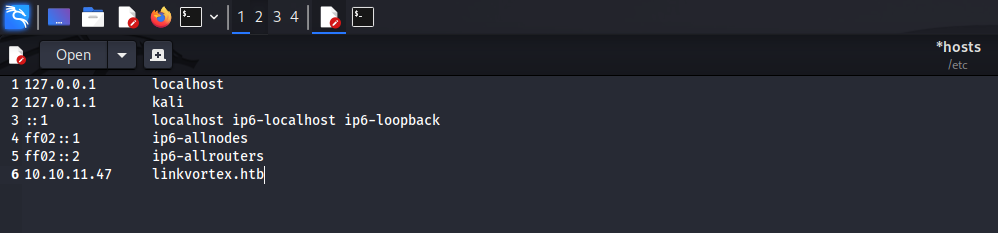
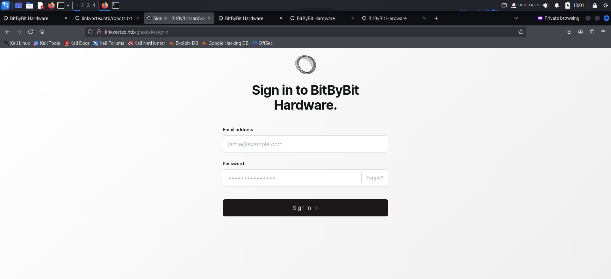
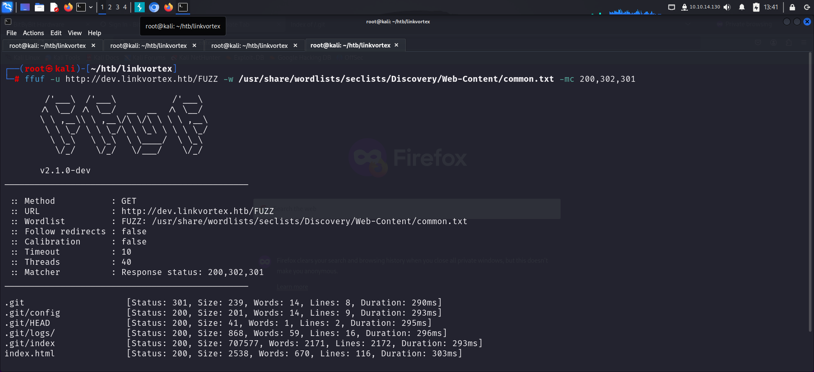

Link to machine : https://www.hackthebox.com/machines/linkvortex

# RECONNAISSANCE

I performed an **nmap** aggressive scan to find running ports and services.

I added the machine domain to my */etc/hosts* file for name resolution.

# FOOTHOLD

Since the server had an **http** service running, I visited the website from my browser.

I then performed a directory bruteforce using **ffuf** to find other files and directories.

The directory bruteforce revealed *robots.txt* file. This file could reveal more interesting files or directories.

I accessed the paths revealed in the *robots.txt* file and landed on a login page.

I tried logging in using a default mail and common password but failed.

Since I had no other leads, I tried bruteforcing subdomains.

I found a subdomain and added it to my *hosts* file.

I visited the newly discovered subdomain and found a message stating the site was under construction.

I again performed a directory bruteforce to find directories and files in the subdomain and found a git repository.

I downloaded **GitHack** from github and ran it on the target to download the entire repository on my local system.

It contained a folder and docker configuration file.

I inspected the files and found the password for the admin email account.

I used this credential to log into the web application.

I then used **wappalizer** to identify information about the CMS version and the tech stack being used.

I searched available exploits for the CMS version and downloaded a python exploit.

I downloaded the exploit and tried reading the */etc/passwd* file.

Since I was able to read the file, I tried reading the configuration file of the CMS. I found the path of this file from the Dockerfile.

Here, I found a username and password of another user.

I tried logging in using these credentials and got shell access on the target.

Finally I captured the user flag from its home directory.

# PRIVILEGE ESCALATION

I viewed my **sudo** privileges and found that I was allowed to run a particular command as sudo without any password.

I viewed the allowed bash script to see what it does.

This script checks if the input is a *.png*. If it isn't, the script exits with an error. Then it checks if the file is a **symlink**. If it is, the script reads the actual target. If the target points to */etc* or */root*, the link is deleted, else it is moved to */var/quarantined/*. If the **CHECK_CONTENT** variable is set to true, it tries to display the content of the quarantined file.

Hence, I created a link to the root flag on my home directory.

I then linked this link to another png file on my home directory.

Finally, I executed the script and passed my png file to get the contents of the root flag. This worked because the CHECK_CONTENT flag would have been true when the script read the source of the png file (which was a file linked to the root flag).

That's it from my side, Until next time :)

---
