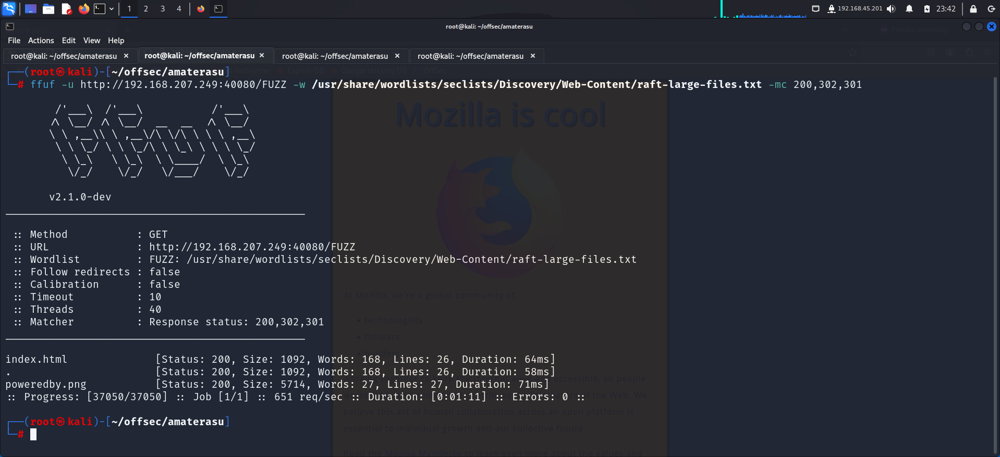
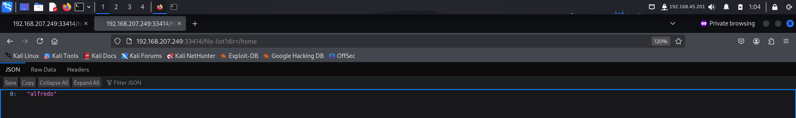
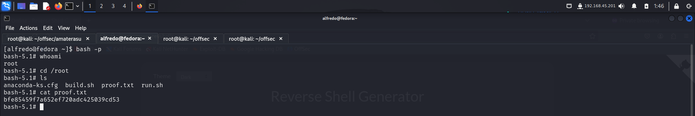

> Welcome to my writeup where I am gonna be pwning the **Amaterasu** machine from **proving grounds**. This challenge has two flags, and our goal is to capture both. Let’s get started!

# GETTING STARTED

To access the lab, visit **[proving grounds](https://portal.offsec.com/labs/play)** and download the vpn configuration file. Connect to the vpn using `openvpn <file.ovpn>` and start the machine to get an IP.

> [!NOTE] 
> This writeup documents the steps that successfully led to pwnage of the machine. It does not include the dead-end steps encountered during the process (which were numerous). This is just my take on pwning the machine and you are welcome to choose a different path.

# RECONNAISSANCE

I performed an **nmap** scan to find information about the target.

The scan revealed a bunch of open ports and services running on them.
# FOOTHOLD

I started off with **ftp**. Since **nmap** scripts identified **anonymous** login on the server, I logged into the server anonymously.

I wasn't able to enter any commands on the **ftp** server so I switched to the **http** server running on port **40080**.

The page didn't contain anything interesting so I used **ffuf** to bruteforce hidden directories.

I identified a **png** image and downloaded it. I analyzed it with **binwalk**.

I tried extracting the **zip** data using **`binwalk -e poweredby.png --run-as=root`** however found nothing useful. Hence I moved onto the **http** server hosted on port **33414**.

The homepage did not reveal anything so I performed a directory bruteforce using **ffuf** to find hidden directories and files.

I accessed the discovered paths and found endpoints to perform various operations.

The `file-list?dir=/tmp` endpoint allowed me to view the contents of the **`/tmp`** directory.

The `/file-upload` endpoint allowed us to upload files. So I created a file and tried uploading using **curl**.

I navigated to the `file-list` endpoint and found my uploaded file.

Since the `/file-list` endpoint used the parameter `dir` to select a folder to view, I used it to view the contents inside `/home` directory.

Inside **Alfred's** home directory, I found the **.ssh** folder so I looked into it. I also found that the first flag was located here.

The **.ssh** file contained **alfred's** public and private key. I could upload my public key to this folder and save them as **authorized_keys**. This would allow me to log in using my private key.

Since the **api** only allowed certain file extensions, I renamed my file to `id_rsa.txt` 

Finally I uploaded the file and saved them as *authorized_keys*

I the logged in using my private key on the using **ssh** service that was running on port **25022**

Upon logging in, I captured the first flag from the home directory.

# PRIVILEGE ESCALATION

I copied the **linpeas** script to identify vulnerabilities that could be used to escalate my privilege.

I ran the script.

This identified a cron job that was running every minute

I viewed the script that it was running. This script:

1. Adds `/home/alfredo/restapi` to the `PATH` so that any executables in that directory are easily accessible.
2. Changes the working directory to `/home/alfredo/restapi`.
3. Creates a compressed archive of all files in this directory and stores it in `/tmp` as `flask.tar.gz`.

I viewed inside the **`/restapi`** folder and found 2 python files and a folder to store compiled python files. I created a bash script that added an **suid** bit to **/bin/bash** binrary. I added execution permission to this file using **chmod** and copied it inside the **`/restapi`** folder.

After a minute I verified if my script was executed and found the **suid** bit on the **`/bash`** binary.

Finally I executed **bash** in privileged mode and captured the final flag from the `/root` directory.

# CONCLUSION

Here's a summary of how I pwnd **Amaterasu**:
- I fuzzed web directories to find a directory with api endpoints that allowed my to upload files and view contents of directories.
- I uploaded my **public key** as **authorized_keys** in the **.ssh** file and logged in using my **private** key.
- I captured the first flag from **alfred's** home directory.
- I ran **linpeas** to discover a **cronjob** that ran every minute.
- I added an executable bash script that added an **suid** bit to the **`/bin/bash`** binary and waited for the cron to execute my script.
- I then executed **bash** in privileged mode and captured the final flag from the `/root` directory.

That's it from my side! 
Happy hacking 🎉

