>Welcome to my writeup where I am gonna be pwning the **CyberSploit1** machine from **offsec proving grounds**. This challenge has two flags, and our goal is to capture both. Let’s get started!

# GETTING STARTED
This machine can be accessed in **[proving grounds play](https://portal.offsec.com/labs/play)** and is ranked as **easy**.

> [!NOTE] 
> This writeup documents the steps that successfully led to pwnage of the machine. It does not include the dead-end steps encountered during the process (which were numerous). This is just my take on pwning the machine and you are welcome to choose a different path.

# SCANNING
I performed an **nmap** aggressive scan to find running ports, services and os related information.

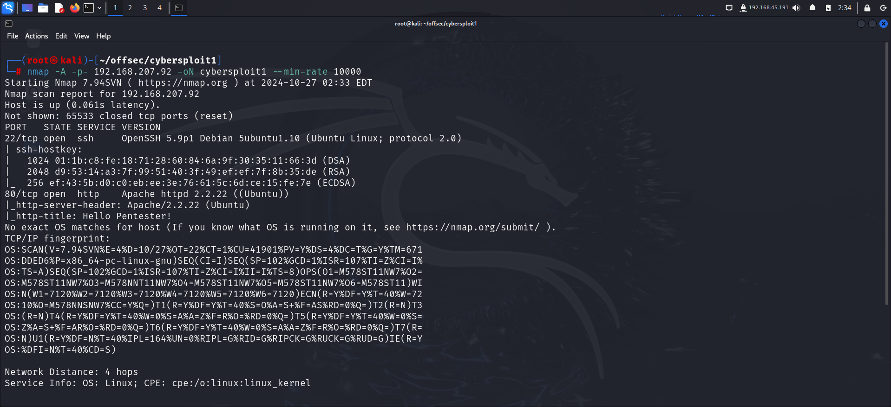

The scan revealed 2 active ports, **ssh** and **http**.

# FOOTHOLD
I visited the target on a browser to access the **http** service and found a static webpage.

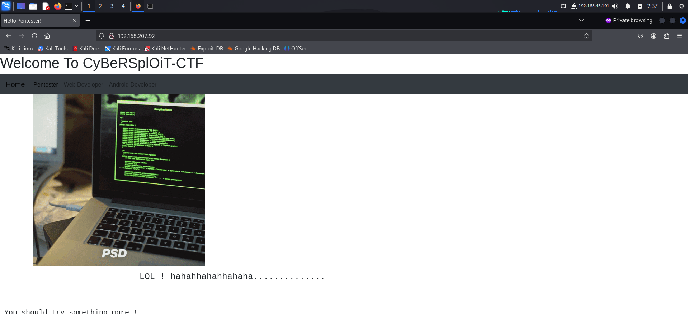

The page did not reveal anything useful initially so I viewed the page source and found a username commented out towards the end of the **html** document.

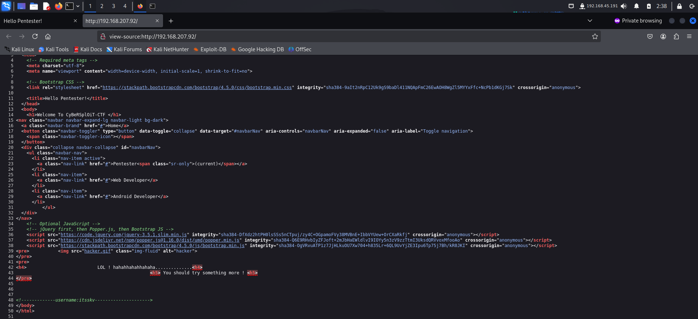

Next I performed web fuzzing using **ffuf** and discovered the **robots.txt** file.

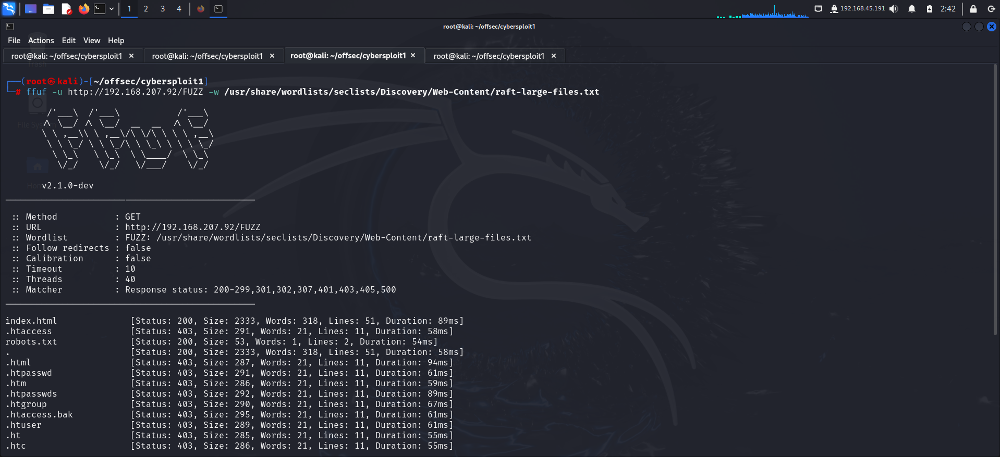

accessing **`/robots.txt`** revealed a base64 encoded string. So I decoded it using the **base64** command line utility.

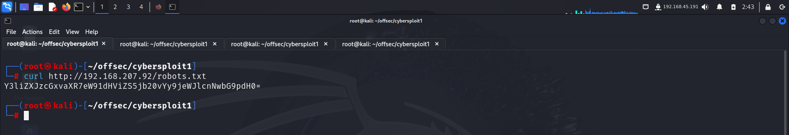

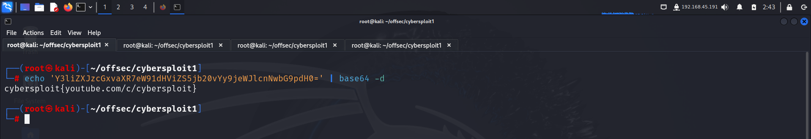

This seemed interesting but initially I had no idea what this meant. I did some more reconnaissance on the website and found nothing useful.

Since the target was running **ssh**, and I had discovered a username; I tried using this as a password to log into the system.

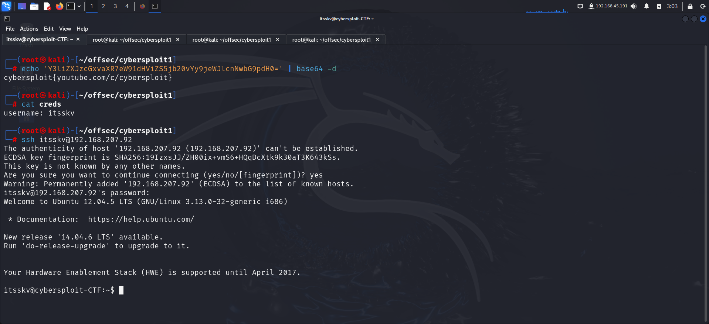

After getting initial access, I listed out the contents of my current directory and found the first flag in **local.txt**.

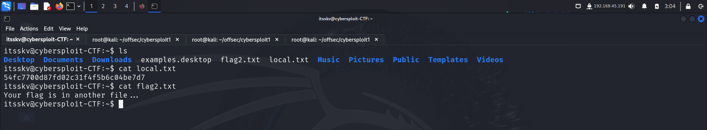

# PRIVILEGE ESCALATION

For privilege escalation, I downloaded **linux smart enumeration** script from github on my local system and transferred it to the target.

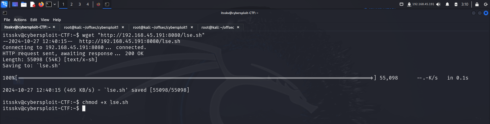

I executed the script and found some interesting results.

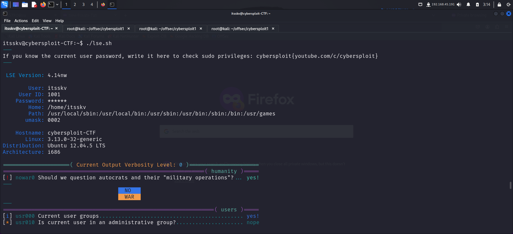

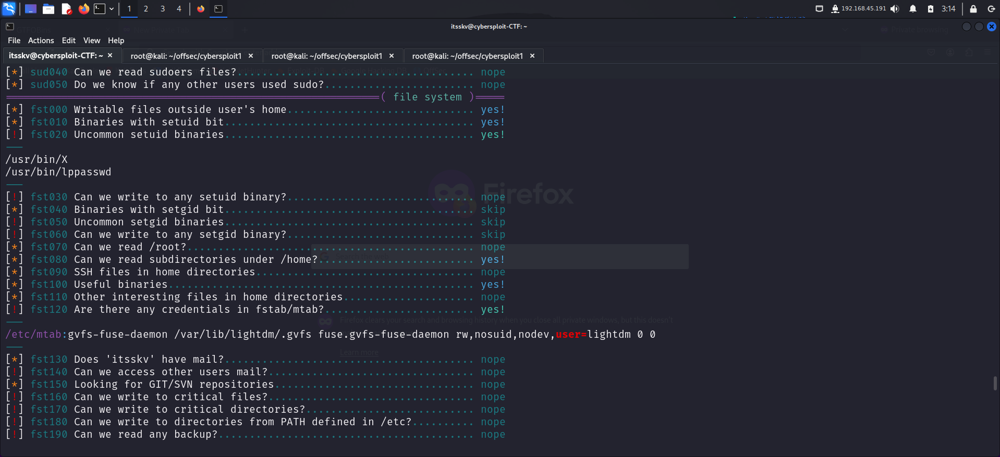

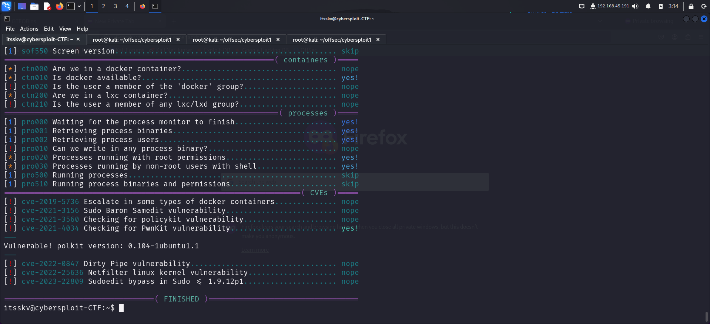

The script identified a couple of misconfigurations which I looked into but found nothing interesting. I then tried looking for kernel exploits. I viewed my kernel version using the following command:

```bash
itsskv@cybersploit-CTF:~$ uname -r
3.13.0-32-generic
```

I googled available exploits for this version and found some on **exploit db**.

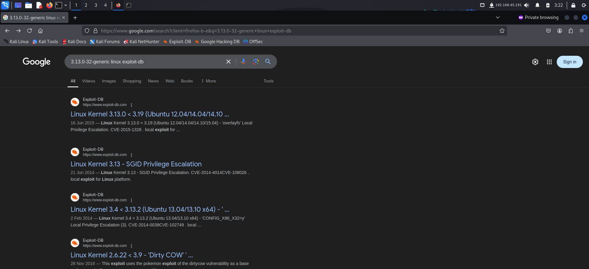

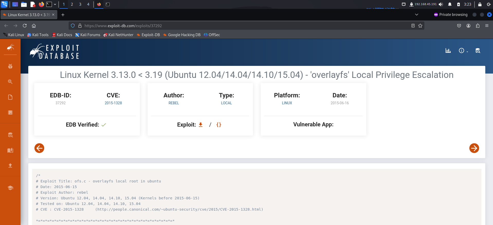

I downloaded the exploit on my system and started a python http server to transfer it on the target.

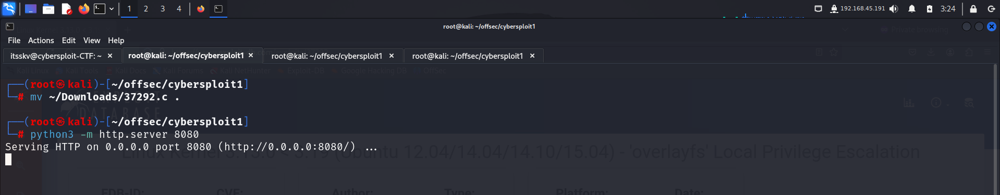

I downloaded the exploit from my local machine and compiled it using **gcc**

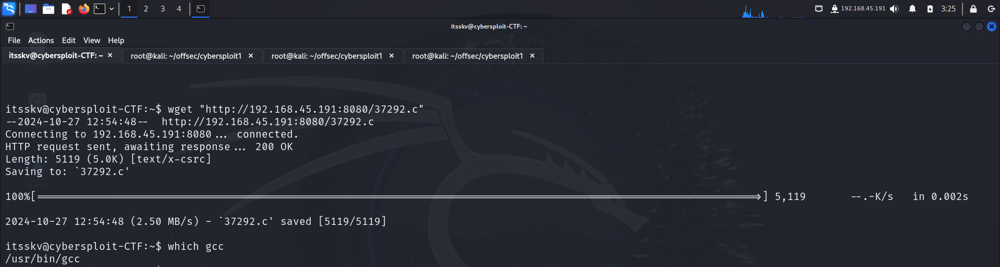

Finally I ran the exploit and got root shell.

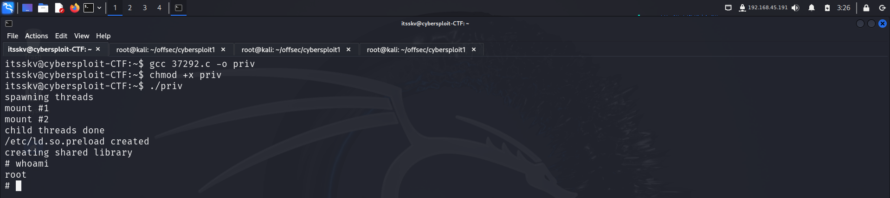

I spawned a pty shell and then navigated to the `/root` directory to capture the final flag.

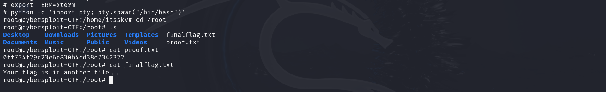

# CONCLUSION
Here's a summary of how I pwned the machine:
- I found the username to be hardcoded in the html page.
- I performed web fuzzing and found `/robot.txt`
- I found the password in base64 encoded format in `/robots.txt`.
- I used the username and password to get initial access.
- I found the first flag in my home directory.
- I exploited the kernel to escalate my privilege.
- I captured the final flag from the `root` directory.


Happy Hacking! 🎉

---


