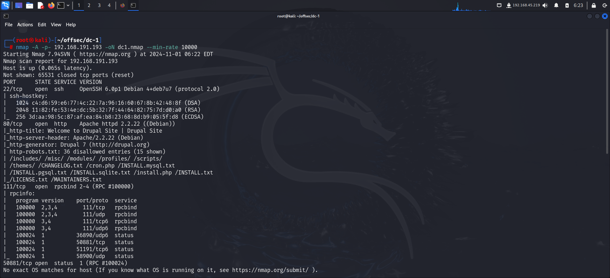
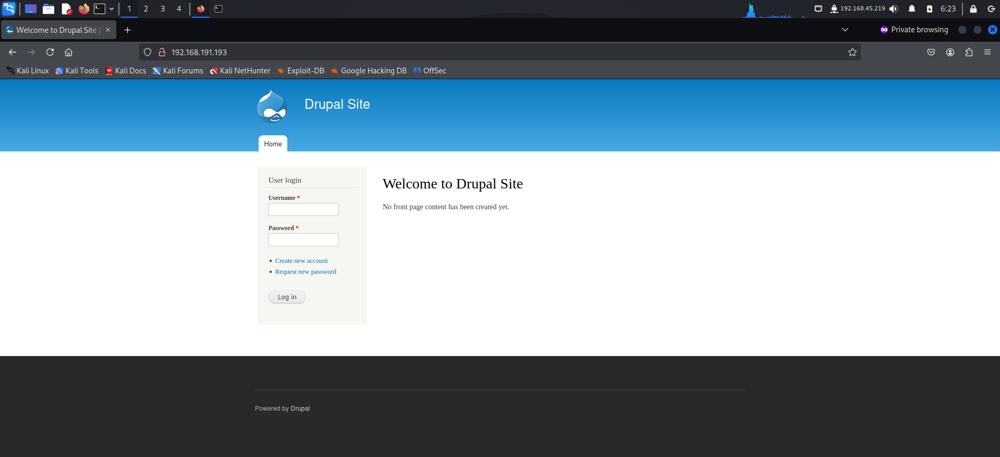
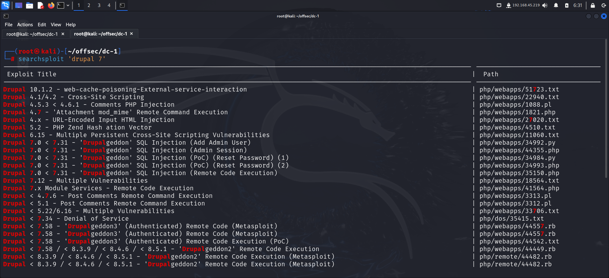
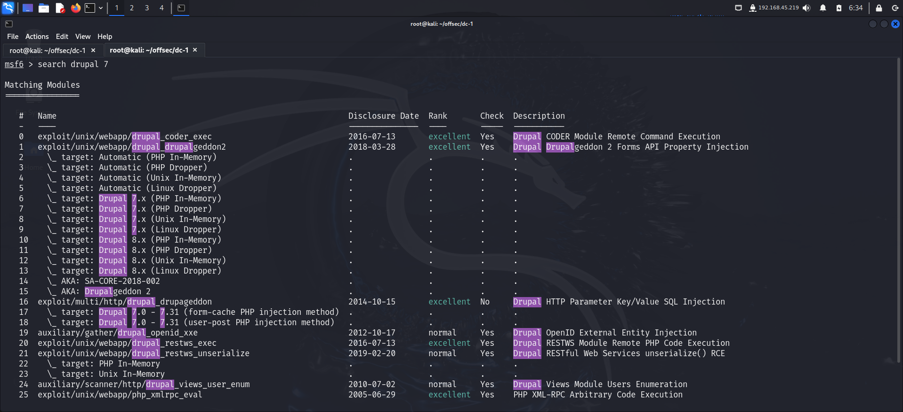
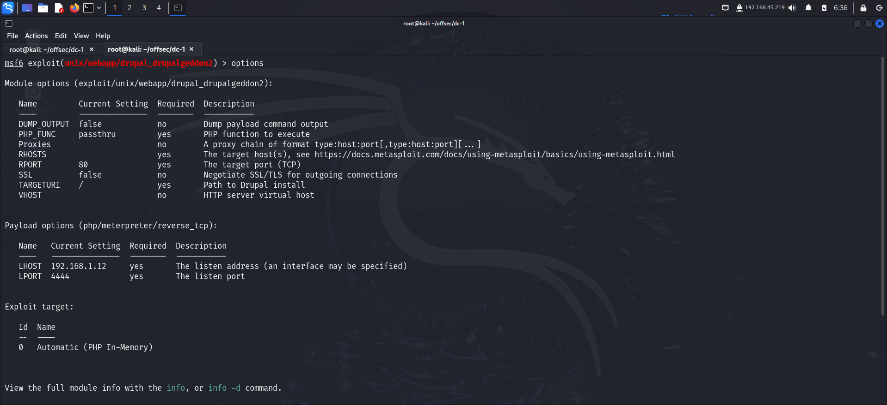
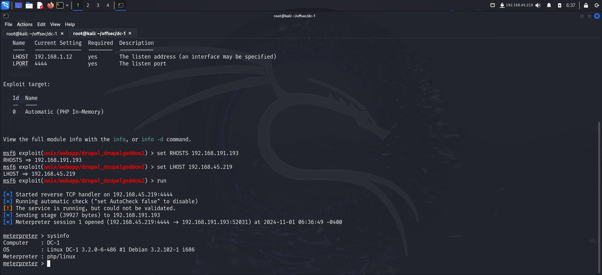
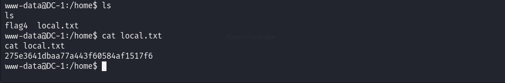
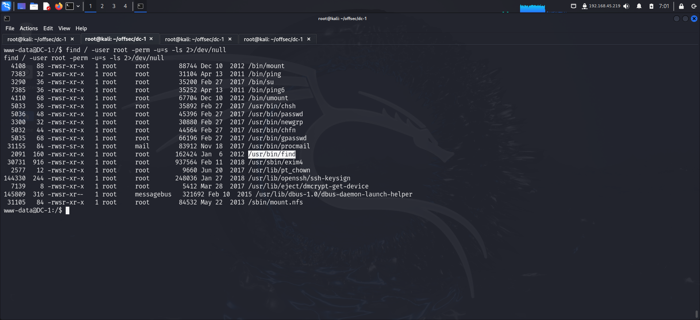
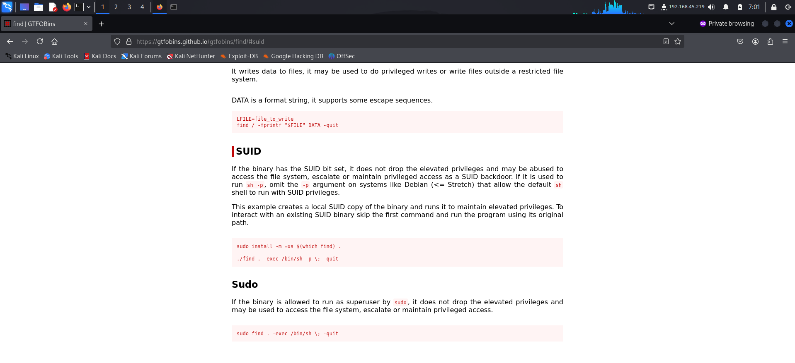
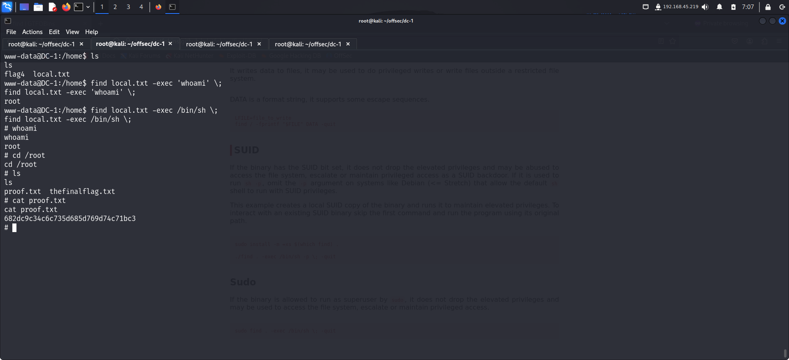

> Welcome to my writeup on **DC-1** from **offsec proving grounds**. This challenge has 2 flags and I am gonna walk you through the steps required to pwn the machine and capture them both. Let's get started!

# GETTING STARTED

To access the lab, visit **[proving grounds](https://portal.offsec.com/labs/play)** and download the vpn configuration file. Connect to the vpn using `openvpn <file.ovpn>` and start the machine to get an IP.

> [!NOTE] 
> This writeup documents the steps that successfully led to pwnage of the machine. It does not include the dead-end steps encountered during the process (which were numerous). This is just my take on pwning the machine and you are welcome to choose a different path.

---
# RECONNAISSANCE

I performed an **nmap** aggressive scan to find open ports and the services running on them.

# FOOTHOLD

I visited port 80 on my browser and found a **cms**.

I quickly looked for exploits using **searchsploit** and found a some in **metasploit**.

To use them, I started the **metasploit** framework by typing `msfconsole` and used the exploit available for Drupal 7.

I added the required parameters to the exploit and ran it to get a **meterpreter shell**.

I entered shell mode by typing `shell` and navigated to the `/home` directory. Here I found my first flag.

# PRIVILEGE ESCALATION

When I looked for **suid** bits on binaries, I found the **find** command which seemed unusual. So I navigated to **gtfobins** to check if this was exploitable.

I found a way to escalated my privilege and followed the steps to get **root** access.

Finally I captured the final flag from the `/root` directory.

# CONCLUSION

Here's a short summary of how I pwned **DC-1**:
- I Identified a **cms** to be running through **nmap** scan.
- I found exploits for that particular **cms** on metasploit and used them to get initial access.
- I captured the first flag from the `/home` directory.
- I looked for binaries with suid bit and found the `find` command which seemed strange.
- I searched on **gtfobins** and found a way to exploit this misconfiguration to get **root** access.
- After escalating my privilege, I captured the final flag from `/root` directory.

That's it from my side! Until next time ;)

---