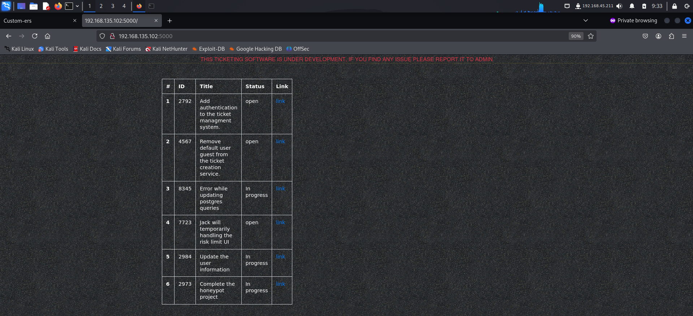
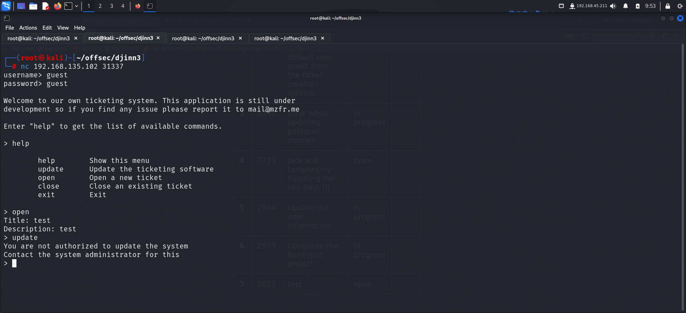
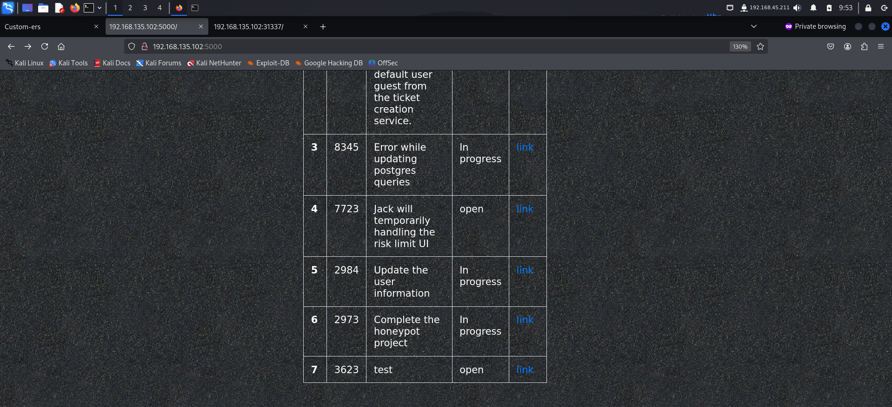
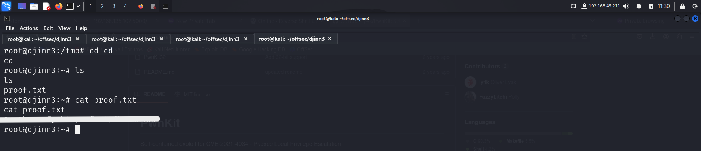

 > Welcome to my writeup where I am gonna be pwning the **dJinn3** machine from **proving grounds**. This challenge has two flags, and my goal is to capture both. Let’s get started!

# GETTING STARTED

To access the lab, visit **[proving grounds](https://portal.offsec.com/labs/play)** and download the vpn configuration file. Connect to the vpn using `openvpn <file.ovpn>` and start the machine to get an IP.

> [!NOTE] 
> This writeup documents the steps that successfully led to pwnage of the machine. It does not include the dead-end steps encountered during the process (which were numerous). This is just my take on pwning the machine and you are welcome to choose a different path.

# RECONNAISSANCE

I ran an **nmap** aggressive scan on all ports to find information about the target.

# FOOTHOLD

The **nmap** revealed 4 open ports running different services. I started of with the http server running on port 80 and accessed it on my browser.

I then accessed the server running on port 5000. This page contained hyperlinks and some interesting information about some ticketing system.

I tried accessing port 31337 on the browser but couldn't do so. So I tried accessing it with **nc**. 

I tried some common credentials like admin, user etc but none of them worked. I read the tickets that were present on port 5000 and found something interesting.

These tickets revealed possible usernames. I tried multiple usernames with common password and ultimately got in using **`guest:guest`**.

This looked like an API that allowed us to work with the tickets that were present on port 5000.

I tried adding a ticket and found it on the server hosted on port 5000.

Even the structure of remained the same throughout.

From this, I was able to assume that the api sent the title and description to the backend which then inserted them in a template. Also, the **nmap** scan revealed port 5000 was running **werkzeug** which is a module used with **flask**. **Flask** servers are infamous for being vulnerable to **SSTI** (Server Side Template Injections).

So I added a simple command to check if the application indeed was vulnerable.

The server had executed the command that I had sent confirming the presence of **SSTI** vulnerability.  Since flask by default uses **jinja2**, I tried a payload specific to that template engine to see if it works.

It worked. So I went to **hacktricks** to look for ways to get RCE and found this payload.

I tried executing the payload first to see if it worked. If it did, I could attempt to get a reverse shell.

The payload was able to execute commands on the server. Hence I could try getting a reverse shell.
I went to **revshells** and copied the **nc mkfifo** payload.

I opened another ticket with my reverse shell payload and started a listener on another terminal.

Upon visiting the page, I got a reverse shell.

I then found the first flag inside **`/var/www`**.

# PRIVILEGE ESCALATION

I looked for binaries with uncommon suid bit sets and found **pkexec**

When **pkexec** has an **suid bit set**, we can try to escalate our privilege using the PwnKit method. I googled for the exploit and found the github repo.

I downloaded the script on my local machine and then started a python server so that I could transfer it to the target.

I followed the instructions that were provided on the **github** repo.

After getting the root shell, I captured the final flag from the **`/root`** directory.

# CONCLUSION
Here's a short summary of how I pwned **djinn3**:
- I discovered an **SSTI** vulnerability on the server running on port 5000 and used the api hosted on port 31337 to get a reverse shell.
- I then captured the first flag from the `/var/www` directory.
- I looked for binaries with uncommon **suid bits** and found pkexec.
- I googled for exploits and found the **Pwnkit** repo on github.
- I followed the instructions given in the repo to got root access.
- Finally I captured the root flag from the `/root` directory.

That's it from my side! Until next time :)

---

