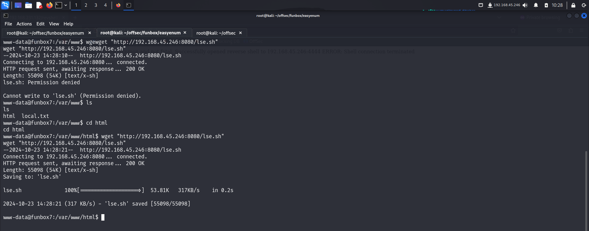
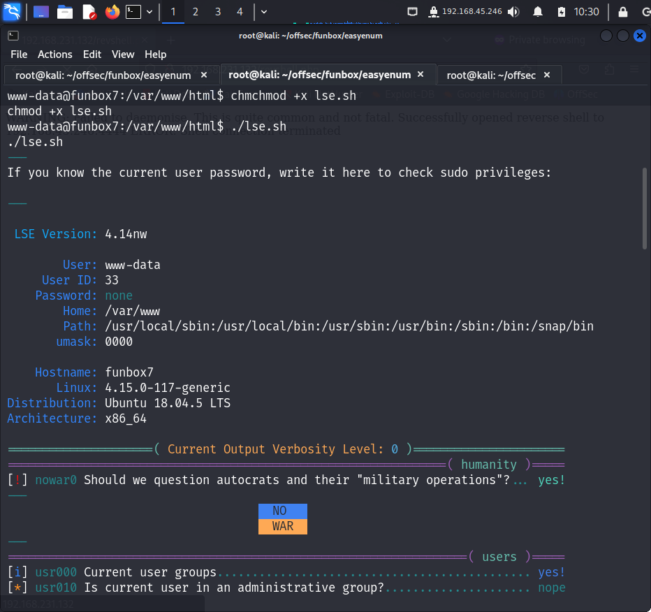

> Welcome to my writeup where I am gonna be pwning the **FunBox EasyEnum** machine from **proving grounds**. This challenge has only 2 flags. Let’s get started!

# GETTING STARTED
To access the lab, visit **[proving grounds](https://portal.offsec.com/labs/play)** and download the vpn configuration file. Connect to the vpn using `openvpn <file.ovpn>` and start the machine to get an IP.

> [!NOTE] 
> This writeup documents the steps that successfully led to pwnage of the machine. It does not include the dead-end steps encountered during the process (which were numerous). This is just my take on pwning the machine and you are welcome to choose a different path.

# FOOTPRINTING
I performed an **nmap** aggressive scan to find open ports and the services running on them.

# INITIAL ACCESS
The scan identified **http** service to be up and running so I accessed it through my browser. I landed on a default **apache** landing page.

Hence I fuzzed web directories and files using **ffuf**.

I tried accessing the **robots.txt** file but found nothing interesting.

Another page identified while fuzzing was **phpmyadmin**, so I tried accessing it and used default credentials to try to log in.

Since the default credentials didn't work, I tried digging deeper by enumerating **file extensions** using **ffuf**. I tried common extensions like **`.js`**, **`.php`**, **`.asp`**, **`.aspx`** and found a file with **`.php`** extension.

I accessed it on the browser and found it to be a graphical user interface for the **`/var/www/html`** directory. It allowed various operations on the files present inside like, change permissions, delete, add, rename etc.

Here I found the first flag and read it using the available functions.

Next I downloaded the **php reverse shell** payload from **pentestmonkey** on my local system.

I modified the payload to add my listening address and port and uploaded it on the target.

I gave it read, write and execute permissions for owner, group and others.

Finally I triggered the payload by attempting to access it and got a reverse shell.

I spawned a **pty** shell using **python** and exported my terminal for better usability.

# PRIVILEGE ESCALATION
I transferred the **linux smart enumeration** script from my system to the target to identify misconfigurations that could help me escalate my privilege. 

I ran the file and found a hash for **oracle** user.

I navigated to **hashcat** and tried finding the code for the hash I had found. It turned out to be **md5**.

I copied the hash on my local system and cracked it using **hashcat** with **rockyou.txt** wordlist.

I then switched to **oracle** using the cracked password.

I tried looking around but found nothing interesting so I switched back to the **www-data** user. I remembered finding a **phpmyadmin** page when I was **fuzzing** the web directories so I look for interesting files in it. The default path for **phpmyadmin** is **`/etc/phpmyadmin`** so I navigate to it.

Here I look inside multiple config files and find a username and password in one of the files.

Passwords are sometimes reused by people with lack of security awareness. So I tried a password spray attack on the users that were present in the **`/home`** directory and got access to **karla**. 

Upon logging in, I got a message regarding **sudo**. So I tried looking at the **sudo** privileges **karla** had. 

**Karla** had the permission to run all commands as **sudo** without password. So I used it to spawn a **bash** shell. Once I became the **root** user, I navigated to the **`/root`** directory and captured the final flag.

# CONCLUSION
Here's a summary of how I pwned the machine:
- I performed web fuzzing to find a **php** file that provided a GUI for working with contents inside the **`/var/www/html`** directory.
- I found the first flag in this directory.
- I used this interface to upload my **php reverse shell** script.
- I got a reverse shell by triggering the payload. 
- I did further enumeration and found the hash of one of the user's. I cracked the hash but then found nothing interesting upon switching users.
- I investigated the **phpmyadmin** file for juicy information and found a set of credentials in one of the files inside **`/etc/phpmyadmin`**.
- I tried switching users using this password and got access to **Karla**
- **Karla** was authorized to run **sudo** with all commands so I used this to spawn a **bash** shell as **root**.
- Once I became a **root** user, I navigated to the **/root** directory and captured the final flag.

That's it from my side! Happy Hacking ;)

---
