> Welcome to my writeup on **gaara** from **offsec proving grounds**. This challenge has 2 flags and I am gonna walk you through the steps required to pwn the machine and capture them both. Let's get started!

# GETTING STARTED

To access the lab, visit **[proving grounds](https://portal.offsec.com/labs/play)** and download the vpn configuration file. Connect to the vpn using `openvpn <file.ovpn>` and start the machine to get an IP.

> [!NOTE] 
> This writeup documents the steps that successfully led to pwnage of the machine. It does not include the dead-end steps encountered during the process (which were numerous). This is just my take on pwning the machine and you are welcome to choose a different path.

# RECONNAISSANCE

I performed an **nmap** aggressive scan on the target to identify open ports and the services running on them along with some additional information.

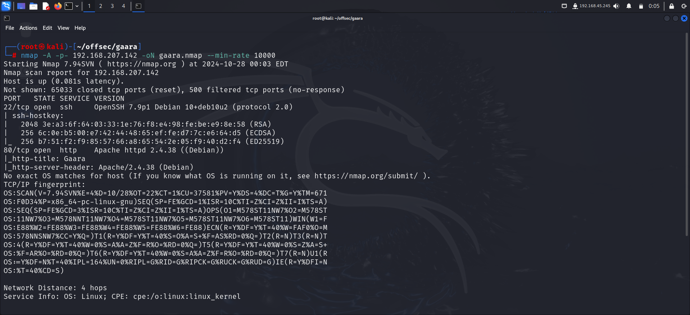

# FOOTHOLD

The **nmap** scan discovered an **http** server running on the target. So I accessed the site on browser.

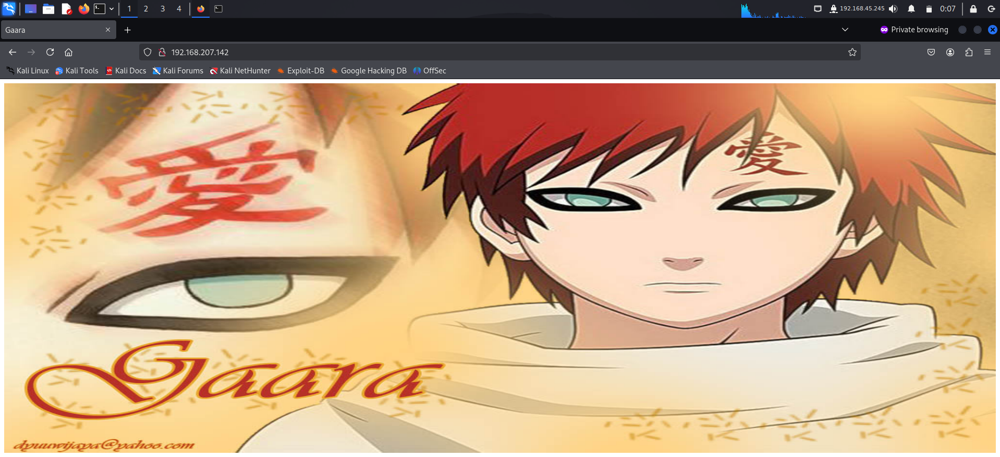

The browser had nothing interesting so I used **ffuf** to perform web directory fuzzing. Through this, I discovered a new directory.

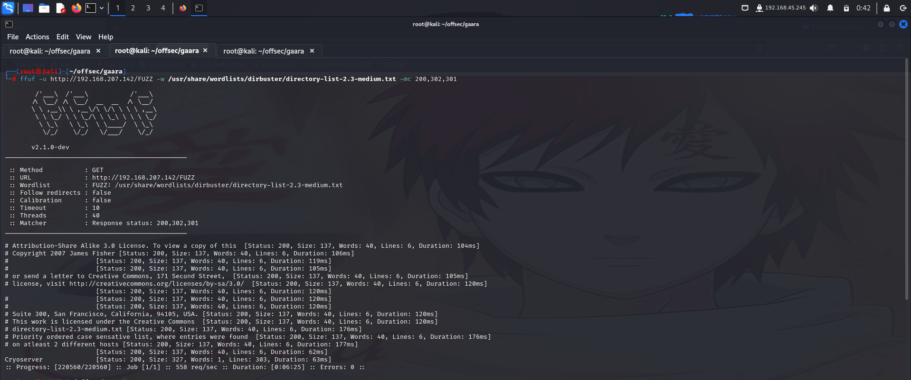

Upon accessing the directory, I found 3 new paths.

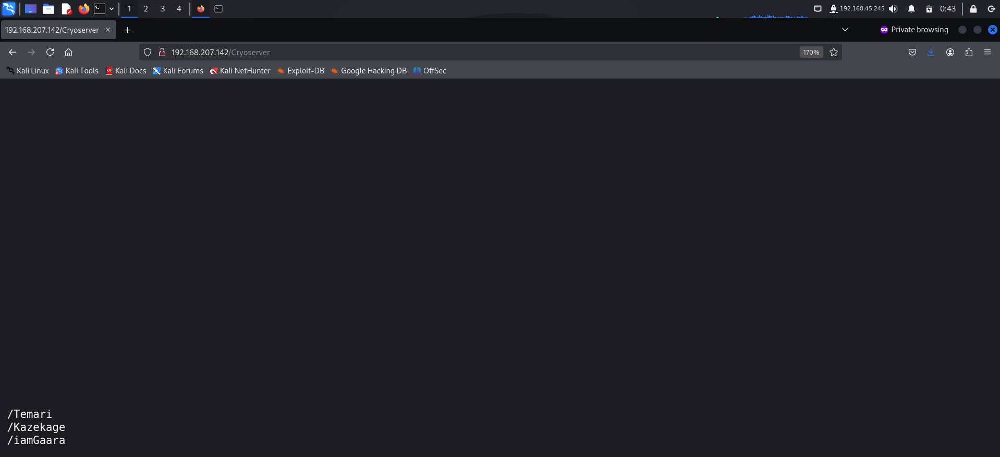

I accessed them one after the other but they all had the same extract. Upon closer inspection, I found that `/iamGaara` had an encoded string.

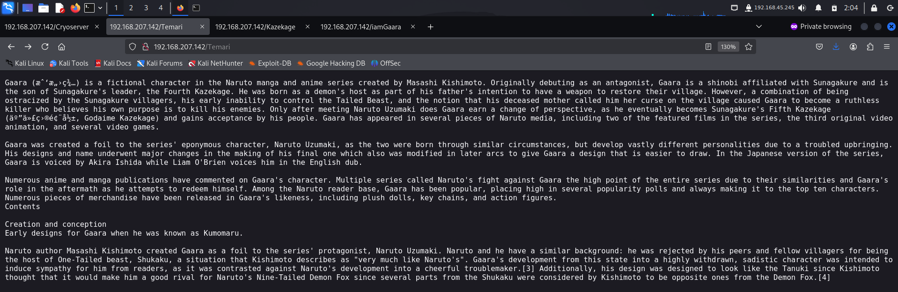

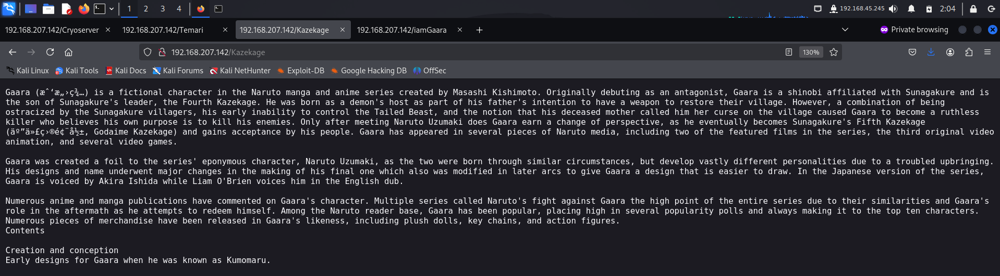

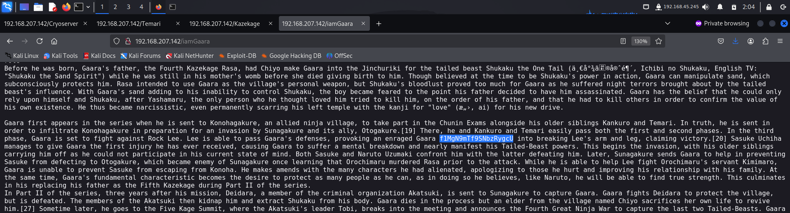

To decode this, I visited **cyberchef** and tried multiple encoding formats, out of which **base58** worked. 

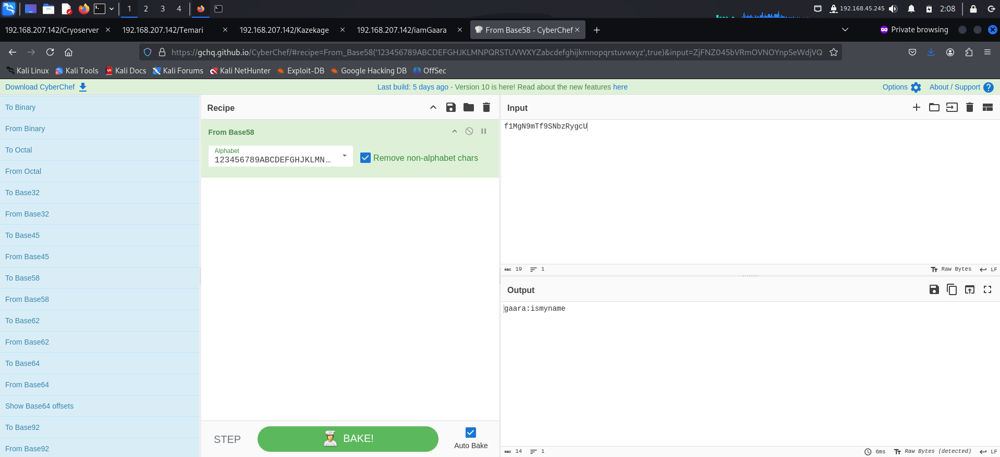

This looked like a pair of credentials so I tried logging in through **ssh** using them.  However, this turned out to be a rabbit hole. The password was incorrect.

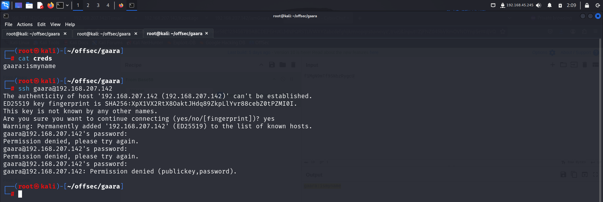

Since I had no other leads, I tried brute-forcing the password of  *gaara* using **hydra** and **rockyou.txt** wordlist.

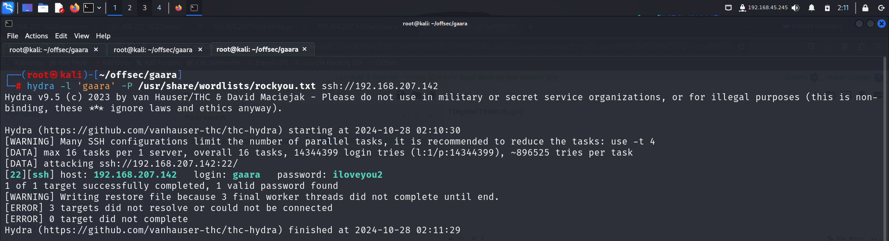

After finding the valid password, I logged in through **ssh** and found the flag in my home directory.

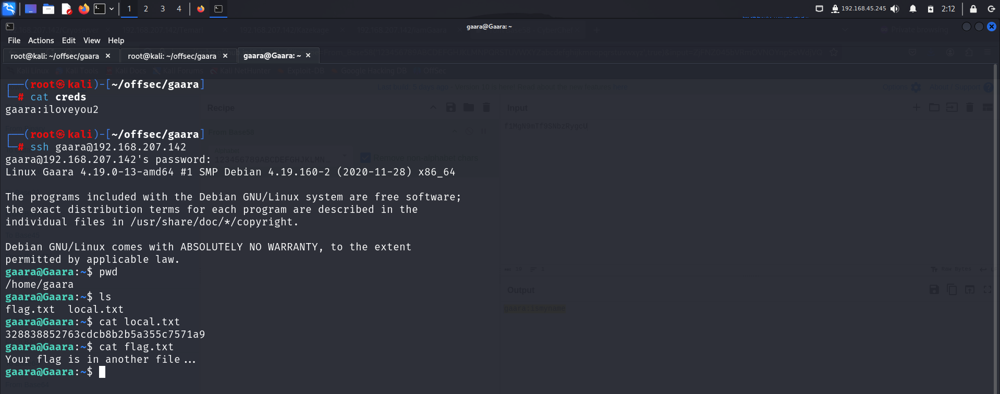

# PRIVILEGE ESCALATION

After getting initial access, I downloaded **linux smart enumeration** script on the target to look for misconfigurations that could lead to privilege escalation.

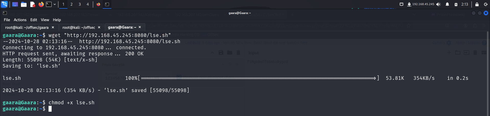

I ran the script and found an interesting set of binaries with **setuid** bit. I also found that I could write into the `/usr/local/games` directory.

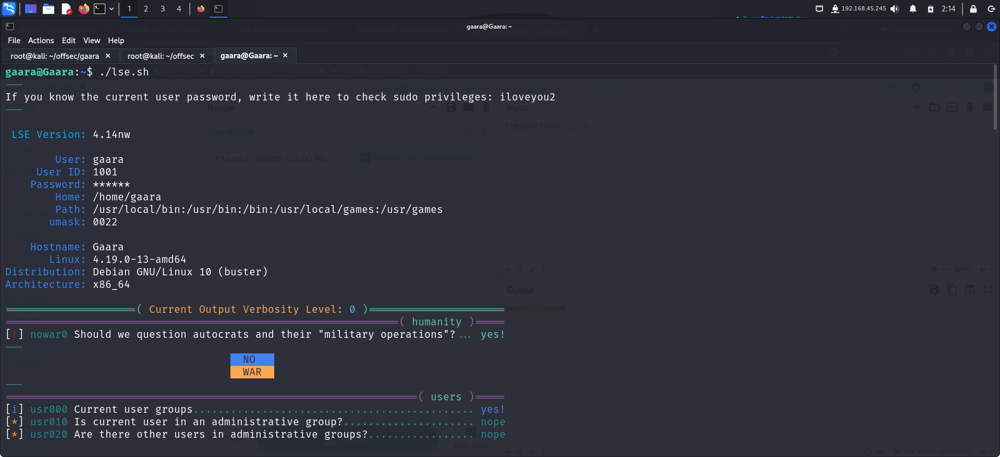

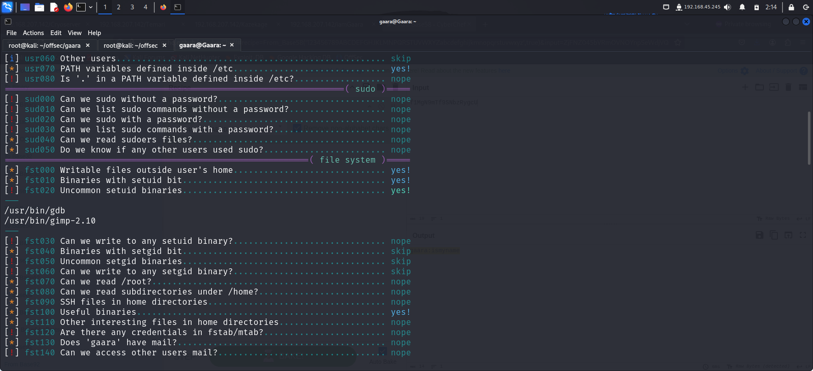

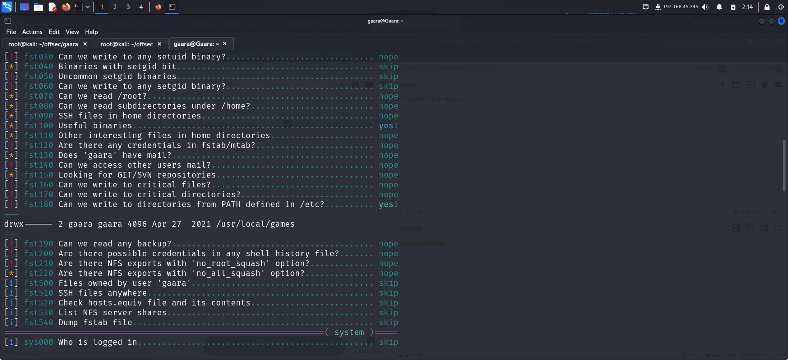

I started off with the **setuid** bit binaries and searched **gtfobins** for ways to exploit them. I found a way to escalate privilege with **gdb** so I repeated the steps mentioned on the site.

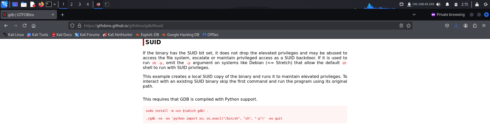

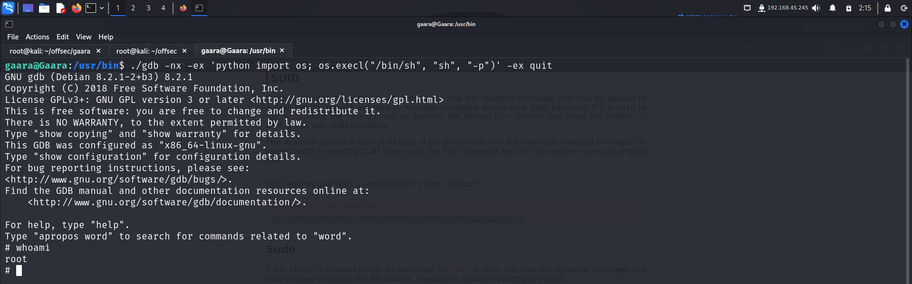

After getting **root** access, I captured the final flag from the `/root` directory.

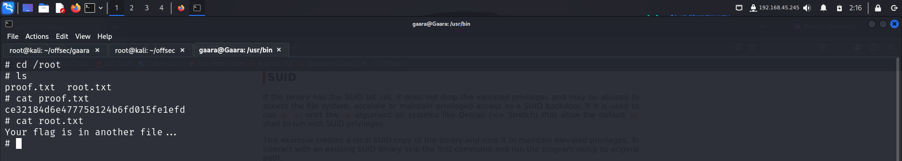

# CONCLUSION

Here's a summary of how I pwned the machine:
- I performed a directory brute-force attack to discover hidden directories.
- This directory revealed more paths that I could analyze.
- One of the page contained a base58 encoded string which contained a username and password.
- After failing to log in with the given password, I brute-forced the correct password using **hydra**.
- **hydra** identified the valid set of credentials and I used them to log in as **gaara**.
- I then captured the first flag in my home directory.
- I discovered uncommon setuid bits on 2 binaries and visited **gtfobins** to look for ways to exploit them,
- On **gtfobins**, I found a way to escalate my privilege using **gdb**
- I used the provided method to become a **root** user and captured the final flag from the `/root` directory.

That's it from my side!
Until next time :)

---
