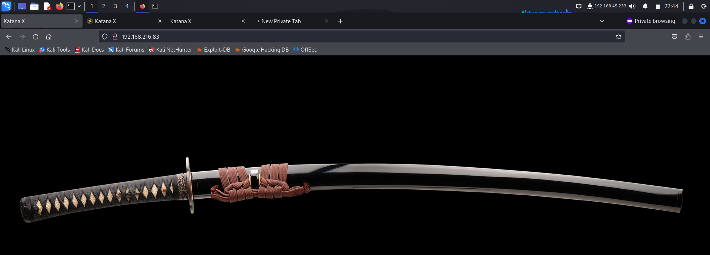
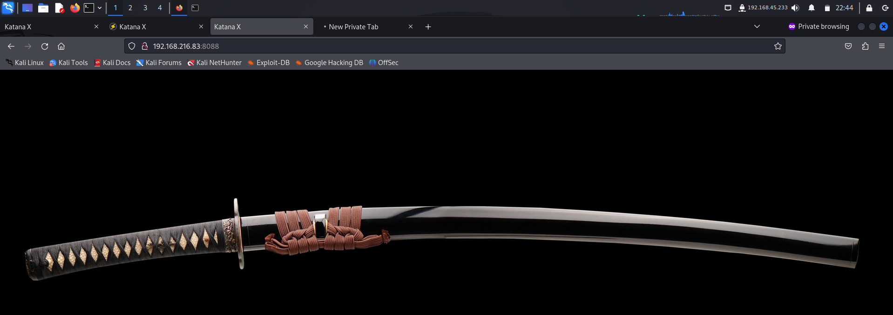

> Welcome to my writeup where I am gonna be pwning the **Katana** machine from **proving grounds**. This challenge has two flags, and our goal is to capture both. Let’s get started!

# GETTING STARTED
To access the lab, visit **[proving grounds](https://portal.offsec.com/labs/play)** and download the vpn configuration file. Connect to the vpn using `openvpn <file.ovpn>` and start the machine to get an IP.

> [!NOTE] 
> This writeup documents the steps that successfully led to pwnage of the machine. It does not include the dead-end steps encountered during the process (which were numerous). This is just my take on pwning the machine and you are welcome to choose a different path.

# RECONNAISSANCE
I performed an **nmap** aggressive scan on the target to gather as much information as possible at once.

# FOOTHOLD
The scan I identified a bunch of open ports with different services. Hence I started enumerating them 1 at a time. Since the target is running 2 major services, **ssh** and **http**; I start investigating **http**.

I accessed the default **http** port on a browser and found nothing interesting.

I then accessed the rest of the ports that was running **http** services and got no information

port **8715** also prompted us for a username and password. But upon entering a random set of credentials, I got the same page as above.

I then tried to brute force available directories using **dirb** where I identified more paths

I visited the `/ebook` directory and accessed various pages inside it.

I entered a random set of credentials and got in. This meant that the credentials weren't validated.

I found an upload functionality here and tried uploading a file but I faced some error.

I then dug deeper with **ffuf**, this time using a different wordlist on all the ports running the **http** service. When fuzzing files for port 8080, I found **upload.php** file and viewed it on the browser.

I checked how it worked by first uploading a normal text file.

After uploading the file, I checked all the available urls by adding the path to it. When I added the file path at port **8715**, I found my file.

Hence I could now try uploading a reverse shell. I visited **revshells** and copied a **php reverse shell** payload.

I then started a reverse shell listener.

I uploaded the payload file in both the options and triggered it by navigating to the file.

Hence I got a reverse shell. I spawned a **pty** shell and exported my terminal for better usability.

I got a shell for the user **www-data** so I navigated to **/var/www/** as this is where my user has access to and found the first flag.

# PRIVILEGE ESCALATION
To identify ways to escalate my privilege, I downloaded **linpeas** on my local system and transferred it to the target.

I then ran the script which then revealed an interesting file with capabilities. 

Since I did not know much about **capabilities** I navigated to **hacktricks** and found a blog on it where I found that Linux capabilities help a service do only what it needs as "root" (without all the privileges that come with full root access), rather than allowing it to run with unrestricted root power.

I then visited **gtfobins** to identify ways of exploiting it.

I used the method shown above and got **root** access. I then navigated to the **`/root`** directory and captured the final flag.

# CONCLUSION
Here's a short summary of how I pwned the machine:
- I identified multiple ports running **http** service.
- I performed web fuzzing on all the ports running the service to find a page that allowed file upload.
- I uploaded my reverse shell script and triggered it to get a reverse shell.
- I captured the first flag from `/var/www/`
- I ran **linpeas** and identified **capabilities** misconfiguration.
- I used **gtfobins** to find a way to exploit this to get **root** access.
- I navigated to `/root` to capture the final flag.

That's it from my side! Happy Hacking! 🎉

---