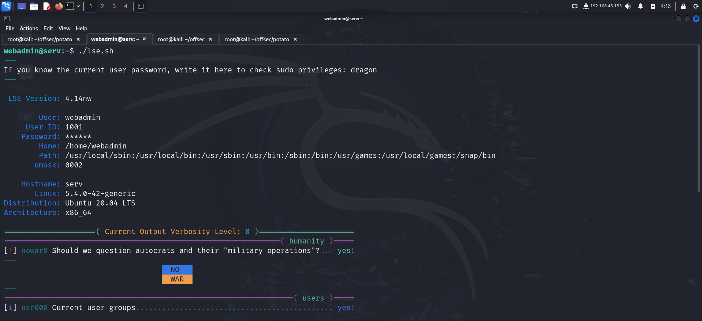

# GETTING STARTED

To access the lab, visit **[proving grounds](https://portal.offsec.com/labs/play)** and download the vpn configuration file. Connect to the vpn using `openvpn <file.ovpn>` and start the machine to get an IP.

> [!NOTE] 
> This writeup documents the steps that successfully led to pwnage of the machine. It does not include the dead-end steps encountered during the process (which were numerous). This is just my take on pwning the machine and you are welcome to choose a different path.

# RECONNAISSANCE

I performed an **nmap** aggressive scan to find information about the target.


# FOOTHOLD

Since the **nmap** scan detected that the **ftp** server allowed **anonymous** login, I logged into the **ftp** server using **`anonymous:anonymous`**. Here I found 2 files which I transferred onto my local machine.


The **`index.php.bak`** file looked like the source code for a login panel. I then navigated to the web server.


I performed a web directory brute force using **ffuf** to find hidden directories. Here I found 2 directories, `admin` and `potato`.


I tried logging in using default credentials but those didn't work. I then tried logging in using the username and password that were hardcoded in the source code found on the **ftp** server.


Here's what this script did: 

```php
$pass = "potato"; //note Change this password regularly
```
Here, a variable `$pass` is defined and assigned the string `"potato"` as the password. 

```php
if($_GET['login'] === "1"){
```
This checks if the URL query parameter `login` is equal to `"1"`. If it is, the code within this `if` block will execute.

```php
  if (strcmp($_POST['username'], "admin") == 0 && strcmp($_POST['password'], $pass) == 0) {
```
Within the `login` check, a second `if` statement compares the submitted `username` and `password` values:
  - `strcmp($_POST['username'], "admin") == 0` checks if the `username` from the form (`$_POST['username']`) matches the string `"admin"`.
  - `strcmp($_POST['password'], $pass) == 0` checks if the submitted `password` matches the value stored in `$pass` (`"potato"`).
  - If both are `true`, it means the credentials are correct.

If the credentials match, it displays a welcome message and a link to `dashboard.php`.

```php
    setcookie('pass', $pass, time() + 365*24*3600);
```
This sets a cookie named `pass` with the value of `$pass` (in this case, `"potato"`), which will expire in one year (`365*24*3600` seconds).

If the login fails, it displays an error message and provides a link back to `index.php`, the login page.

I looked for ways to bypass the comparison done by the **strcmp** function and found a way on google.


Hence if I modified the password parameter, I could potentially bypass the security check. To try it out, I fired up **burp suite** and captured a login request. I then changed the `password` parameter as show below and forwarded the request.


Hence I got access to the admin area. However I found nothing useful here.


As a last resort, I tried to bruteforce **ssh** credentials using **nmap** and succeeded.


I used these credentials to log into the system.


# PRIVILEGE ESCALATION

I downloaded the **linux smart enumeration** script on the target and gave it executable permission.


I then ran the script to find available misconfigurations on the system.




The script revealed I could run a particular command as **sudo** without any password.


I looked for ways to exploit a the **nice** binary on **gtfobins** and tried it, however, it failed.


This means I could only execute the entire command and not a single binary. Also, I looked inside the **`/notes`** directory and found shell scripts in it. This means I could run shell scripts present inside the folder. However, due to lack of privilege, I couldn't add or modify any script here. So I used relative path to make it execute a shell script from my home directory.


This approach made me a **root** user. I then captured the flag from the `/root` directory.


# CONCLUSION

That was the complete walkthrough of **potato**. Hope you learnt something new!

Happy Hacking :)


---