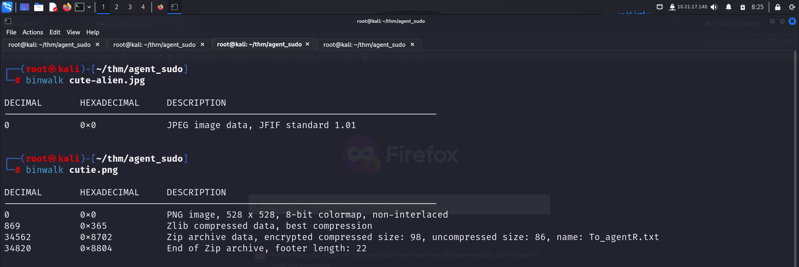
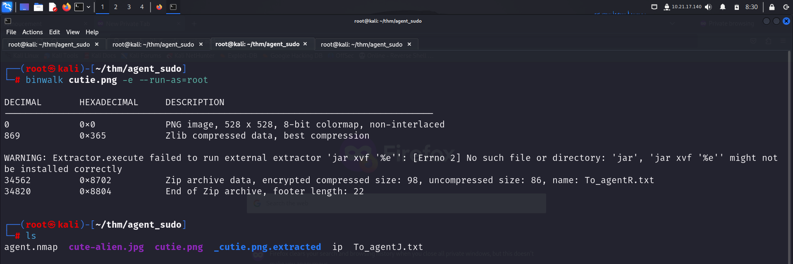
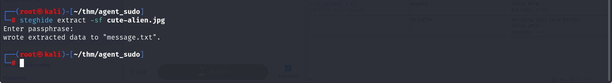
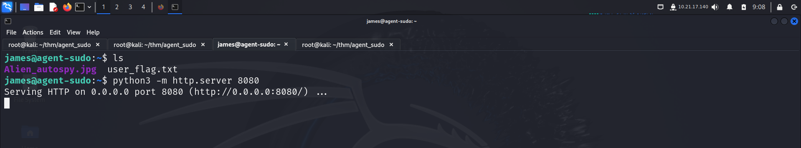
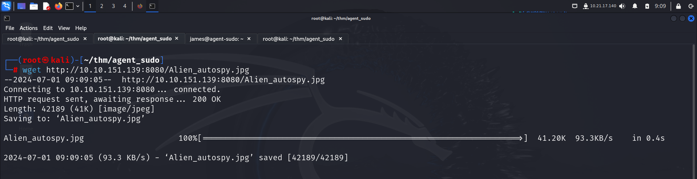
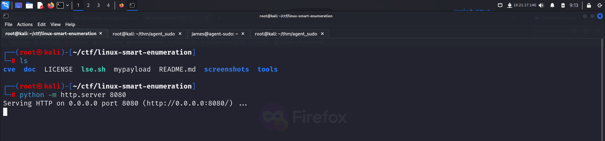
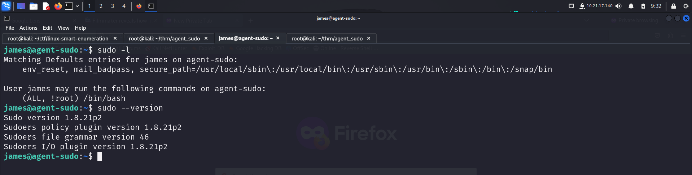
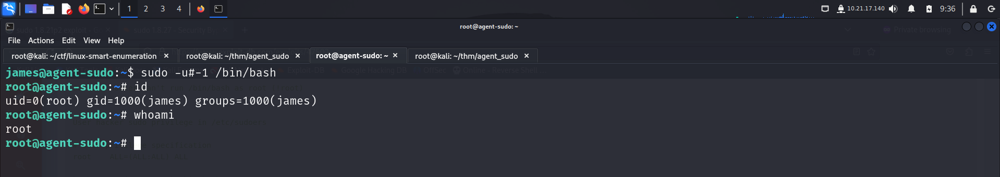
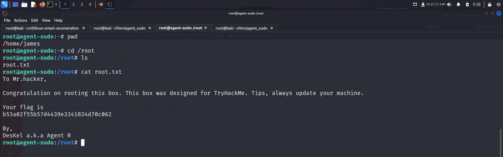

# GETTING STARTED

To access the lab, click on the link given below:-

https://tryhackme.com/r/room/agentsudoctf

> [!NOTE] 
> This writeup documents the steps that successfully led to pwnage of the machine. It does not include the dead-end steps encountered during the process (which were numerous). This is just my take on pwning the machine and you are welcome to choose a different path.

# RECONNAISSANCE

I performed an **nmap** aggressive scan to identify open ports and running services.

# INITIAL ACCESS

I accessed the web server using **curl** but received instructions on how to access the page.

Since the message was written by *Agent R*, I tried using the nickname *R* to access the page and received a new message.

**Note:** The **-L** flag in curl is used to follow redirects.

I tried accessing different pages by changing the alphabet and finally found a way to get in when I used **C**.

I found a username called *chris* so I attempted to crack its password for the other 2 services found running, namely *ftp* and *ssh*.

I successfully connected to the *ftp* server using these credentials.

I then downloaded all the files present in the server.

I then read the txt file

I then used **binwalk** to search for hidden files inside the images and found some in the *cutie.png*.

I then extracted the file from inside the image.

I looked inside the extracted directory.

I tried to extract the zip file but found that it was password protected. So I converted the file to **john** format and attempted to crack its password using **john**.

So I extracted the files using this password.

The zip contained a txt file, so I read that.

I visited [**CyberChef**](https://gchq.github.io/CyberChef/) and decoded the message.

I used the **steghide** command with the password *Area51* to extract information from the JPEG image file.

I read the *message.txt* file

I logged in using the username *james* and his password via **SSH**.

I found the *user* flag inside the directory

I then transferred the file to my system using an **HTTP** server.

I then conducted a Google reverse image search to gather more information about the image.

# PRIVILEGE ESCALATION

I downloaded the [**Linux Smart Enumeration**](https://github.com/diego-treitos/linux-smart-enumeration) script and ran it on the target.

The script identified something of interest.

I searched for exploits available for this *sudo* version.

I read the **POC** and replicated it to escalate my privileges.

I captured the *root* flag and revealed Agent R's identity.

# CLOSURE

Here's a concise summary of how I compromised **agent sudo**:
- I accessed the web server, which required a specific **user-agent** for entry.
- After gaining access, I conducted a **password spray** attack and discovered **chris's** **ftp** password.
- Downloading all files from the **ftp** server, I uncovered hidden messages and passwords within images.
- Using **john**, I cracked the password for *cutie.png* and obtained access to *cute-alien.jpeg*.
- Extracting files from *cute-alien.jpeg*, I found credentials for **ssh** login.
- With these credentials, I established initial access.
- Finally, identifying a vulnerability in **sudo**, I applied an exploit from **exploit-db** to gain **root** access.

That concludes my approach. Happy hacking!

---