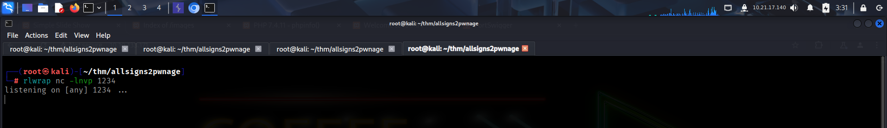
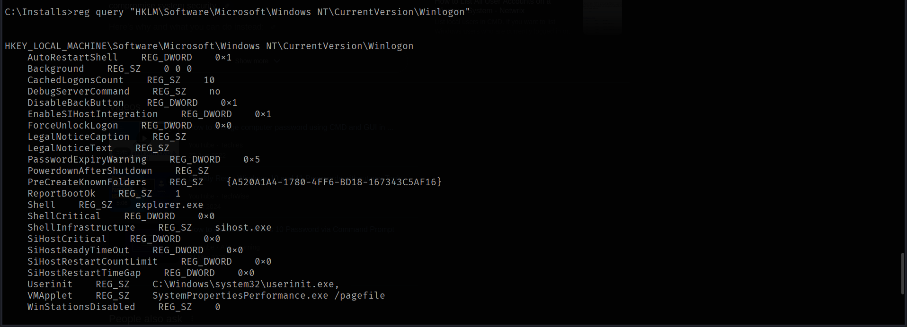

https://tryhackme.com/room/allsignspoint2pwnage

# SCANNING

I scanned the target using **nmap** to find open ports and various service information.

# FOOTHOLD

The **nmap** script scan revealed that the **ftp** server running on the target allowed anonymous login, so I connected to the server and found a txt file. I downloaded the text file on my local system.

The text contained a notice regarding a file share on the target for image upload and management.

I then listed out the shares on the target and found the `images$` share.

I accessed the share and found a bunch of images.

I then accessed the web application. My guess was that the images on the web page was being loaded from the `images$` share. This also meant that this share would be accessible through the browser as well.

I then fuzzed for files using **ffuf** and found a bunch of endpoints but when I visited those endpoints, I didn't find anything useful.

I then fuzzed for directories and found out that the target was hosting the application on a **xampp** server. I also found the `images` directory that contained the images shown on the web page.

Since I had access over the `images$` share, I could upload a malicious file and execute it through the browser. I uploaded **pentestmonkey**'s **php-reverse-shell** through the share.

refreshing the `images` webpage reflected the uploaded payload.

I then started a **netcat** listener.

However, when I tried executing the payload, it failed.

I tried various payloads and finally got a reverse shell using **PHP Ivan Sincek**'s payload. I copied the code after configuring the appropriate listener IP and port.

I removed the previous reverse shell payload and created a new one. I pasted the code and transferred it to the target using the `images$` share.

Finally, I executed the payload through the web application and got a reverse shell.

I then captured the user flag from *sign*'s Desktop.

# PRIVILEGE ESCALATION

I then viewed the internal shares and found another interesting share , `Installs$` that I had missed.

I visited the share and found some interesting files.

The `Install_www_and_deploy.bat` file seemed unusual so I read its contents and found *administrator*'s password.

I also looked for saved credentials in the windows logon registry hives and found the password for the user *sign*.

The room had a task that required us to find the password of *ultravnc*; I found this password in the configuration file of **ultravnc** stored under `C:\Program Files\uvnc bvba\UltraVNC`.

This seemed to be encoded. So I downloaded the appropriate decoder from: https://aluigi.altervista.org/pwdrec.htm

This decoder required the configuration file to be passed as argument, so I uploaded it on the target using the `images$` share.

I then ran the decoder with the configuration file as the argument and found the password.

While enumeration, I also found that I had `SeImpersonatePrivilege` enabled, I could use this to get **NT AUTHORTIY** access.

To exploit this privilege, I would require the **printspoofer** payload. So I uploaded it on the target using the smb share.

https://github.com/itm4n/PrintSpoofer

I then used **Printspoofer** to spawn a new shell as **nt authority\system**.

Finally, I captured the admin flag from *administrator*'s Desktop.

---
