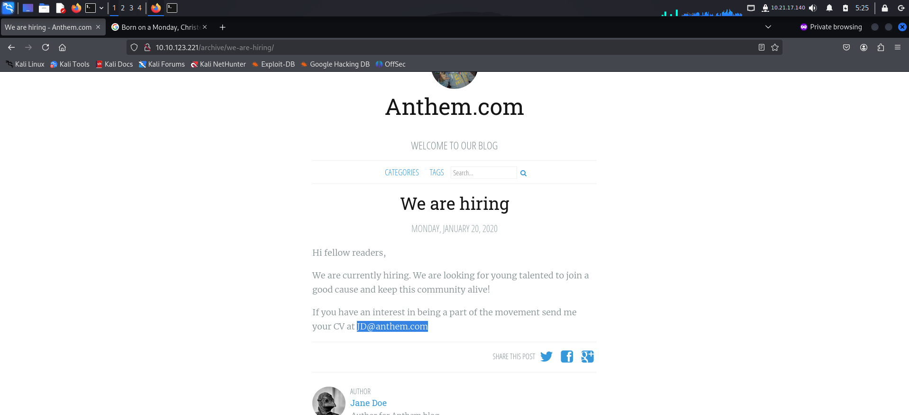
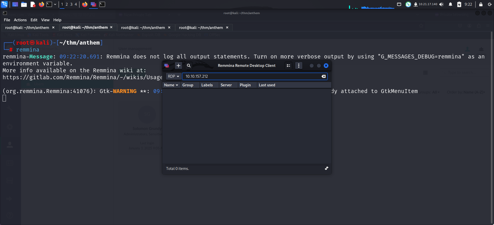

Link to machine : https://tryhackme.com/room/anthem

# RECONNAISSANCE

I performed an **nmap** aggressive scan to find open ports and the services running on them. It also ran default scripts on the services found.

# FOOTHOLD

The **nmap** scan revealed an **http** server running on the target. So I accessed it from my browser.

I used **ffuf** to bruteforce hidden files on the web app.

The *robots.txt* file usually contains sensitive endpoints. So I accessed it and found a string. I saved the string as it could be used in the future.

I continued analyzing the application and found an email address.

When I tried accessing the page of a specific author, I received an error. So I accessed the *authors* page and discovered the first flag.

The reviewed the source code of my home page and found another flag.

I visited the rest of the endpoints that I had discovered from robots.txt and **ffuf** scan.

I found a login panel at the *umbraco* endpoint.

I was able to log in using the email id I found on the web page and using the string from *robots.txt* as password.

Hence, I got access to a CMS admin panel.

I viewed the source code and got another flag.

I viewed the source code of other pages from here and found another flag.

I checked if the credentials I used on the web app could be used to get **rdp** access using **nxc**.

Since I had the valid credentials, I got **rdp** access on the target.

I captured the user flag from the user's desktop.

# PRIVILEGE ESCALATION

I looked at the folders and files present (including hidden files) and found a backup folder inside the C drive.

This folder contained a file called *restore.txt* that I could not access.

Hence, I modified the file's properties to allow the machine account to read the file.

Finally I read the file and found a string. This string could be another password so I tried using it to log in as administrator.

After logging in as administrator, I captured the final flag from desktop.

That's it from my side !
Happy hacking :)

---
