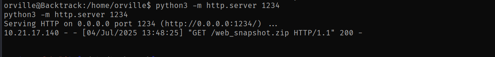

- https://tryhackme.com/room/backtrack

# SCANNING

I performed an **nmap** aggressive scan on the target and found a bunch of open ports.

# FOOTHOLD

I found a **tomcat** landing page on port 8080 a service called *Aria 2 WebUI* running on port 8888.

A simple google search about *Aria 2 WebUI* revealed a path traversal vulnerability in it.

I was able to read local files using this. The `/etc/passwd` file revealed the users present on the system.

I then found the path of the **Tomcat** configuration file and read it.

This file revealed the username and password for the tomcat manager.

However, when I tried accessing the manager panel using the credentials, something went wrong.

I was able to access the *Server-Status* endpoint which meant that the credentials were indeed valid.

I referred to the following articles:
- https://www.hackingarticles.in/tomcat-penetration-testing/
- https://book.hacktricks.wiki/en/network-services-pentesting/pentesting-web/tomcat/index.html?highlight=tomcat#msfvenom-reverse-shell

I used them as a reference to generate a malicious payload that I could upload for a reverse shell.

I also found a way to upload the file through command line through **stack overflow**.

Finally, I uploaded the payload and accessed it to get a reverse shell.

I got a shell as **tomcat**, did not have the permissions to access the contents inside the other user directories.

I switched back to my home directory and found the first flag.

# LATERAL MOVEMENT

I listed my **sudo** privileges and found that I could run a binary on a bunch of **Yml** files. One interesting thing about the allowed command is the **wildcard (`*`)** denoting all **yml** files. I could use backtracks to point to any other **yml** file of my choice.

**GTFOBins** had a way to exploit this to escalate privilege.

I followed the methods described on **GTFOBins** and spawned a shell as **wilbur**.

> note: I used backtracks to point to the new **yml** file that I had created.

I spawned an interactive **bash** shell.

After getting shell access as **wilbur**, I read the contents inside the home directory and found a note that contained the credentials of **orville** for a custom web app that was running locally.

I listed the active ports and found port **80** on listening state.

I also found my credentials in a hidden file called *`.just_in_case.txt`*

I then connected to the target using these credentials to get a better shell.

I also performed Local port forwarding using these credentials.

I then accessed the web application through my browser.

I accessed the login panel and logged in using the credentials that I had discovered earlier.

I tried uploading a reverse shell but failed to do so due to some restrictions.

I then created a simple web shell and tried various bypass techniques and finally managed to upload the file using **double extensions**.

I then tried executing a command but failed.

I then tried uploading the file outside it's intended directory.

However, it did not work.

**Double URL encoding** the backtracks bypassed the restrictions and allowed me to upload the file outside the *uploads* directory.

Finally, I was able to execute commands.

I then used **nc** to get a reverse shell from the target.

Since the application was running as **orville**, I got a shell as that user.

I then captured the second flag from the home directory.

# PRIVILEGE ESCALATION

There was a zip file so I transferred it on my local system.

When I uncompressed the file, I realized it was only a backup of the web application.

I did not find anything useful on the target. One thing that I noticed when I uncompressed the backup was that it contained the malicious **php** file that I had uploaded to get a shell as **orville**. This meant that the backups were being made periodically. 

To monitor the background tasks, I download **pspy** and transferred it onto the system.

Running **pspy** revealed something interesting...

Multiple commands were being executed as root and then the user was changed to **orville**.

When root switched to **Orville** using the command `su - orville`, it created a new shell for orville. The `-` in the command basically acts like a full login for **Orville**.

So, the root shell doesn't actually end. It just runs in the background while **Orville**’s shell spawns in the foreground. I found an article that spoke about this privesc vector: https://www.errno.fr/TTYPushback.html

Instead of exiting **Orville**’s shell (as this could close the entire session), we could use this technique to send a `sigstop` signal, to pause the **orville** shell and switch back to the original root shell that is running in the background.

I created the following **python** payload to add an **SUID** bit on the `/bin/bash` binary and transferred it on the target.

I then added the command to execute this in the **`.bashrc`** file so that it could be executed when the root user switched to **orville**.

After some time, an SUID bit was added to the `/bin/bash` binary.

Finally, I executed **bash** in privileged mode and got root access.

I then captured the final flag from root user's home directory.

I also found the root credentials inside the **manage.py** file present in the `/root` directory.

That's it from my side!
Until next time :)

---
