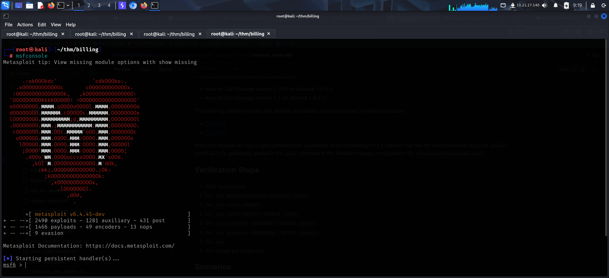

To access the machine, click on the link given below:
- https://tryhackme.com/room/billing

# SCANNING

I performed an **nmap** aggressive scan on the target to find open ports, os information, service versions and to run a default nse script scan.

# INITIAL ACCESS

The target had a web server running so I accessed the web page through my browser.

The *`robots.txt`* file also did not contain any new endpoint.

I also tried accessing the asterisk call manager port.

Since I did not get any leads, I started the **metasploit** framework and looked for exploits related to *asterisk* or *mbilling*.

Since there was a well ranked exploit for the *mbilling* service, I decided to give it a try.

I configured the required options and ran the exploit. Luckily, I got a reverse meterpreter shell.

I spawned a **pty bash** shell and enumerated information about the current user and os kernel.

I then looked for the flag and found it in *magnus* user's home directory.

# PRIVILEGE ESCALATION

I looked for **sudo** permissions and found out that I could run a particular command as sudo without a password.

I looked like banning and unbanning IPs.

This was the first time I came across such an attack vector. So I searched online and found this guide that showed how it could be used for privilege escalation:
- https://exploit-notes.hdks.org/exploit/linux/privilege-escalation/sudo/sudo-fail2ban-client-privilege-escalation/

I copied the steps shown and managed to add an **suid** bit on **`/bin/bash`**.

Finally, I executed `/bin/bash` in privileged mode and found the root flag inside the **`/root`** directory.

---
