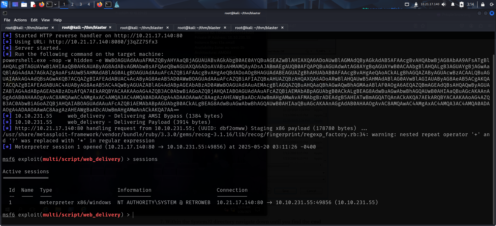

To access the machine, click on the link given below:
- https://tryhackme.com/room/blaster

# RECONNAISSANCE

I performed an **nmap** aggressive scan on the target to find open ports and the services running on them.

# FOOTHOLD

The nmap scan revealed a web application to be running on port 80, so I accessed it on my browser.

It was a default IIS landing page so I fuzzed for hidden directories and found one called *retro*.

I visited the directory and found a blogging application.

The author of the blog could be a user in the system so I kept note of it.

A comment on one of the blogs had a potential password.

I checked if the username and password were valid and found that I could use them to access the target through **rdp**.

I used **xfreerdp** to access the machine.

I found user.txt in the Desktop.

# PRIVILEGE ESCALATION

The Desktop had another application called hhupd.

I searched online for exploits and found articles for privilege escalation through UAC bypass.

link to article: https://justinsaechao23.medium.com/cve-2019-1388-windows-certificate-dialog-elevation-of-privilege-4d247df5b4d7

I followed the steps given in the article to escalate my privilege to administrator:
- Right click on the application and select run as Administrator

- A dialogue box appears. Click the *show information...* link.

- A web browser will automatically open after clicking on the hyperlink. If not, click on the link again. The url should be of Verisign.

- Save the page in the following way:
	- click on save
	- ignore any warnings
	- a dialogue box will appear 
	- within the file explorer, navigate to `C:\Windows\System32` and open `cmd.exe`

- I spawned a shell as NT Authority System.

- I then captured the root flag from Administrator's Desktop.

I wanted to get a meterpreter shell. So I started the **metasploit** framework.

I used the following exploit to get a reverse meterpreter shell by executing a payload on the target:
`exploit/multi/script/web_delivery`

# SUMMARY
Here's a short summary of how I solved **Blaster**:
- I discovered a blogging application on the IIS web server
- I found a username and password in the blogs
- I captured user.txt from Wade's Desktop
- I found an application called **hhupd** on the Desktop and looked for related exploits.
- I used the application to bypass UAC and spawn a shell as NT Authority System
- I migrated the shell to a meterpreter session using the `web_delivery` exploit in **metasploit** framework.
- I captured the root flag from Administrator's Desktop.

That's it from my side!
Until next time :)

---
