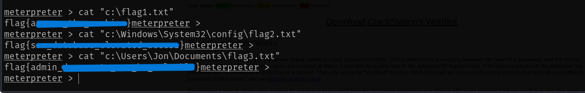

To access the machine, click on the link given below:
- https://tryhackme.com/room/blue

# SCANNING

I performed an **nmap** scan to find open ports and the services running on them.

I ran a vulnerable script scan for **SMB** and found that the target was vulnerable to **MS17-010**.

# FOOTHOLD

I started metasploit and selected the exploit for this vulnerability.

I then set the required configurations like listener IP, target IP, Payload etc and ran the exploit.

Finally, I got a shell.

I backgrounded the shell using `CTRL + Z` and ran the `shell_to_meterpreter` post module to upgrade my shell to **meterpreter**.

Finally, I spawned a **meterpreter** session and got **NT AUTHORITY/SYSTEM** access on the target.

I listed the running processes. Migrating to a legitimate process would make our exploit more stealthy so I migrated to **wininit.exe**.

Finally, I used **`hashdump`** to dump NTLM hashes from the target.

I then cracked the hash for Jon using **Crackstation**.

I then searched for all the flags that we had to capture and accessed them.

---
