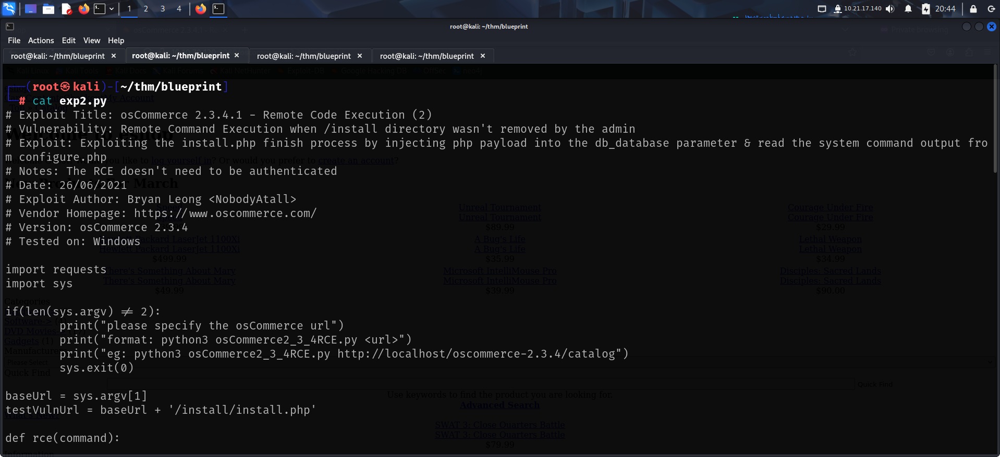
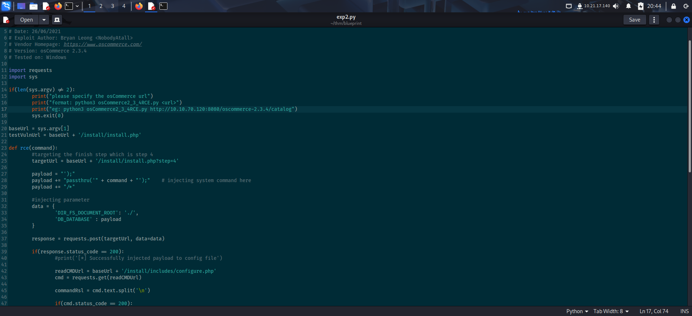

Link to machine : https://tryhackme.com/room/blueprint

# SCANNING

I performed an **nmap** aggressive scan on the target to find open ports and services running on them.

# FOOTHOLD

I accessed the web service running on the target and found a directory listing of a content management system.

I looked for exploits related to the cms and found a couple on exploit db.

I then downloaded the exploits and configured parameters in them.

I then ran the exploit and got shell as **NT Authority**.

I then captured the root flag from *Administrator*'s Desktop.

 

Now that I had full control on the target, I downloaded the hashes from registry hives and extracted them on my system using **impacket-secretsdump**

https://security.stackexchange.com/questions/38518/how-to-get-an-nt-hash-from-registry

Finally I cracked the hash using **crackstation**

---
