To access the challenge, click on the link given below:
- https://tryhackme.com/room/cowboyhacker

# SCANNING

I scanned the target using **nmap** and found 3 services running:
- FTP
- SSH
- HTTP

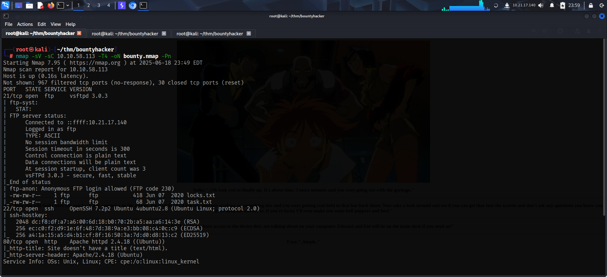

The default script scan also found that the FTP server allowed *anonymous* access.

# FOOTHOLD

I visited the website and found potential usernames. Besides that, I found nothing special. Even directory and file fuzzing yielded no results.

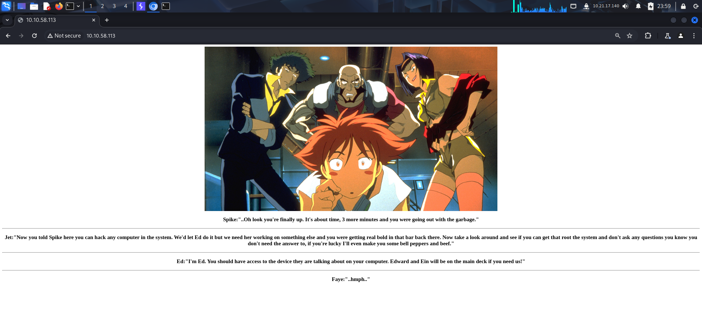

I then moved onto FTP and logged in as an *anonymous* user. I then listed the contents and found 2 *txt* files.

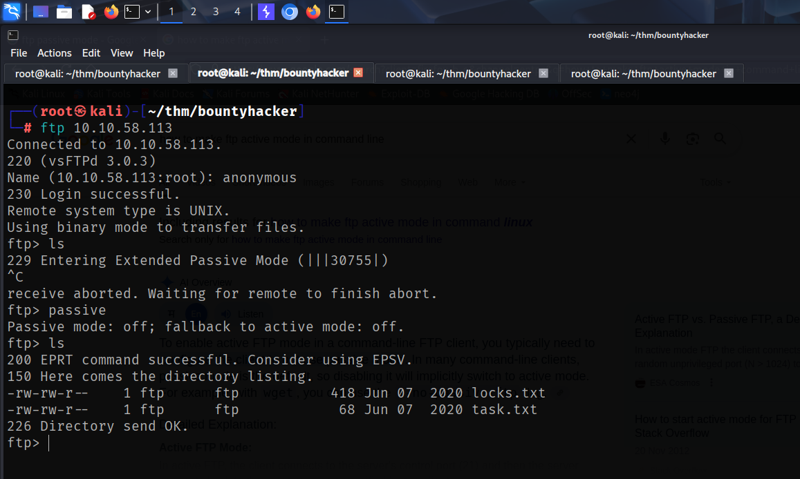

I downloaded both the files on my local system to view what's inside them.

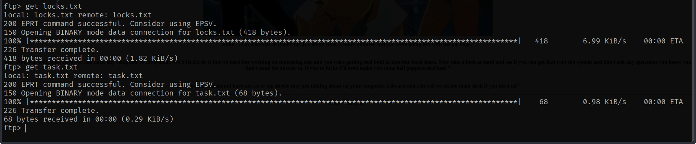

The *'task.txt'* file revealed 2 potential usernames:
- Vicious
- lin

The *locks.txt* file seemed like a wordlist.

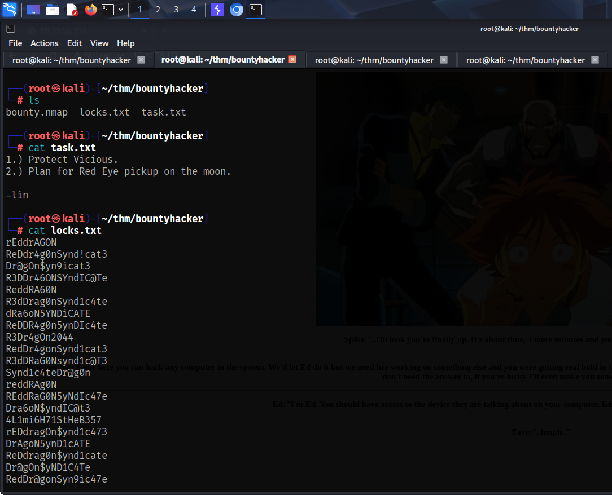

I then used **hydra** and found a valid **ssh** password from the *'locks.txt'* wordlist for the user *lin*.

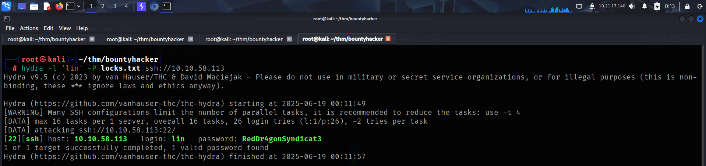

I then accessed the target using **ssh** and captured the user flag from *lin*'s Desktop.

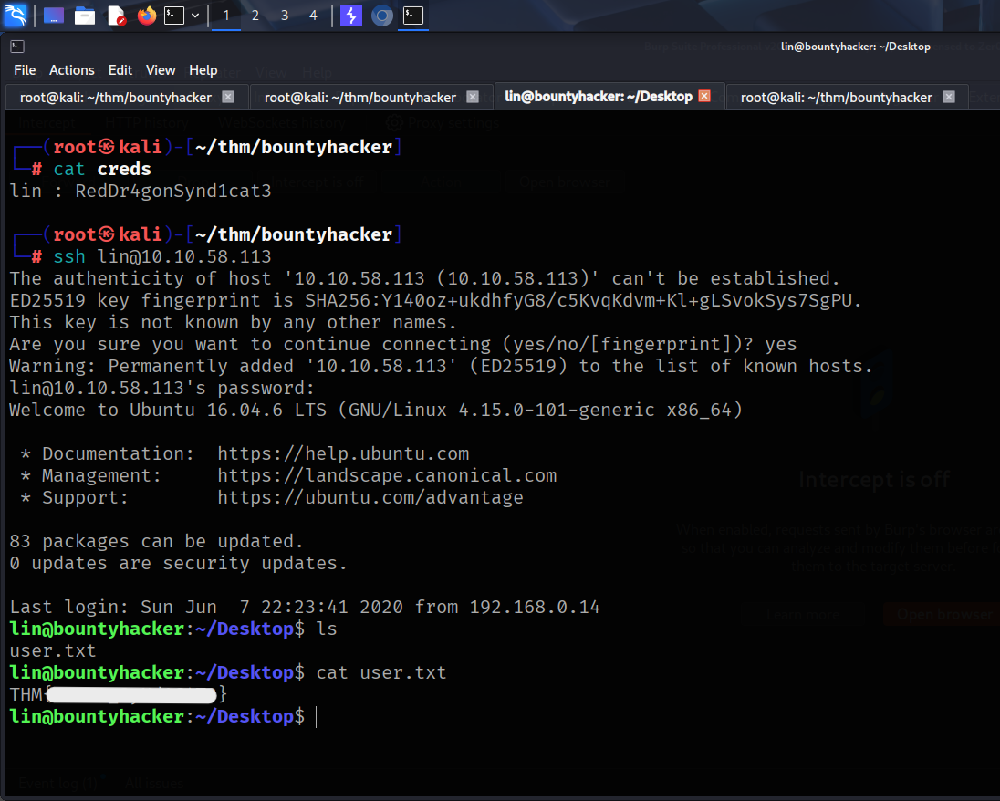

# PRIVILEGE ESCALATION

Since I had the password, I looked at *lin*'s **sudo** privileges. Here, I found *lin* was allowed to execute **tar** as root.

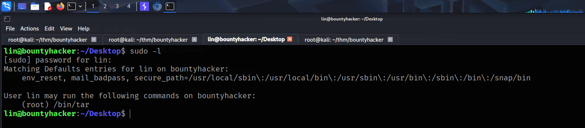

I checked **GTFObins** to see if this binary could be directly exploited and found a way to spawn a **bash** shell.

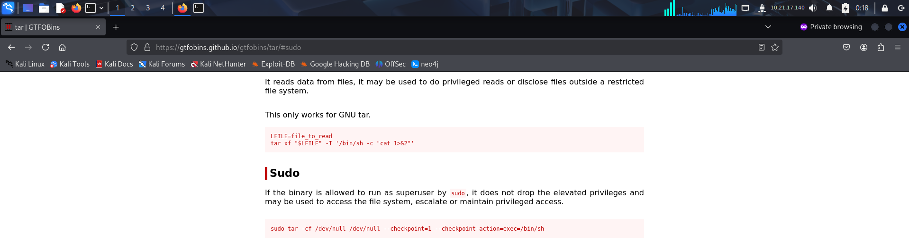

I referred to the command in **GTFObins** to spawn a **bash** shell as *root*.

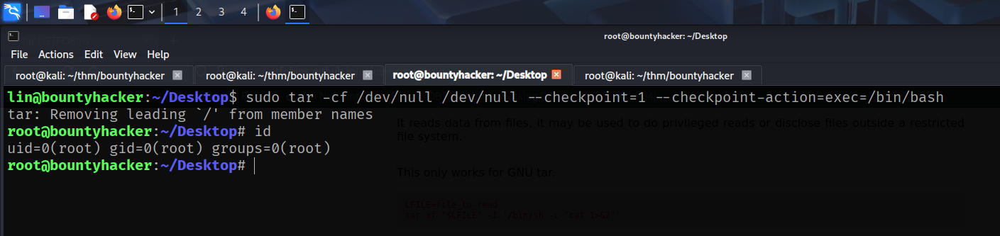

Finally, I captured the root flag from */root* directory.

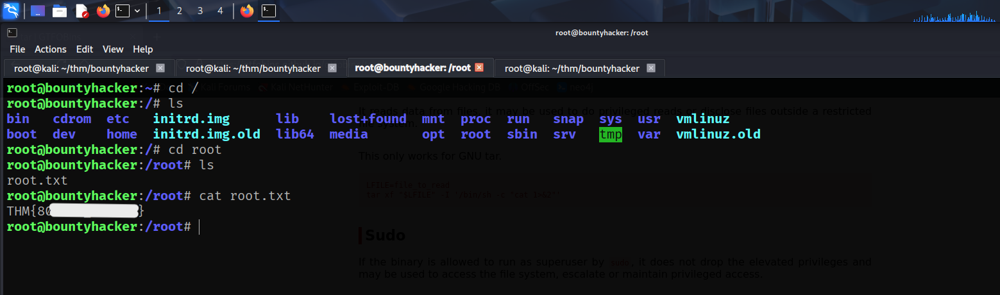

That's it from my side!
Until next time :)

---
