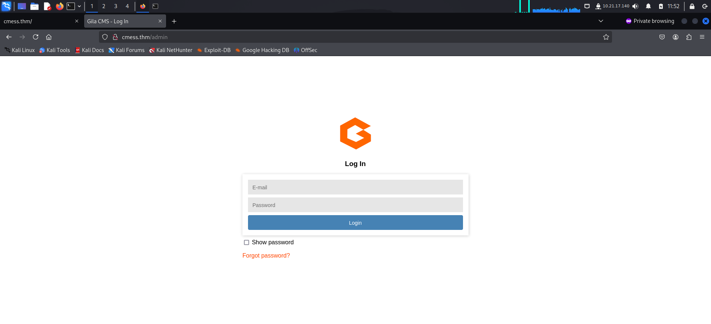
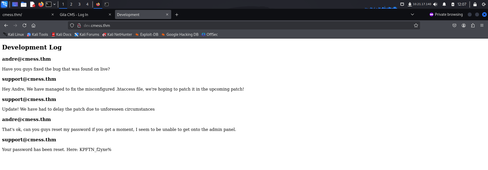
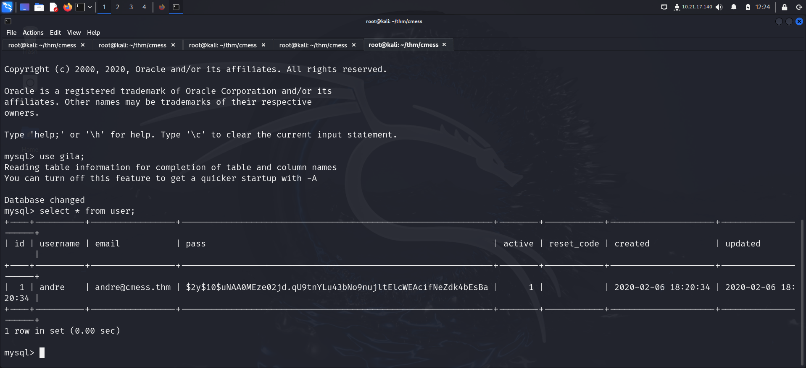
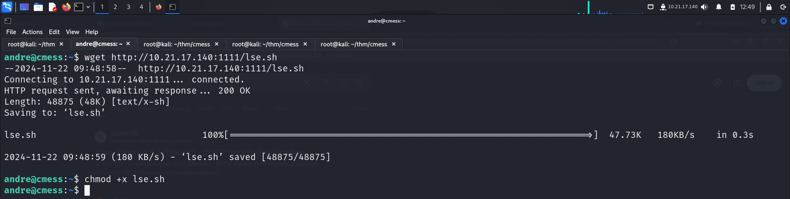

Link to machine : https://tryhackme.com/room/cmess

# RECONNAISSANCE

I added the machine hostname to my *hosts* file for proper name resolution.

I then performed an **nmap** aggressive scan to find open ports, services running on them, and perform default script scans on them.

# FOOTHOLD

The script scan discovered *robots.txt* file so I accessed it to discover 3 more endpoints.

I also bruteforced directories using **ffuf** and found an admin login panel.

I then looked for subdomains and found 1. I added the subdomain to my *hosts* file for correct resolution.

I then accessed the subdomain and found the credentials for *andre*.

I logged in and got information about the CMS being used and its version.

I searched **exploit-db** for exploits related to this CMS and found an RCE exploit for the version being used on the target.

I downloaded the exploit and started a **netcat** listener. Upon execution, I got a reverse shell.

I navigated to the *home* directory but was unable to access the contents of *andre*.

I read the configuration files and found a few credentials. I also discovered an **SQL** service running internally and credentials for it.

I connected to the **SQL** service running and found a hash for *andre*.

I found the hash type from the **hashcat** hash example's page and tried cracking the hash. However, I failed.

I did further recon and found a password file in the */opt* directory that contained *andre*'s backup password.

I used the password to log in as *andre* using **ssh** and captured the user flag from the home directory.

# PRIVILEGE ESCALATION

I then downloaded **linux-smart-enumeration** on the target and ran it to find ways for privilege escalation.

It found I was able to read a backup file in the */tmp* directory.

It also found a cronjob that backed up contents inside the */home/andre/backup* directory.

I visited the directory and found a note.

I copied **/bin/bash** to */tmp/bash* and granted it **suid** allowing execution as root. I then created a special filename that tricked **tar** into triggering a checkpoint every 1 file processed. I then abused **tar**'s ability to execute commands at a checkpoint by creating another file.

Hence, when **tar** processed it, it will execute **`sh evil.sh`**. So when the cron job runs the `tar` command, it triggers a checkpoint every 1 file, executes **evil.sh** and runs this as root creating an **suid** bit on */tmp/bash*.

After a while, I checked the */tmp* directory to find my file being successfully executed.

I then spawned a privilege **bash** shell and got root access.

I captured the root flag from the */root* flag.

That's it from my side, until next time!

---
