To access the machine, click on the link given below:
https://tryhackme.com/room/creative

# SCANNING

I performed an **nmap** aggressive scan on the target to identify open ports and the services running on them.

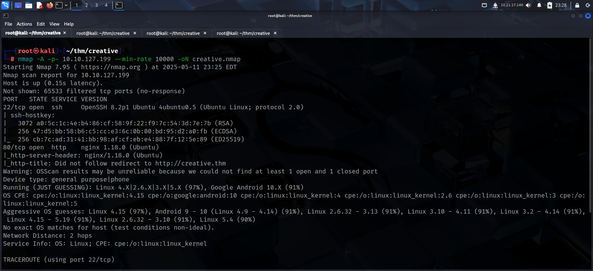

# FOOTHOLD

I was able to discover a web server running so I added the IP in my `/etc/hosts` file and accessed the web server through my browser.

I tried looking for files, directories but found nothing. I then enumerated subdomains and found 1.

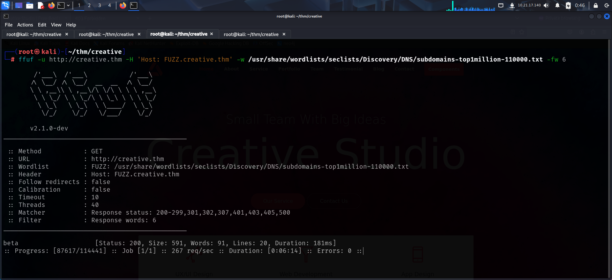

After adding the subdomain in the **`hosts`** file, I accessed it and found an interesting feature. It allowed us to send request to a website to see if it is active.

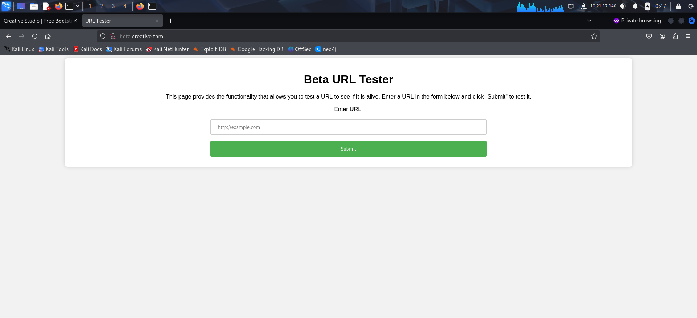

I started an **http** server on my local system and tried accessing it through the application.

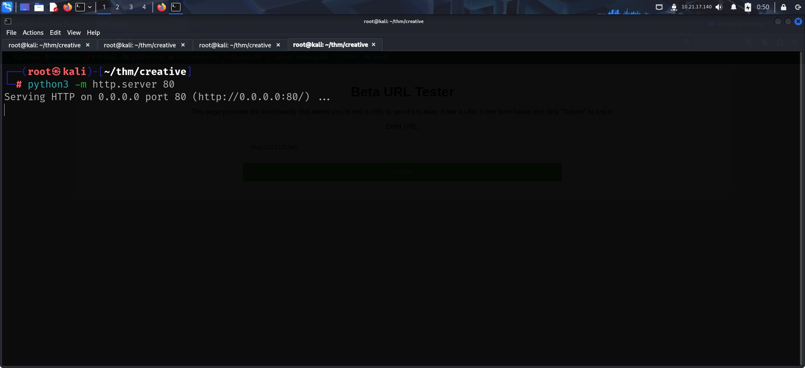

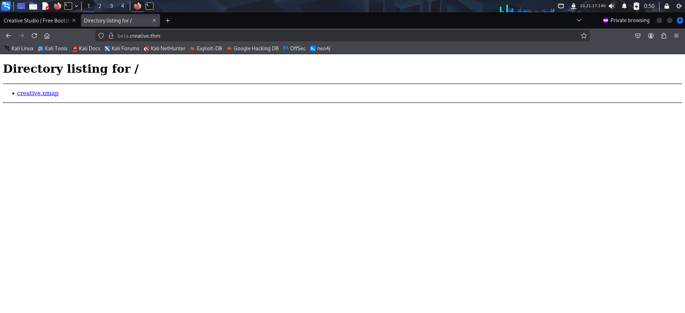

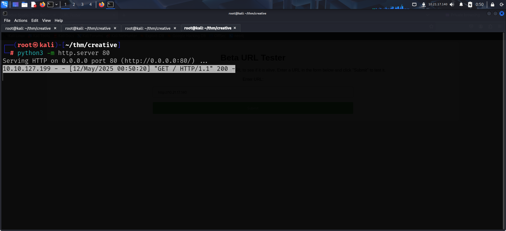

Since I was able to make the server send requests, I tried using it to execute php, js, python payloads but none of them seemed to work. The application simply displayed the contents of the files. Out of curiosity, I tried accessing the localhost and found the rendered html of the domain.

I then fired up Burp and tried analyzing it in an efficient manner.

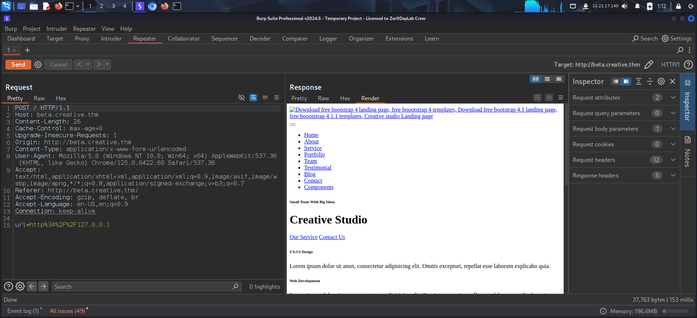

So, if the page existed, I would get the rendered contents of the page else, I would receive an error. I exploited this behavior to scan internal ports using intruder.

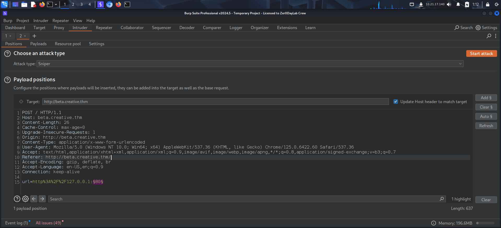

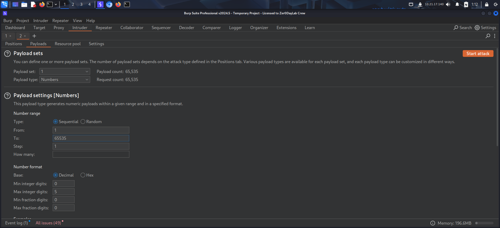

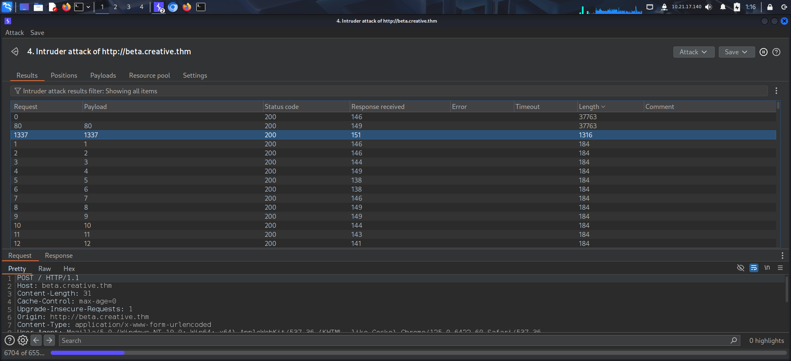

I found port 1337 to be hosting the root directory.

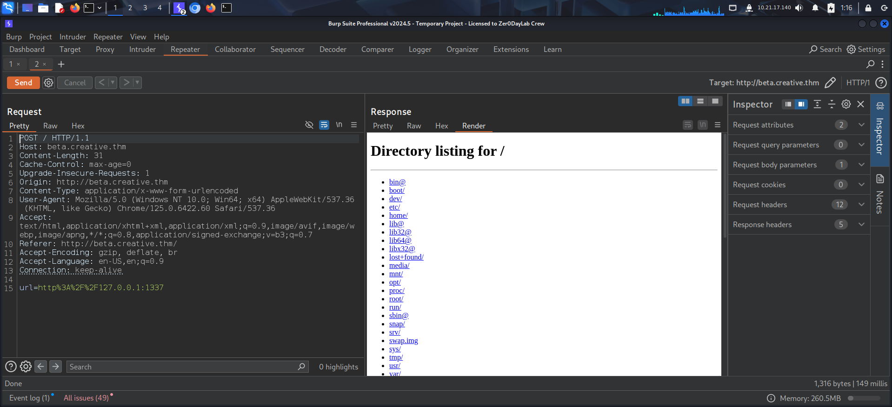

I was then able to access the user flag from *saad*'s home directory.

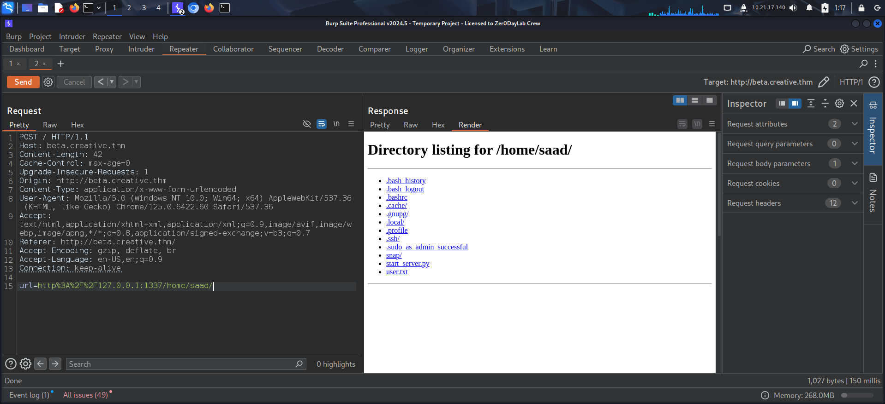

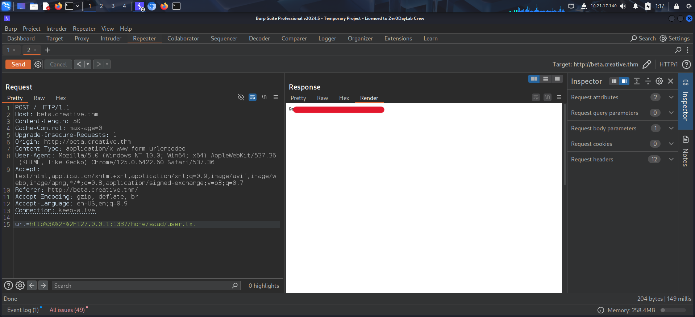

I also found `saad`'s **ssh** keys and copied the private key onto my local system.

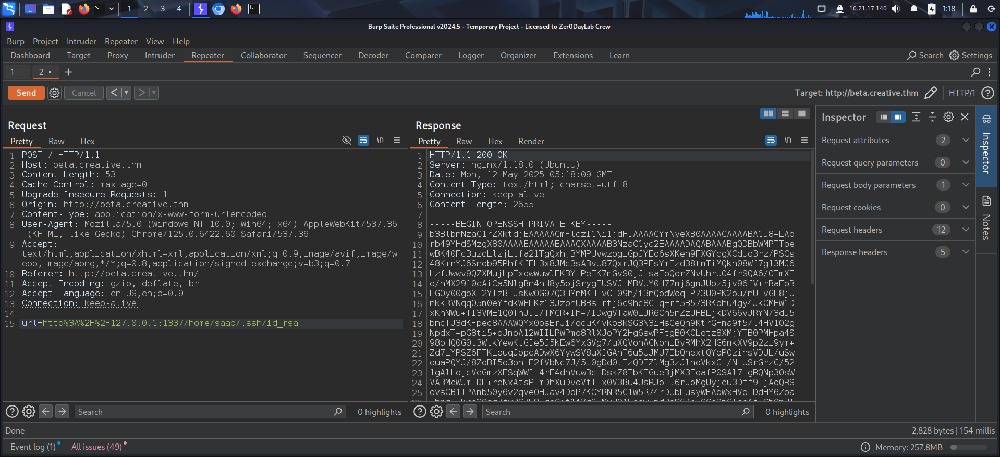

I tried logging in using the private key but was prompted for a passphrase. So, I converted the key to **john** crackable format and cracked it using **john** the ripper.

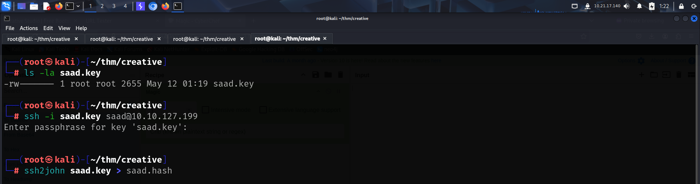

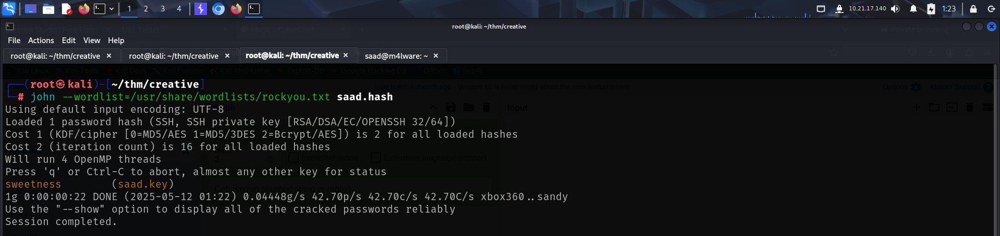

Finally, I used the passphrase to log in as *saad*.

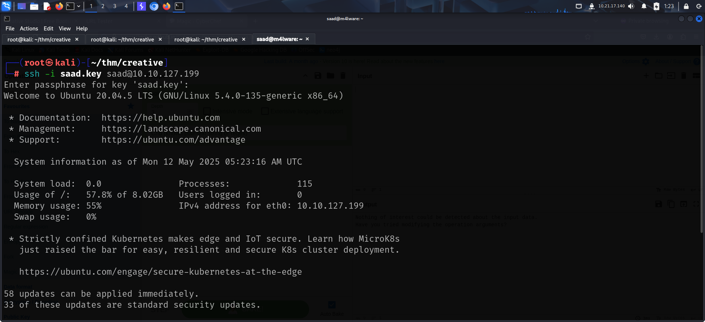

# PRIVILEGE ESCALATION

I examined the contents of *saad*'s home directory and found the **.bash_history** file which could hold command history. I viewed the file and found out *saad*'s password.

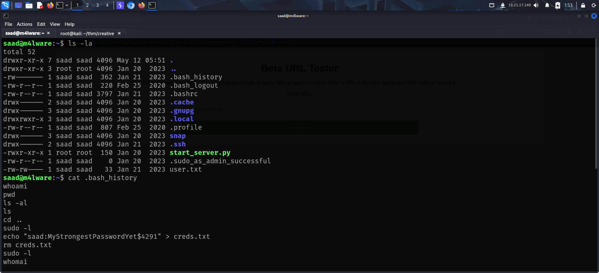

I then looked for my **sudo** privileges and found the following

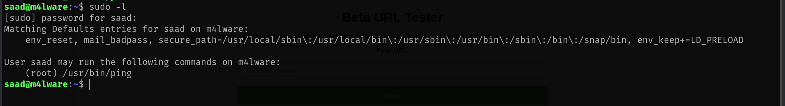

The **ping** permission in itself wasn't anything special. However, the environment variable `env_keep+=LD_PRELOAD` was something that could be exploited. I could make the program load a library of my choice before running the `ping` command as sudo.

I referred to the below article for reference.

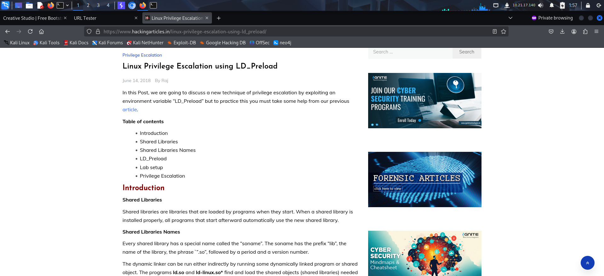

I created a C code to spawn a **bash** shell and converted it into a library.

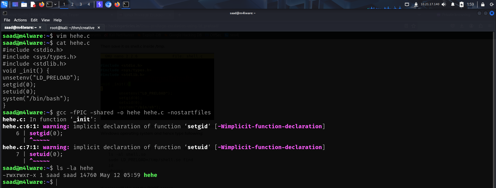

Finally, I used the environment variable to load my binary before executing the **ping** command as **sudo** and spawned a **bash** shell as **root**.

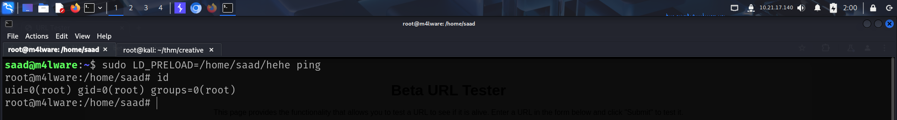

I then captured the root flag from **`/root`**

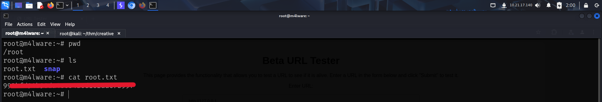

---

