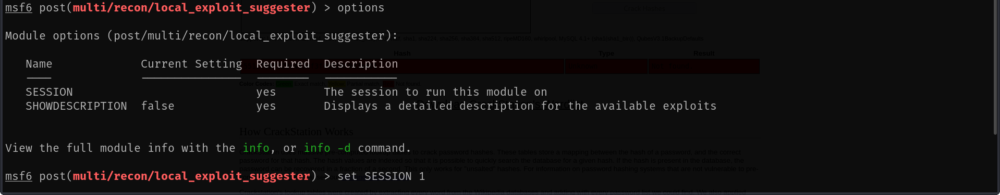
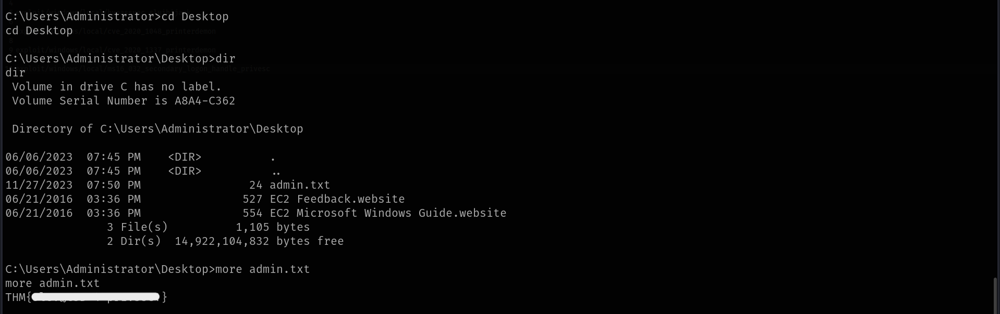

Link to machine : https://tryhackme.com/room/cyberlensp6

# SCANNING

Upon receiving the target IP, I added it in my */etc/hosts* file for name resolution.

I then performed an **nmap** aggressive scan to find open ports and the services running on them. 

# FOOTHOLD

I **nmap** scan revealed an **http** server running on port 80 and 61777 so I accessed them from my browser.

The server running on port 61777 revealed the apache version being used. A simple google search revealed an **RCE** vulnerability.

I looked for exploits using **searchsploit** and found one on **metasploit**.

I booted the **metasploit** framework and selected the exploit.

I configured the options and ran the exploit to get code execution.

I then captured the user flag from the Desktop.

# PRIVILEGE ESCALATION

I then ran privilege escalation checks using **PowerUp** and **winPEAS**.

Since both of them revealed nothing of interest, I ran the local exploit suggester module in metasploit.

I after getting a bunch of recommendations, I tried each one of them one after the other. Starting with the first exploit, I configured the required options.

Running it got me root access on the target.

Finally I captured the root flag from the *Administrator's* Desktop.

That's it from my side! Until next time :)

---
