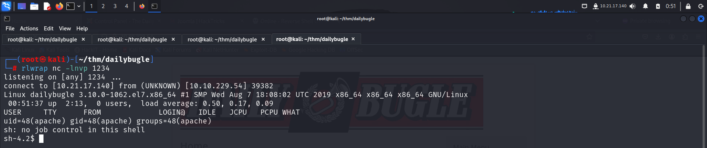
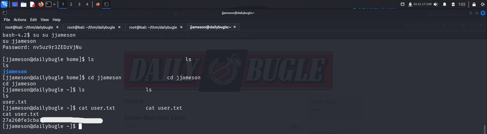
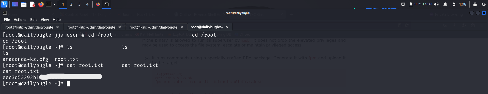

# GETTING STARTED

To access the challenge, click on the link given below:
https://tryhackme.com/r/room/dailybugle

> [!NOTE] 
> This writeup documents the steps that successfully led to pwnage of the machine. It does not include the dead-end steps encountered during the process (which were numerous). This is just my take on pwning the machine and you are welcome to choose a different path.

# RECONAISSANCE

I ran an **nmap** aggressive scan on the target to find open ports and the services running on them. It also performed a default script scan for additional information.

# FOOTHOLD

The **nmap** scan revealed an **http** server on port **80** so I accessed it from my browser. 

This seemed looked like a simple blog. The *Login Form* seemed interesting but before moving forward, I decided to check out other things. The **nmap** scan had also revealed a **robots.txt** file with a few directory paths so I decided to check that out.

Out of all the paths, only the **`/administrator`** path revealed a **login** page. Rest all were just blank pages.

After that, I ran an **nse** script on the server to find the answer to find more information. I ran the *http-enum.nse* script and found a file which contained the **joomla** version.

I googled this version and found **sql** injection articles on it.

I viewed the POC in **exploit-db** but didn't use it as the challenge asked us to use a python script instead.

I checked another article which had a link to a github repository that contained a python code.

I downloaded the script on my system and ran it against the target to get the user credentials.

The script revealed the hash for `jonah`. To find it's type, I search the **hashcat examples** page and found that it was a **bcrypt** hash.

I then used **john** and found the password.

I used the username revealed by the script and the cracked password to log into the **joomla administrative panel**

I then looked for ways I could get an RCE from here and found a way in **hacktricks**.

Hence, I first configured a **php** reverse shell payload on **revshells** with my IP and port.

Then, as stated in the **hacktricks article**, I navigated to **Templates**. Here I found out that *`protostar`* was the default template being used on the web server.

I then clicked on `Templates` and selected the `Protostar` template.

Then, I selected the **index.php** code and pasted my reverse shell code. I then saved and closed this.

Then I started an **nc** listener and visited the main page to get a reverse shell.

I explored the directories that were present in `/var/www/html` and found a set of **mysql** credentials. I looked inside the **sql** server but found nothing useful. So, I just copied the password as it could be used in the future.

Since the user flag wasn't in the `/var/www` directory, I tried checking the `/home` directory. However, when I tried going inside **jjameson**, I was denied from accessing it.

I tried switching to this user with the password I had discovered earlier which luckily worked. 

I then viewed inside the **jjameson** directory and found the user flag.

# PRIVILEGE ESCALATION

I checked my **sudo** permissions by typing `sudo -l` and found that **jjameson** could execute `yum` as **sudo** without a password.

I navigated to **gtfobins** and found a way to spawn an interactive shell as **root**.

I simply copy pasted these commands on my terminal and spawned a **root** shell.

After becoming **root**, I captured the final flag from the `/root` directory.

# CONCLUSION

Here's a short summary of how I pwned **daily bugle**:
- I discovered an administrator login panel on the server from the **robots.txt** file revealed in the **nmap** scan.
- I used the **http-enum** script to find the **joomla** version.
- The version was vulnerable to **sql** injection. I used a python POC script from [github](https://github.com/stefanlucas/Exploit-Joomla/tree/master) to get the username and hash for the panel.
- I cracked the hash using **john** and logged into the application.
- I added a **php** reverse shell script in the default template used by the application and got a reverse shell.
- I found the sql credentials in the `/var/www/html/configurations.php` file.
- I managed to switch to `jjameson` using the password found above and captured the user flag from `jjameson`'s home directory.
- I exploited **yum**'s **sudo** privilege to get **root** access and captured the final flag from `/root`.

That's it from my side!
Until next time :)

---