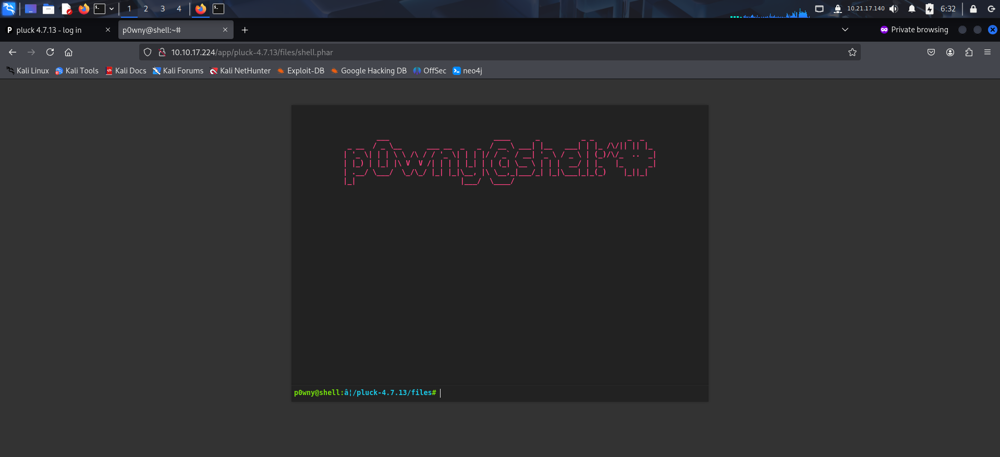
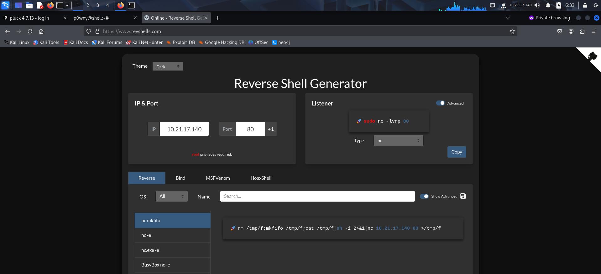
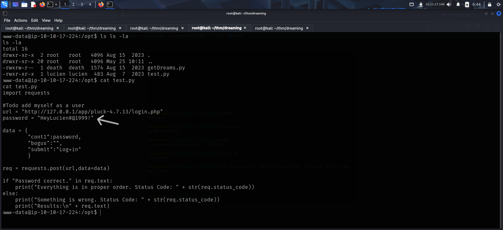
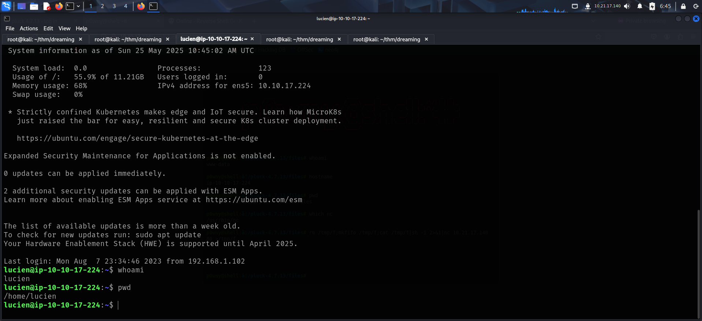
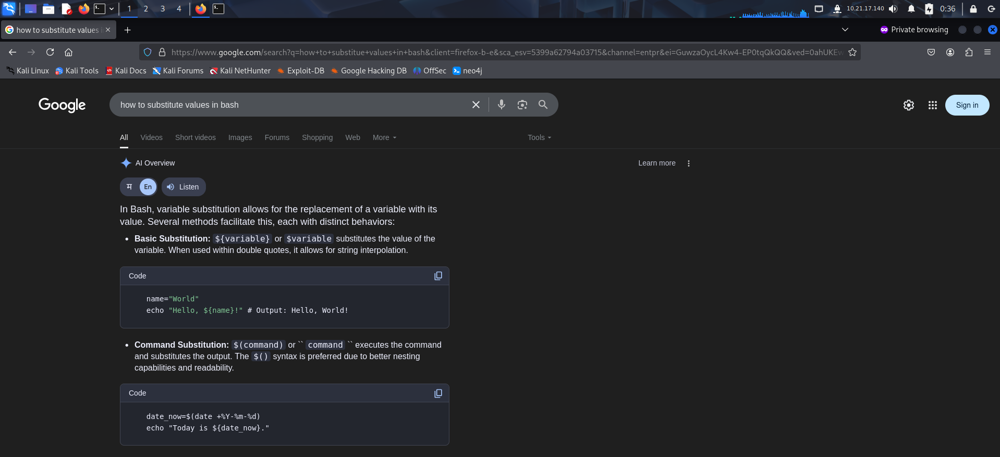
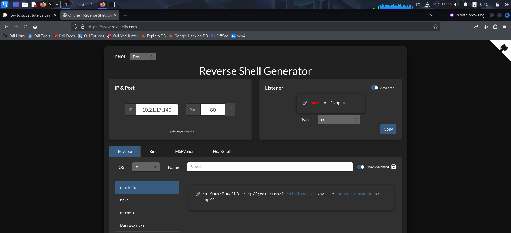
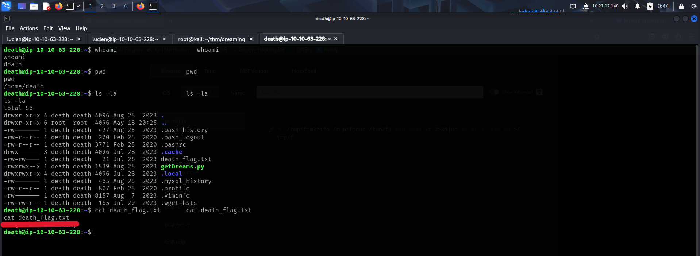

To access the machine, click on the link given below:
- https://tryhackme.com/room/dreaming

# RECONNAISSANCE

I performed an **nmap** aggressive scan to find open ports and the services running on them.

# CAPTURING THE FLAGS

The target only had **ssh** and **http** running, so I accessed the web server through my browser.

The server had a default Apache landing page. So I fuzzed for hidden directories using **ffuf**.

The endpoint had a directory listing.

I used **searchsploit** to look for exploits related to the CMS and found an interesting exploit that could be used if I had some credentials.

I clicked on *admin* and was prompted to log in.

I tried using common passwords and logged in using *'password'*.

After logging in, I downloaded the exploit on my local system and viewed it to understand its usage.

The exploit required the target IP, port, password and path to the CMS.

Hence I ran the exploit by giving it the required parameters.

I accessed the uploaded shell through my browser.

I verified if the target had **netcat** and got a reverse shell.

After getting a reverse shell, I viewed the number of users present in the system.

While exploring the file system, I found 2 python files that contained user credentials. The password of *death* was not visible but I found the password of another user called *lucien*.

I logged in as *lucien*.

I then captured *lucien*'s flag.

Listing **sudo** privileges revealed I was allowed to run a python script as the user *death*.

I ran the script to see what it does.

I had also found a script with the same name in the `/opt` directory. Examining the script revealed that there was a database named library that had a table that contained 2 columns. Both were printed on our terminal.

*Lucien*'s bash history also had the **mysql** password.

So I accessed the **mysql** server and viewed the table that was being used by the *getDreams.py* script.

I wanted to substitute the value of the *dream* column with a command's execution. So I looked for ways I could do it on google.

After finding a way to substitute values, I used a revshells script to get a reverse shell as the use *death*.

After getting a shell as *death*, I captured *death*'s flag.

I then viewed the python script and found *death*'s password.

I now only needed to find the flag of morpheus. So I viewed that user's files and found a pythons script.

Since it was a python script that imported libraries, I looked for writable files inside the `/usr/` directory hoping to find something interesting and found I had write permissions on **shutil.py**.

I copied a python reverse shell payload and replaced the contents of **shutil.py** with it. I then started a **netcat** listener.

After some time, I received a reverse shell.

Finally, I captured *morpheus*'s flag

That's it from my side!
Until next time :)

---
