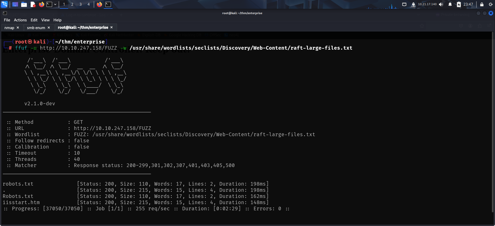
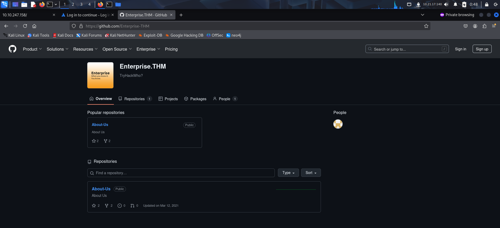
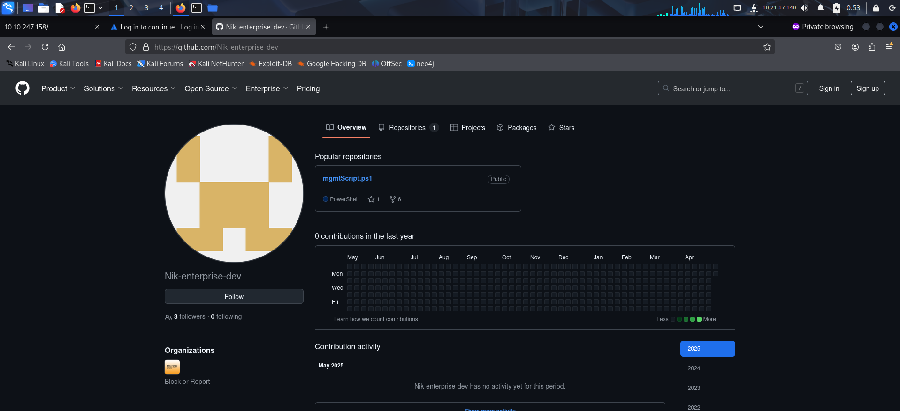

To access the machine, click on the link given below:
https://tryhackme.com/room/enterprise

# SCANNING

I performed an **nmap** aggressive scan on the target to find open ports and the services running on them.


# FOOTHOLD

I accessed the web application running on port 80 and 7990.


I fuzzed hidden files and found a *robots.txt* file on the domain controllers web app. This seemed wierd so I accessed it through my browser.




However, I did not get any useful information.


I then looked for smb shares using **smbclient**.


There were 2 interesting shares. So I first accessed the *docs* share and downloaded the files present in it.


Both the documents were password protected, so I couldn't open it.


I then accessed the *Users* share.


It had a bunch of files so I downloaded everything.


I used the `find` command to look for files containing words like `history` or `secret` or something similar in their name and examined them.

```bash
find /root/thm/enterprise/APPADMIN/ -type f -name "*history*"
```

I found a credential inside a file called `Consolehost_history.txt`.


I tested the credential to see if I could use it for command execution but failed.


The atlasian login page said they were shifting to github, so i looked for its github.


I found the organization on github and viewed its peoples.




I accessed the user profile and viewed the uploaded script and found a new set of credentials.




These were valid credentials but it didn't allow us to execute commands. 


I used these credentials to look for any other share that might be reserved for the user.


I then enumerated the users and found  the credential of another user in its description.


I tested these creds aswell but it didnt provide access to the system.


I then looked for kerberoastable accounts and got the kerberoast hash for the user `bitbucket`.


I then cracked the hash using **john**


Finally, I accessed the machine using this credential. Through **rdp**.


I then accessed the user flag from the Desktop.


# PRIVILEGE ESCALATION

I downloaded few tools for enumerating privilege escalation vectors.
- PowerView
- PowerUp
- Sharphound


I first ran **sharphound** for comprehensive enumeration.


I downloaded the zip created by sharphound through smb share and uploaded it on **bloodhound**.


I found an interesting permission. The *Replication* user was allowed to perform **dc-sync**.


I then ran **PowerUp** to look for misconfigurations in the local system.


It discovered an **unquoted service path** vulnerability.


I then verified my access on the path of the exe.


Since I had access, I created a payload using **msfvenom** and upload it on the vulnerable path.


Finally, I started a listener on my local machine and restarted the service.


Finally, I got a reverse shell as **nt authority\system**.


I then captured the root flag from **Administrator's** desktop.


---
