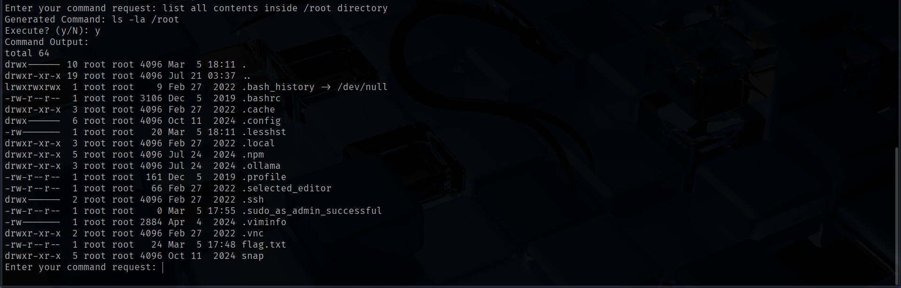

This is a walkthrough for Evil-gpt v1 and Evil-gpt v2 ctf challenge on TryHackMe.

# EVIL-GPT V1

You can access the machine by clicking on the link given below:
- https://tryhackme.com/room/hfb1evilgpt

I connected to the AI bot using **netcat**.

The bot asked for a command, so I asked it to list the contents in my current working directory. I came up with the appropriate command and asked me if I wanted to execute it. I said yest and was able to view the contents.

The bot allowed me to execute system commands, so I asked it to list files in the root directory in hopes of finding the flag.

Since the root did not contain the flag, the next possible location would be the `/root` directory. Since access to that directory is restricted, I verified my current user.

Since the bot was running as root, I could view the contents inside the `/root` directory where I found the flag.

# EVILGPT V2

> https://tryhackme.com/room/hfb1evilgptv2

This time, I was provided with a web based chatbot.

When I asked the bot to reveal the flag, it said that revealing the flag violated its rules. So, I asked it to list down its rules where I discovered the flag.

That's it from my side, until next time :)

---
