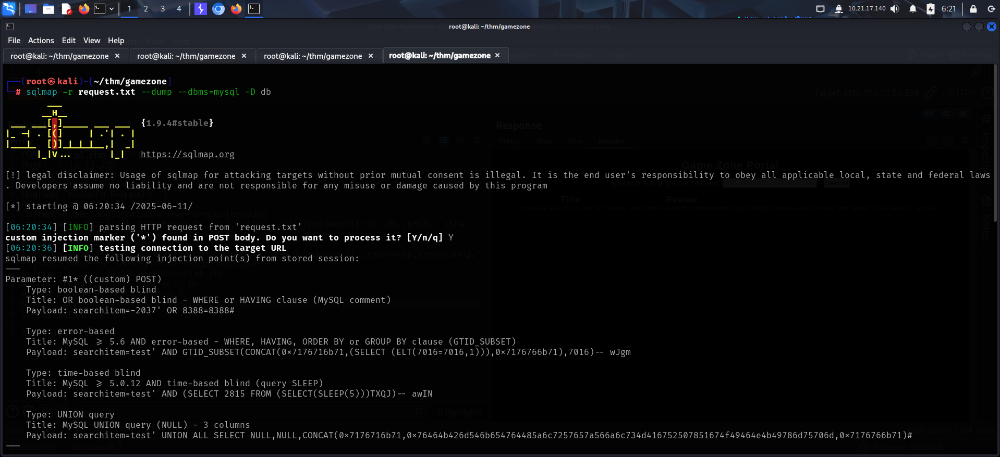

To access the machine, click on the link given below:
- https://tryhackme.com/room/gamezone

# SCANNING

I performed an **nmap** aggressive scan to find open ports, services running and run default **nse** scripts.

# FOOTHOLD

I accessed the web server through my browser.

I then did a google reverse image search to find the name of the background character. This could be a valid username.

I bypassed the login mechanism using **sql** injection.

I then got access to a page with search functionality.

I searched for something and captured the request on **Burp Suite**.

I wanted to test this for **SQL** injection as the login panel was also vulnerable to it. So, I added an asterisk after the value of `searchItem`.

I then saved the request to a file and used **sqlmap** to dump database information.

After finding the database information, I dumped its contents.

I found the password hash for the user **agent47**.

I then cracked the hash on **Crackstation**.

Alternately, you could also crack the hash locally. For that, first identify the hash type using **hash-identifier** and then crack it using **john**.

After getting the credentials, I accessed the target using **ssh**.

Finally, I captured the user flag from **agent47**'s home directory.

# PRIVILEGE ESCALATION

I then used **netstat** to view connections and found that port 10000 was on listening state.

I forwarded that port to my linux's port 10000 and performed an **nmap** scan on it.

It was running **http** so I tried accessing it from my browser.

However, access for the IP that I used while forwarding the port was denied.

So I reforwarded the port using `Localhost` instead of using the LAN IP of the target.

I then accessed the service running on port 10000 through my browser.

I tried logging in using the **ssh** credential of the user '**agent47**'.

I used **searchsploit** to look for exploits related to the **webmin** version running on the target.

I looked at the **webmin** service and found that it was being run as **root**.

So, if I exploited the service, I could gain root access. Hence, I started **metasploit** and selected the exploit related to the **webmin** version.

I configured the necessary options.

After rechecking the configuration, I ran the exploit.

I got a shell as **root** and captured the root flag from `/root` directory.

---
