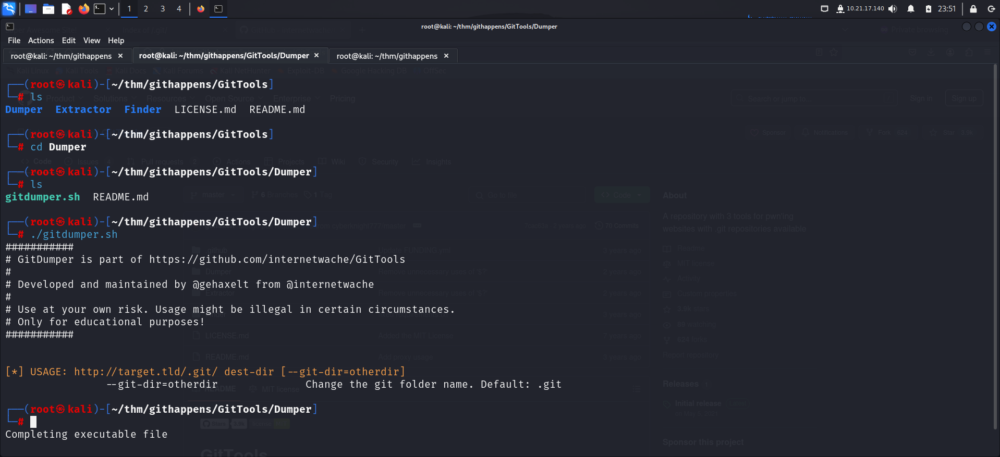
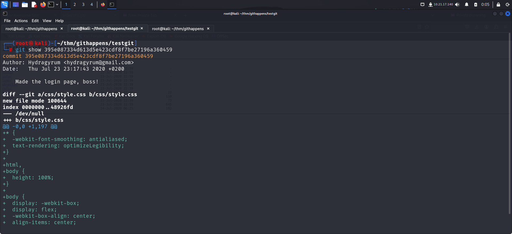

> Welcome to my writeup where I am gonna be pwning the **GitHappens** from TryHackMe. This challenge has 1 flag. Let’s get started!

# GETTING STARTED

To access the challenge, click on the link given below:
https://tryhackme.com/r/room/githappens

> [!NOTE] 
> This writeup documents the steps that successfully led to pwnage of the machine. It does not include the dead-end steps encountered during the process (which were numerous). This is just my take on pwning the machine and you are welcome to choose a different path.

# RECONNAISSANCE

I started of by performing an **nmap** aggressive scan to find open ports and services running on the machine.

# CAPTURING THE FLAG

The scan revealed port 80 to be up and running. It also found a directory `/.git` on the website. I visited the website from my browser.

To find more directories, I performed a web fuzzing using **ffuf**

The fuzz scan revealed another page `dashboard.html`. I then navigated to `/.git` and found contents of a git repository. 

In order to make working with it more convinient, I used **[gittools](https://github.com/internetwache/GitTools)**.
It contains a script called **gitdumper**. This tool can be used to download as much as possible from the found `.git` repository from webservers which do not have directory listing enabled. I used it to copy the contents from the site to my local machine.

I viewed the status of the repo using **`git status`** and found a lot of files had been deleted.

I then viewed logs to find information about the commits that were made using **`git log`** command.

The commit with **`Made the login page, boss!`** comment looked interesting. So I viewed the information that was sent in that commit using **`git show`** command.

Here I found the hardcoded credentials for the **login** page.

I entered these credentials and tried logging in but I didn't get any response from the website. So I revisited the commit to look for more information.

I found another message that I had skipped previously. The flag was the password used to log in. So I submitted the password on **tryhackme** and solved the challenge.

Thats it from side :)
Until next time

---