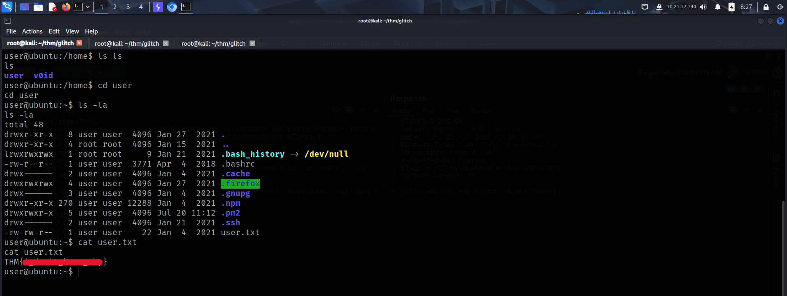
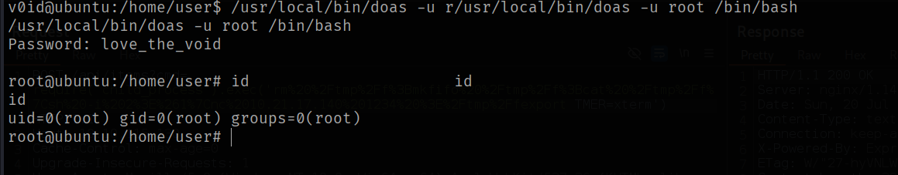

To access the machine, click on the link given below:
- https://tryhackme.com/room/glitch

# SCANNING

I performed an **nmap** aggressive scan to identify open ports and the services running on the target.

# FOOTHOLD

I visited the website running on the target and found nothing interesting at first.

It's source code revealed an interesting endpoint.

I used **Burp**'s **Repeater** to then send a `GET` request to the endpoint and received a base64 encoded token.

I used the **Decoder** tab to then decode this token and added this as the cookie value on the web page.

Refreshing the site now revealed the actual web content.

However, again there was nothing special.

The source code of this page used a **javascript** file which could contain new endpoints.

I viewed the file and found another endpoint.

Then I used **Repeater** to send a request to this endpoint and got another list of items.

I then switched the HTTP method to **POST** and received something unusual, maybe we could send some value through an argument...

I used **ffuf** and found the argument that could be used to send the value.

Next I sent a value with the argument and received an interesting message.

When I switched the number value to an alphabet, the application threw an error. The error was thrown by the **eval** function of **node.js**.

A simple **google** search revealed a way to exploit this and execute our commands.

I then used **revshells** to generate a reverse shell payload.

Finally, I started a **netcat** listener and exploited the vulnerability to get a reverse shell.

After gaining shell, I stabilized it.

Finally, I captured the user flag from *user*'s home directory.

# PRIVILEGE ESCALATION : 1

I checked for binaries with **SUID** bits. I noticed the **pkexec** binary and thought of giving the **PwnKit** exploit a try.

I downloaded the exploit code on the target system and provided it executable permission.

Upon executing it, I received root access.

I then captured the root flag from *root*'s home directory.

# PRIVILEGE ESCALATION : 2

The exploitation of **pkexec** was most likely an unintended way of gaining root access. So I again listed the binaries with **SUID** bits and this time, used the `doas` binary for privilege escalation.

Before using the `doas` binary, I decided to go through the existing information in my directory. I found a folder for **firefox**. This folder could contain user credentials.

When I listed the contents of the directory, I found the credential files:
- **key4.db**
- **logins.json**

I transferred both the files using **netcat**.

After transferring both the files to my local system, I used the **firepwd** tool to decrypt and reveal any passwords stored in them.
- https://github.com/lclevy/firepwd

The files revealed *v0id*'s password. So, I used it to switch to the *v0id* user.

After switching to *v0id*, I ran the `doas` binary to spawn a **bash** shell as *root*.

---
