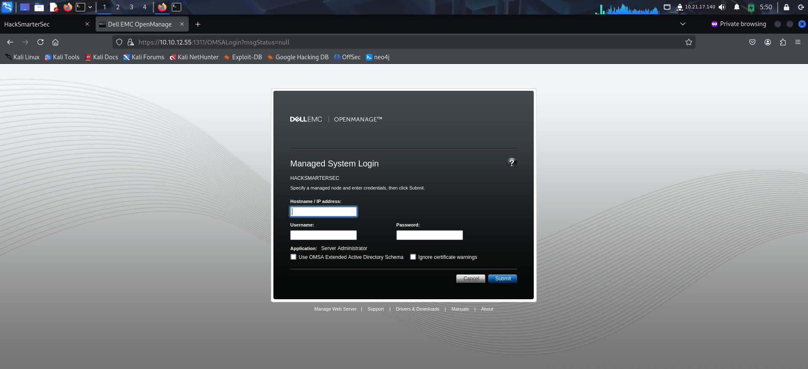
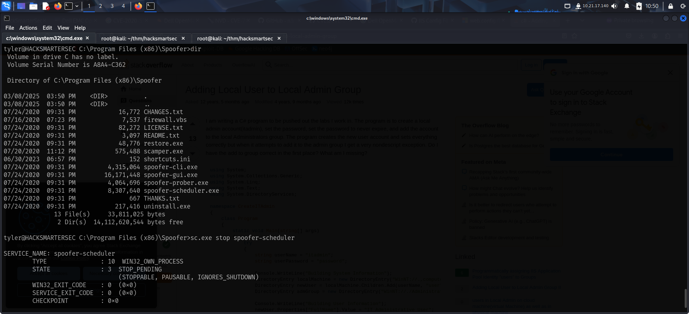

Link to machine : https://tryhackme.com/room/hacksmartersecurity

# SCANNING

I performed an **nmap** aggressive scan to reveal open ports and the services running on them.

# FOOTHOLD

The **nmap** scan revealed a web server running on port 80 and port 1311. So I accessed them using my browser. 

I found a dell emc login panel.

I also got it's version.

I searched for exploits for the management system and found a file read vulnerability.

I read about the vulnerability and found that I was allowed to read files from the system.

I found a PoC on github that I downloaded.

I then ran the exploit and tried reading the default configuration file on IIS servers.

Since that was successful, I read the **web.config**. This is present in the **inetpub/wwwroot** folder.

Here, I found the password so I used it to log in using **ssh**.

Finally, I captured the user flag from Desktop.

# PRIVILEGE ESCALATION

I downloaded and tried running **winPEAS**, **PowerUp** but both of them got blocked by firewall.

I then downloaded **PrivescCheck** and ran it to get attack paths.

Here I found a binary with **Unquoted Service Path**. I queried the service using **sc.exe** to validate the findings.

I then looked for my permissions on the path and found I had full control over the service folder.

At first, I created and tried exploiting an **msfvenom** payload but it got blocked by firewall. So, I created a simple binary using **c** to add my current user to the local administrators group.

I downloaded this payload on the target. I then stopped the service, replaced the original service binary with my payload, started the service and then reloaded the system.

I then exited the **ssh** session and started a new one. I was successfully added to the local administrators group.

I then captured the root flag from *Administrator*'s Desktop.

That's it from my side!
Until next time :)

---
