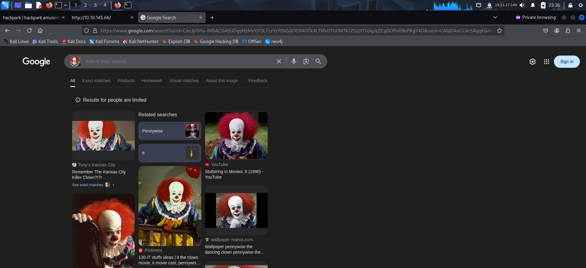
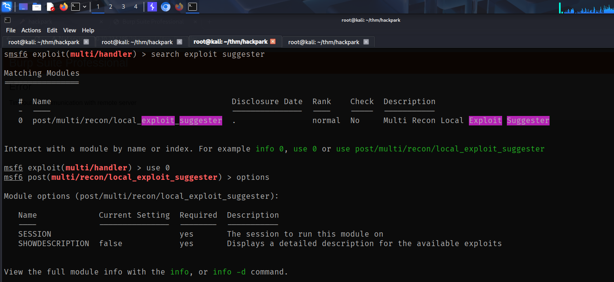

To access the machine, click on the link given below:
- https://tryhackme.com/room/hackpark

# SCANNING

I performed an **nmap** scan to find open ports and the services running on the target.

# FOOTHOLD

The nmap revealed 2 open ports. So I viewed the web application running on port 80 through my browser.

The clown shown on the web page could be related to the target, so I did a google search and found his name.

Inspecting the source code revealed the version of the blogging application that was running.

**searchsploit** revealed an RCE and directory traversal vulnerability related to this particular version.

Before moving forward with the exploit, I visited the *robots.txt* endpoint that was discovered by **nmap**. Here, I found some new endpoints.

I accessed the endpoints but found nothing interesting.

I fuzzed for directories found some interesting endpoints.

Accessing the *admin* endpoint redirected me to a login page.

The home page contained a post with the author name. Clicking on it revealed a username called 'admin'.

I then sent a request from the login panel and captured the request on **Burp Suite**.

I then used **hydra** to bruteforce the password of the admin user from the *rockyou.txt* wordlist.

After finding the password, I logged into the application.

I was then able to access the admin panel.

The About section also revealed the identity of the user running the application.

I now download the RCE exploit.

I read the description of the exploit on **Exploit-DB**.

I also edited the exploit and added my local address to get a reverse shell.

I then followed the instructions given in the description to get upload my payload.

After uploading the payload, I accessed the endpoint and got a reverse shell on my **netcat** listener.

# PRIVILEGE ESCALATION

The shell was unstable so I created a *temp* directory to hold payloads.

I then created a payload for a **meterpreter** shell using **msfvenom** and hosted it locally on an **http** server.

I downloaded this payload on the target and executed it to get a stable reverse shell on my **metasploit** listener.

After getting access, I backgrounded my session and used the **local_exploit_suggester** post module to get post exploitation modules.

Since the post module detected UAC related vulnerability, I could directly exploit this from my **meterpreter** session. So I entered my session and used the **getsystem** command to escalate my privilege.

After getting *NT AUTHORITY\SYSTEM* access, I captured the user flag from *jeff*'s Desktop and the root flag from *Administrator*'s Desktop.

After capturing the flag, I migrated my shell to a 64 bit service.

I then uploaded **PowerUp**.

From the unprivileged shell, when I ran the **PowerUp** module and **Invoke-AllChecks** command, I found the administrator password.

That's it from my side, until next time !

---
