To access the machine, click on the link given below:
https://tryhackme.com/room/ice

# SCANNING

I performed an **nmap** aggressive scan on the target to identify open ports and the services running on them.

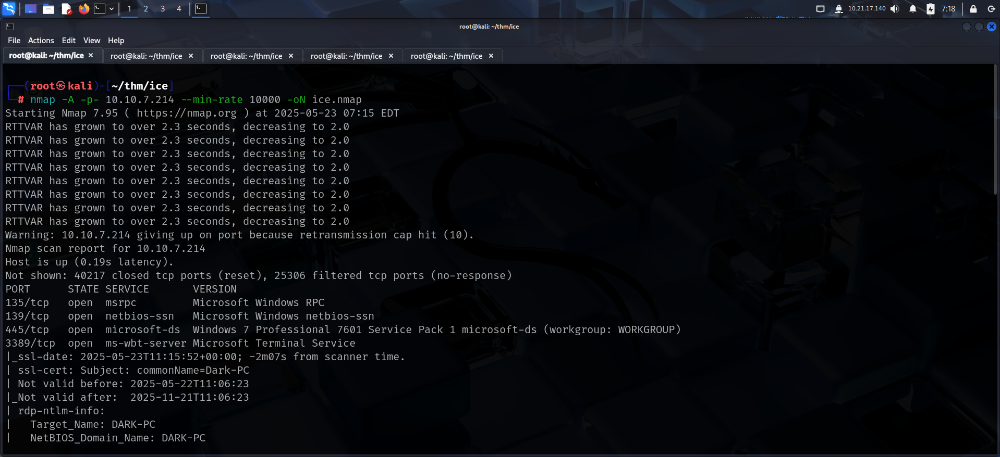

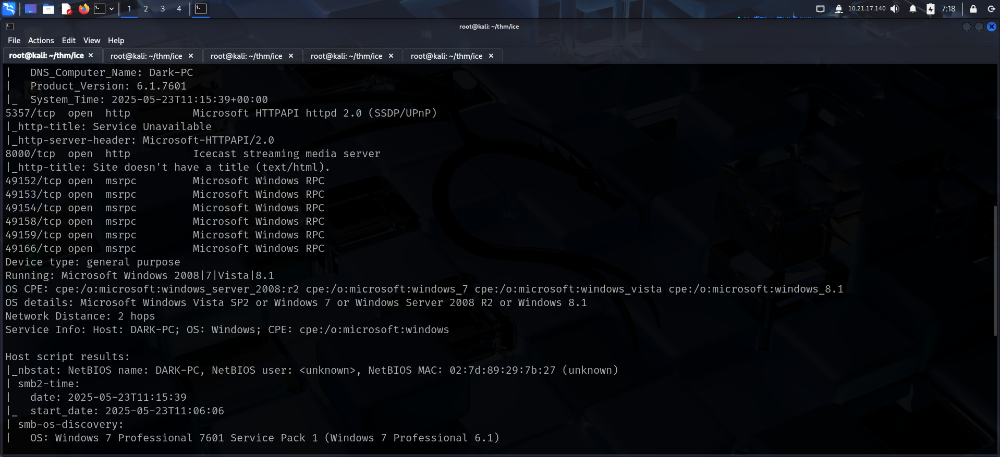

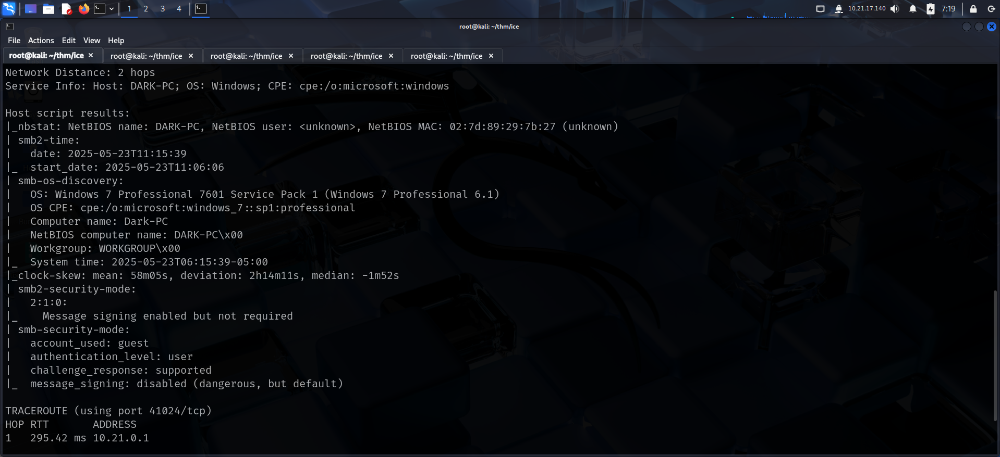

# FOOTHOLD

The **nmap** scan revealed an interesting service running on port 8000 so I accessed it.

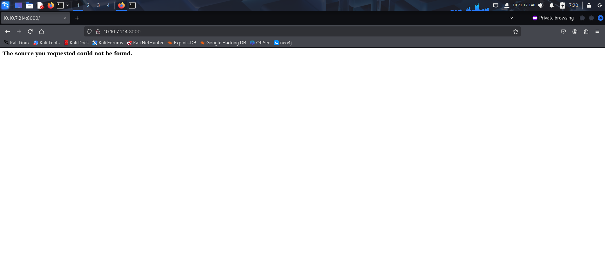

The room had the following link for reference:
https://www.cvedetails.com/cve/CVE-2004-1561/

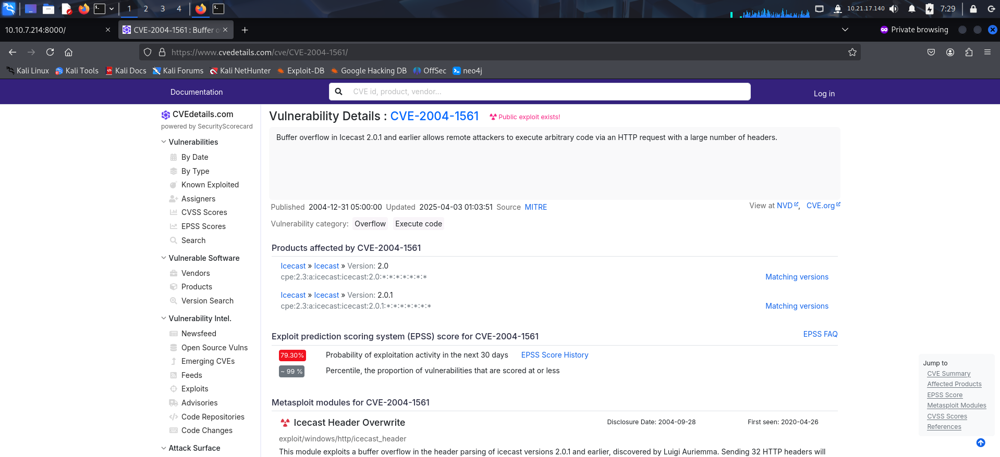

The **Icecast** service running on port 8000 seemed to be vulnerable to code execution. **Metasploit** contained an exploit that could be used for this. So I started the **metasploit** framework and selected the appropriate exploit.

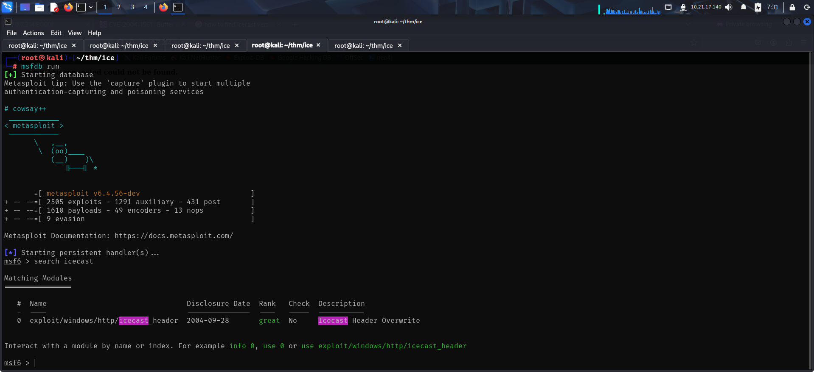

I configured the required options and ran the exploit to get a reverse meterpreter shell.

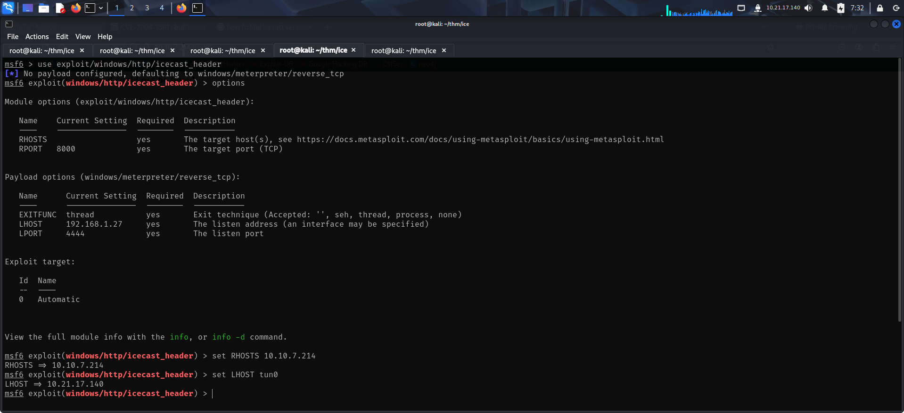

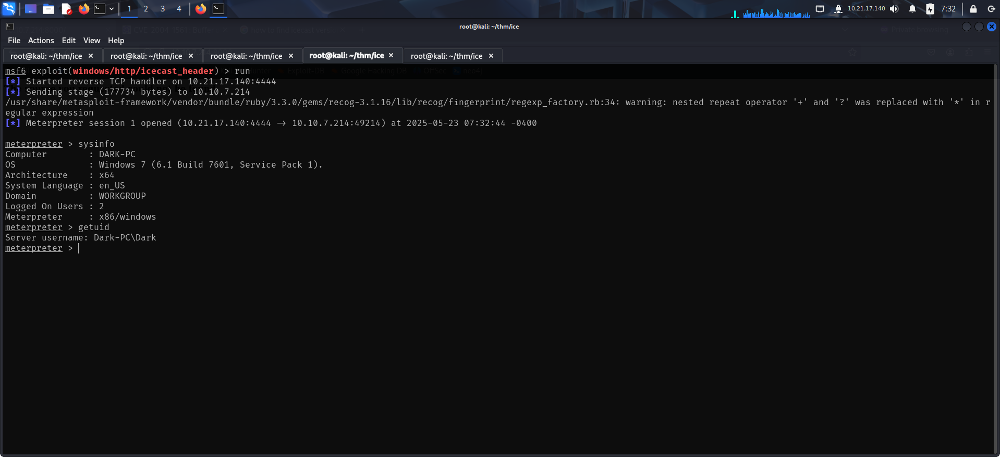

# PRIVILEGE ESCALATION

I used the `local_exploit_suggester` post module to look for privilege escalation vectors.

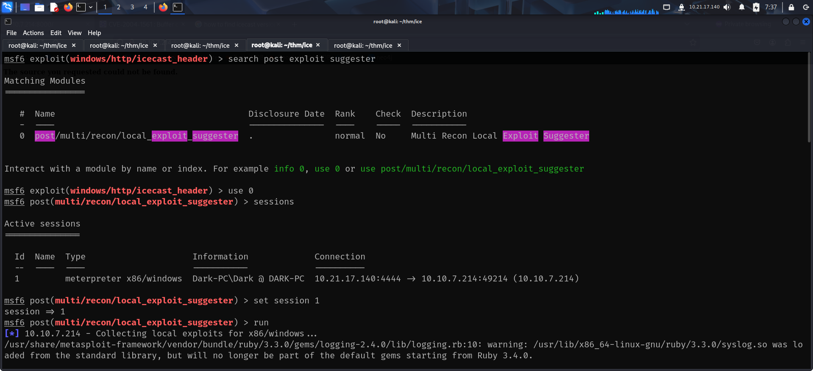

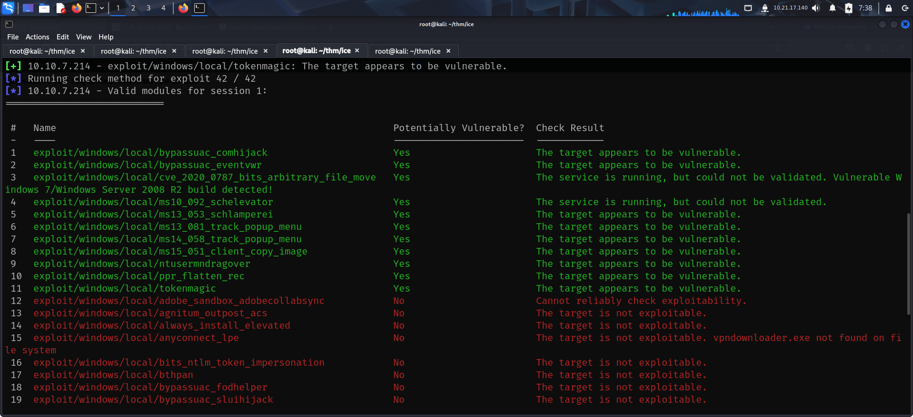

I then used a privilege escalation module and ran it to escalate my privilege.

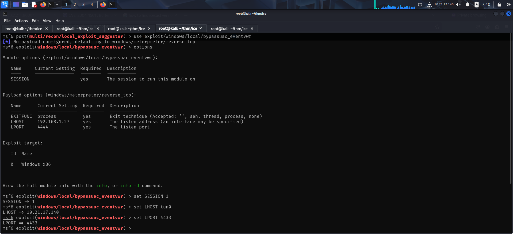

I was still running as Dark user but had admin privileges.

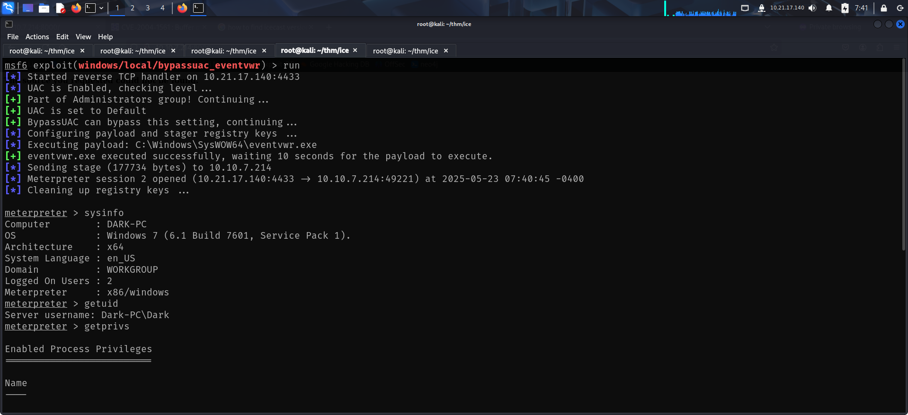

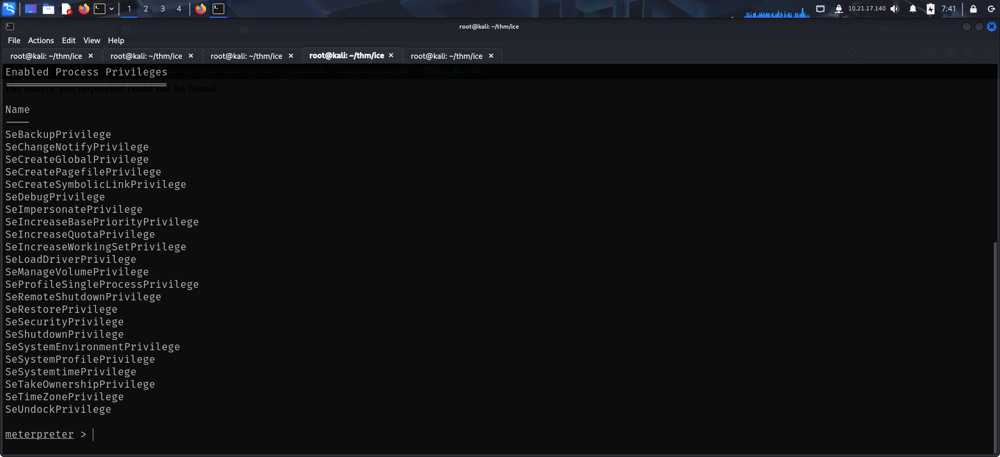

I then listed running processes in the target and found **spoolsv** to be running as NT Authority.

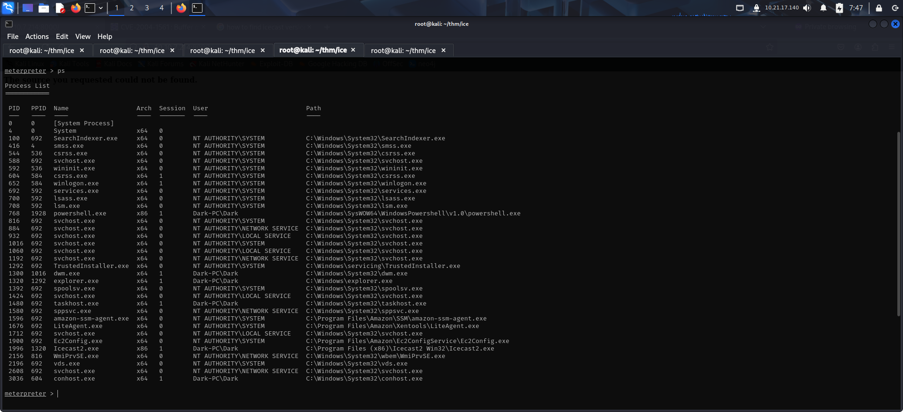

I migrated to the process and got NT Authority access.

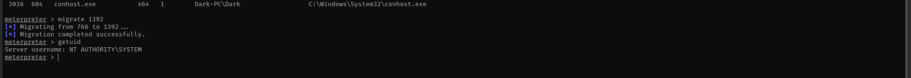

I then loaded **mimikatz** using the **kiwi** extension of **metasploit**.

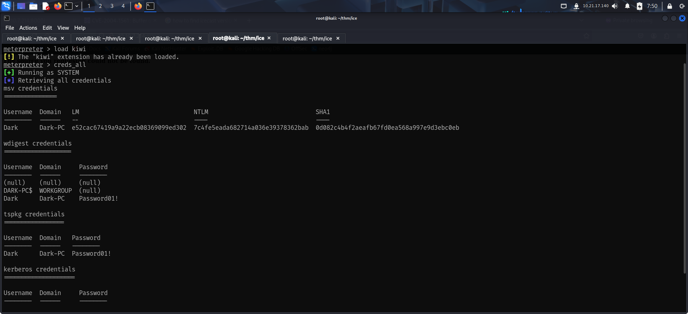

I also dumped the Administrator hash using the **hashdump** command in meterpreter.

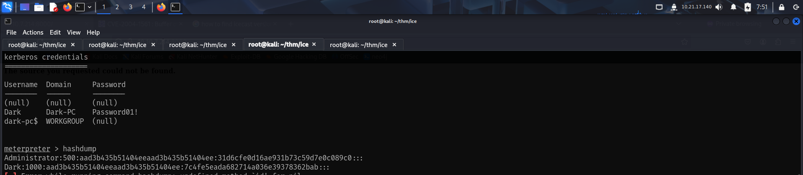

---
