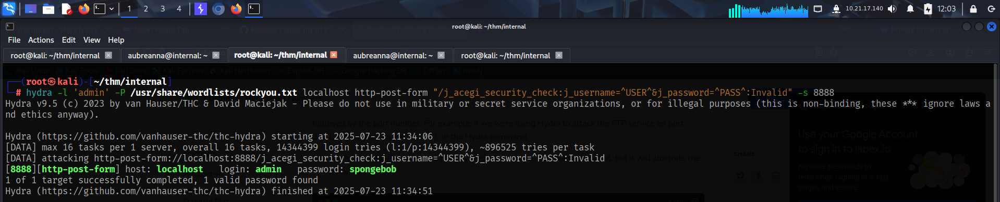

To access the machine, click on the link given below:
- https://tryhackme.com/room/internal

# RECONNAISSANCE
I performed an **nmap** aggressive scan on the target to find open ports and the services running on them.

# FOOTHOLD
I mapped the domain *internal.thm* with the IP in my *host* file and accessed the web application through my browser.

I then used **ffuf** to fuzz for hidden directories and found a wordpress installation.

The `/blog` endpoint also pointed towards **wordpress**

Since, it was **wordpress**, I tried accessing the *wp-login* endpoint. I tried common username passwords but couldn't log in.

The `/wordpress` endpoint pointed to a page that did not exist.

I then went back to the `/blog` endpoint and viewed a blog that was posted. The author could be a valid user.

I then fuzzed for hidden files using **ffuf** but found nothing interesting.

I switched back to the *wp-login* endpoint and verified if *admin* was a valid username.

With no other leads, I tried bruteforcing the *admin* password using **hydra** and found it.

I then logged in to access the **Wordpress** dashboard.

With access to the **wordpress** dashboard, I could get a reverse shell. I referred to **hacktricks** and got a reverse shell by changing the *404.php* template with a **pentestmonkey**'s php reverse shell and calling the endpoint to trigger the payload.

# PRIVILEGE ESCALATION : 1

After receiving the shell, I viewed the */home* directory and found a user called *aubreanna*. However, I did not have the privilege to view the contents inside it.

I then viewed the wordpress installation directory.

The config file often contains sensitive information, so I viewed the *wp-config* file and found the **mysql** credentials.

I then logged into the server and looked at the contents present inside the *wordpress* database.

However, I found nothing except the *admin* user's hash.

I then looked for uncommon binaries with **SUID** bit set

I found **pkexec** and decided to give the **PwnKit** exploit a try. If it worked, I could directly get *root* access.

I also explored other folders and found the credentials for *aubreanna* in a text file inside the */opt* directory.

I then downloaded the **PwnKit** exploit and gave it executable permissions.

Upon executing the exploit, I got root shell.

With root access, I could read the contents of both, user flag and root flag.

However, this privesc vector was unintended.

# PRIVILEGE ESCALATION : 2

I logged in to the system as *aubreanna* using **ssh**.

I found a note inside my home directory that said there was a jenkins service running internally on some IP.

I viewed my IPs and realized that the **jenkins** server was likely running on an internal machine and not locally.

So, I performed a local port forward to be able to access **jenkins** hosted on the internal network from my local port 8888 through the compromised machine.

I then accessed **jenkins** through my browser.

I fuzzed for hidden directories and found a bunch of interesting endpoints.

However, none of them contained anything special. They just threw a *404 not found* error.

With no other leads, I looked for default credentials and found a username.

I tried the username with common passwords but failed to log in.

I then brute forced the password using **hydra** from the **rockyou** wordlist.

After logging in, I was lost. So I referred to **hackingarticles** and found a way to execute **groovy** scripts.

I visited **revshells** and configured a **groovy** script that I could run on the **jenkins** server and receive a reverse shell on my **netcat** listener.

After executing the script, I received a reverse shell.

I then explored the system and found root user's password inside a text file in the */opt* directory.

With the *root* password, I could simply switch my user for a privileged access.

That's it from my side!
Until next time :)

---
