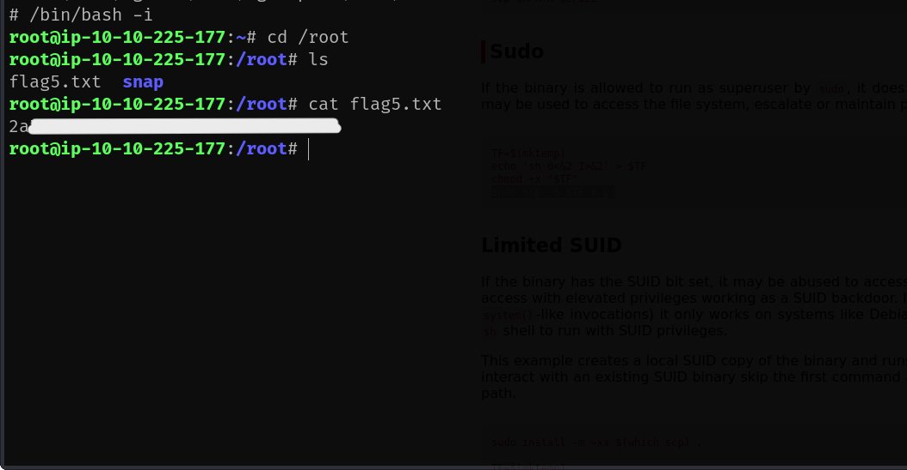

To access the machine, click on the link given below:
- https://tryhackme.com/room/jurassicpark

# SCANNING

I performed an **nmap** aggressive scan to find open ports, service info and script scan results on the target.


The target had only 2 ports open:
- Port 80 : http
- Port 22 : ssh

# FOOTHOLD

I accessed the web application through my browser.


I clicked on the *online shop* and was given an option to select a package.


I clicked on a package and noticed that the package details was being fetched using the **`id`** parameter. I tried adding a **`'`** to see how the application behaved to it.


It instantly triggered an error.


Scrolling to the bottom of the page revealed a challenge.


I then fuzzed for files in the web application and found *robots.txt* that could contain path to interesting endpoints.


However, there was nothing.


The only page left to inspect now was the *item.php* where an error was thrown upon sending a **`'`** in the **`id`** parameter. I viewed the source code and found that the target was running **MySQL** database.


Since, I was dared to use **sqlmap**, I tried using it. However, it was taking a long time and wasn't giving the expected results.


Hence, I switched to manual testing. I captured the request made for the package on **Burp Suite** and sent it to **Repeater**.


Since **`'`** was causing an error, I added a true statement directly after the **id** value. 

The payload that I used:
```
+OR+1=1
```

There was a visible change in the response of the web app.


When I sent a false statement, no results were found.

```
+AND+1=2
```


I then had to find the number of columns. I used **`ORDER BY`** query for the same.

```
+ORDER+BY+1
```


When I tried sorting the result based on column number 6, I received an error. Hence, I could conclude that the table being used had 5 columns.

```
+ORDER+BY+6
```


I then used **`UNION`** to find columns that were returned to us on the web page.

```
UNION+SELECT+1,2,3,4,5
```


My usual methods did not work and was being blocked so I searched online to see if there was any another way.


I used the below query to find the name of the current database.

```
+UNION+SELECT+1,DATABASE(),3,4,5
```


I then used the below query to find the version of the server

```
+UNION+SELECT+1,version(),3,4,5
```


I then queried the table name from the current database.

```
UNION+SELECT+1,table_name+3,4,5+FROM+information_schema.tables+WHERE+table_schema=database()
```


Then I queried the column name for the *users* table.

```
UNION+SELECT+1,column_name,3,4,5+FROM+information_schema.columns+WHERE+table_name="users"+AND+table_schema=database()
```


I then extracted password from the table.

```
UNION+SELECT+1,password,3,password,5+FROM+users
```


I found a password. The question on **Tryhackme** already provided a username called **Dennis**. So I checked if it was a valid **SSH** credential.


I then sent the package request to **intruder** and added the payload marker at the `id` parameter.


I set the payload sets to Number and gave a range from 0 to 50.


When I ran the attack, I found out another valid **id** value that wasn't visible on the package selection page.


This **id** revealed the same user that was specified on **TryHackMe**'s task question.


At this point, I was a little lost, so I tried viewing all the columns that were present in the current table.

```
+UNION+SELECT+1,GROUP_CONCAT(column_name)+3,4,5+FROM+information_schema.columns+WHERE+table_name="users"+AND+table_schema=database()
```


I retried the username and password against **ssh** and changed the letter case of the username...


I used the username and password to log into the target using **ssh**.


Finally, I captured first flag.


# PRIVILEGE ESCALATION

I then looked at me **sudo** privileges and found that I was allowed to run **scp** as root.


My directory also contained a *bash_history* file which would contain a log of commands entered on the terminal.


Viewing the *bash_history* file revealed the third flag. I also got a hint of the location of the fifth flag.


I copied the *shadow* file to see if it had the root password hash.


I then visited **GTFOBins** and found a way to exploit the **sudo** privileges on **scp**.


I followed the method shown on the website and spawned a shell as root.


I captured the fifth flag from */root* directory.



Since, I had root access, I used the **find** command to search for the second flag.


I also found the location of the second flag inside *ubuntu* user's bash history file.


I then captured flag two.


> PS: There is no flag 4.

That's it from my side!
Until next time:)

---
