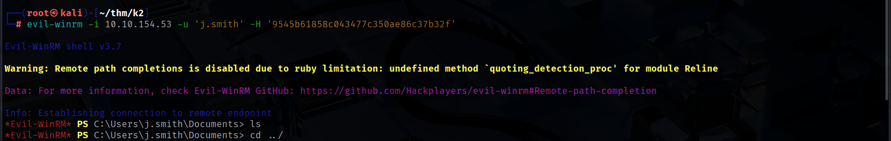

# SCANNING

I performed an **nmap** aggressive scan on the target to find open ports and services running on them.

# FOOTHOLD

I used the usernames found on middle camp to enumerate valid users on this system.

I then tried the passwords and hash that I had found on **middle camp** and **base camp** against *j.smith* user and found that the **middle camp** administrator hash was valid.

I then accessed the machine using **evil-winrm**.

I found another user on the system called *o.armstrong*.

The `C:\` directory contained an interesting directory called *Scripts*.

It contained a script that copied the contents from *o.armstrong*'s desktop to documents.

This was likely a scheduled task. If I could modify this, I could execute commands as *o.armstrong*. So, I looked at my permissions and found that I had privileges on the *Scripts* folder. I could replace the script with a custom one which would allow me to execute commands of my choice.

So, I renamed the original script and tried adding a reverse shell payload in a new *backup.bat* script. However, I was blocked by antivirus.

Instead of getting a reverse shell, I tried capturing the NTLM hash by making the user try and access a share. While accessing the share, the user would authenticate with their NTLM hash and hence I could capture it.

I started responder and after some time, received *o.armstrong*'s NTLM hash.

I saved the hash in a file and cracked it using **john**.

Finally, I accessed the system as *o.armstrong*.

I then captured the user flag from *Desktop*.

# PRIVILEGE ESCALATION

I used *o.armstrong*'s credentials to enumerate the system with **bloodhound**.

I discovered that our user *o.armstrong* had **GenericWrite** permission over the *K2ROOTDC.K2.THM* account.

Hence, I could exploit this using **resource based constraint delegation**.

Hence, I first created a computer account. And then gave it permission to for delegation. This account could act on behalf of other accounts (even domain admins).

I then requested a service ticket (TGS) to access `cifs` of *k2rootdc.k2.thm* on behalf of administrator and exported the ticket to the **KRB5CCNAME** variable.

Finally, I performed DC-SYNC / dumped secrets using the kerberos ticket and found the administrator hash. 

I then accessed the target as *administrator* and captured the root flag.

That's it from my side!
Until next time :)

---
