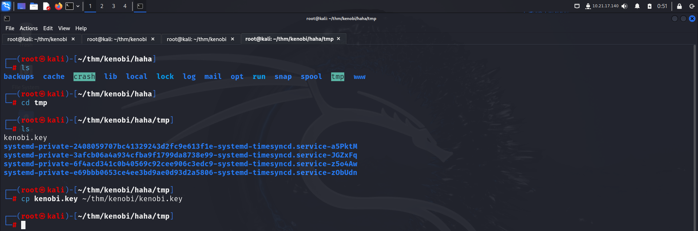
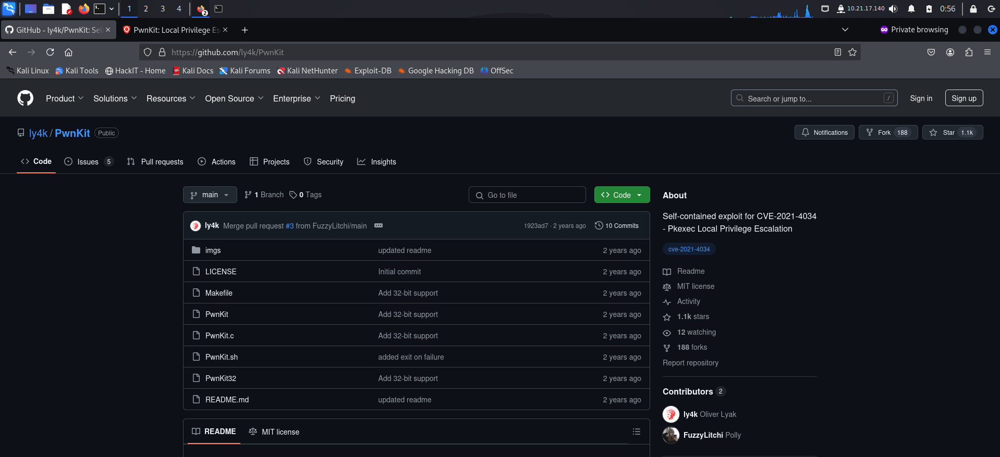

> Welcome to my writeup where I am gonna be pwning the **Kenobi** machine from **TryHackMe**. This challenge has two flags, and our goal is to capture both. Let’s get started!


# GETTING STARTED

To access the challenge, click on the link given below:
https://tryhackme.com/r/room/kenobi

> [!NOTE] 
> This writeup documents the steps that successfully led to pwnage of the machine. It does not include the dead-end steps encountered during the process (which were numerous). This is just my take on pwning the machine and you are welcome to choose a different path.

# RECONNAISSANCE

I performed an **nmap** aggressive scan to find open ports and the services running on it.


The scan revealed various services like **ftp**, **ssh**, **http**, **smb** and **nfs** to be running on the system.

# INITIAL ACCESS

Since the target had an **smb** server, I performed enumeration using **nmap** and listed the shares present on the target.


I connected to the **anonymous** share and downloaded a file called **log.txt**

```bash
smbclient //10.10.146.176/anonymous
ls
get log.txt log.txt
```


The logs file revealed interesting information like a user, path to their ssh key etc.

I then checked the directory that was shared by the target over **nfs**


I then searched **exploit-db** for exploits related to the **ftp** version running on the target.


I downloaded the exploit information on my system and analyzed it.


The file revealed that the **ftp** version running on the target allowed unauthenticated clients to copy files and paste files within the system. Since I had discovered the **`/var`** folder to be mounted over **nfs**, I created a directory and mounted it to the server so that I could access the files inside `/var` directory.


After that, I followed the instructions given in the POC. I connected to the **ftp** server using **nc** and used the **`SITE CPFR`** to copy **kenobi's** private key and **`SITE CPTO`** to paste it in the `/var/tmp` directory.


I then copied the private key onto my system from the **nfs** mounted directory.



I fixed the file permission and logged into the target as **kenobi** via **ssh**.


I then captured *user.txt* from **`/home/kenobi`**.


# PRIVILEGE ESCALATION : EXPLOITING PKEXEC

I listed binaries with **suid** bits using the following command:

```bash
find / -user root -perm -u=s -ls 2>/dev/null
```

Here I found **pkexec**. Since I had faced exploited this binary in the past, I googled the **pwnkit exploit**.




From the **github** repo, I downloaded it onto my system and transferred it to the target.


Upon executing the exploit, I got **root** access.


I navigated to the **`/root`** directory and captured the final flag.


# PRIVILEGE ESCALATION : EXPLOITING SUID BIT ON CUSTOM PROGRAM

I looked for binaries with **suid** bit and found a custom binary called **menu**.


I executed the command to see what it does.


This binary seemed to execute system commands like `ifconfig`, `curl`, `uname` etc in the backend. So I used **strings** to analyze the strings present in the binaries.


Here I found that based on the option selected by the user, it directly execute the system command without providing a complete path to the binary.


I could leverage this vulnerability to modify the system path and become a root user. So, I created a custom binary called **curl** and added it at the start of the **PATH** variable. Hence, if I would execute that particular command through the **menu** binary, I would get **root** access.


I executed the **status check** option and got **root** access.


# CONCLUSION

Here's a brief summary of how I pwned **kenobi**:
- The **nmap** scan revealed **ssh, ftp, smb, nfs** and **http** service running on the target.
- Here's how I used them to get initial access:
	-  **smb** server had a share that allowed anonymous access. Through this, I got a log file that revealed user and their **ssh** key path.
	- **ftp** server was vulnerable and allowed unauthenticated users to copy and paste files within the system.
	- **nfs** server had the **`/var`** directory mounted.
	- The **ftp** vulnerability was exploited to copy **kenobi's** private key to the directory mounted over **nfs**. 
	- This private key was used to then log in as **kenobi**
- I then captured the first flag from **kenobi's** home directory.
- I then listed the binaries with **suid** bits and found 2 ways to become root:
	- I could exploit **pkexec** using **pwnkit** and get **root** access.
	- I could exploit the custom binary with **suid** bit that executed system commands without specifying the complete path to it.
- Finally I captured the final flag from **`/root`** directory.

That's it from my side! 
Happy Hacking :)

---
