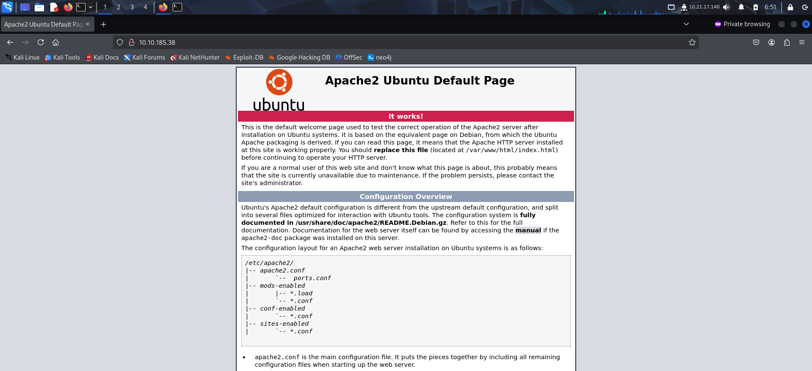
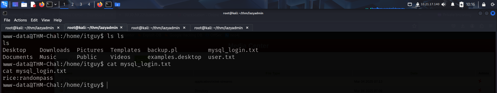
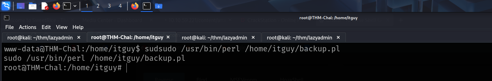
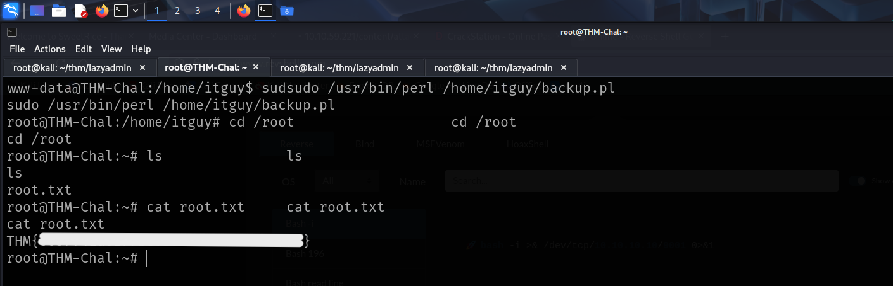

Link to machine : https://tryhackme.com/room/lazyadmin

# SCANNING

I performed an **nmap** aggressive scan to find open ports and the services running on the target.

# FOOTHOLD

The **nmap** scan revealed an http server, so I accessed the web page using my browser.

I then looked for hidden directories using **ffuf**.

Since the */contact* directory had some content, I looked for other directories inside it.

I discovered a login panel and a couple of directory lists.

This folder seemed to have the backend codes.

It contained the service version.

There was a folder called *mysql_backup* which could be of interest.

The folder contained an **sql** file. I downloaded it on my system and extracted the contents to find a set of credentials.

I was able to crack the hash using **crackstation**.

I then logged in using the credentials.

The dashboard contained the version of the CMS that was being used. So I used for exploits available using **searchsploit**.

There seemed to be a file upload vulnerability, so I downloaded **pentest monkey's** php reverse shell code.

The *media center* had a file upload functionality, so I tried uploading the **php** file. 

However, due to security reasons, I wasn't able to upload it on the target. I then tried using an alternate extension like **.phtml**.

I was able to bypass the security measure using an alternate extension. Next I started a **netcat** listener and executed the payload to get a reverse shell.

I then captured the user flag from *itguy*'s home directory.

# PRIVILEGE ESCALATION

I also found a **mysql** login credential so I connected to the server using it.

However, I found nothing interesting. Next I looked for my **sudo** privileges and found that I was allowed to run a perl script.

I viewed the contents of the perl script, it executed a bash script that I was allowed to modify.

So, I modified the bash script and then ran the **perl** script as **sudo**.

After getting root access, I captured the root flag from my *home* directory.

That's it from my side!
Happy hacking :)

---
