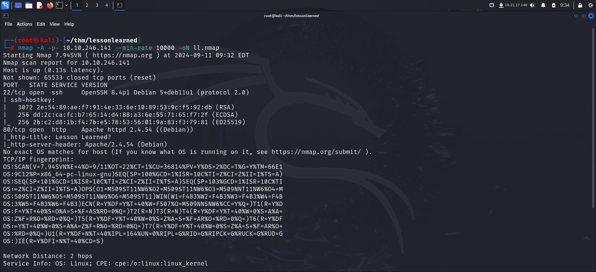
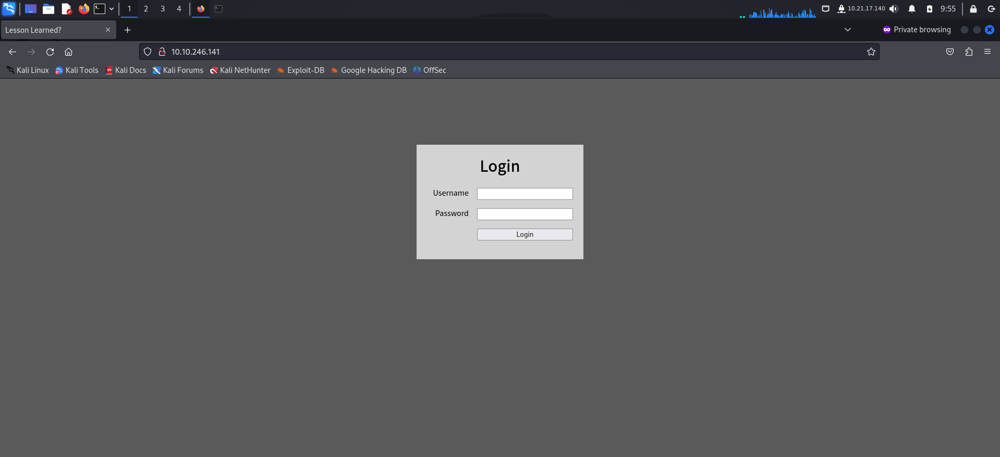
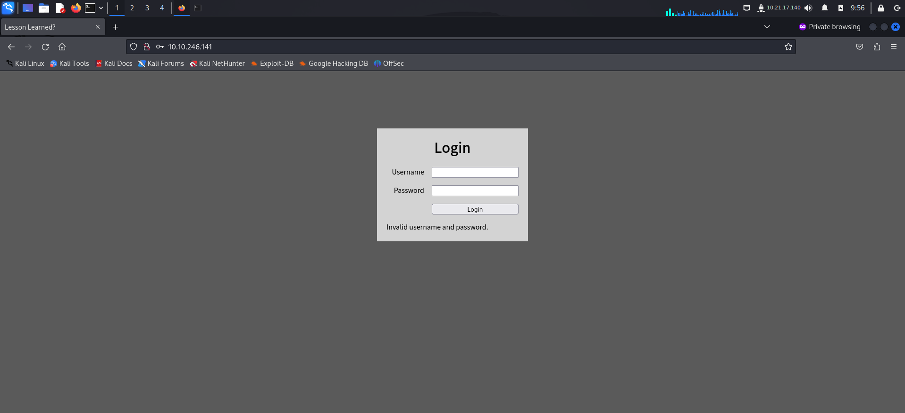
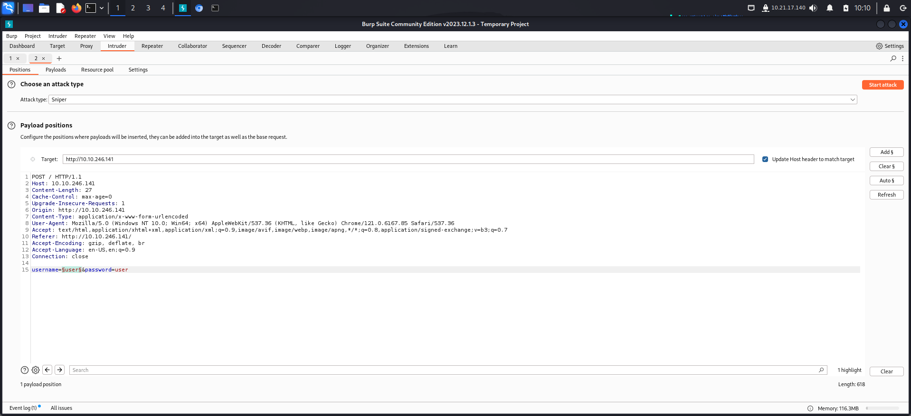
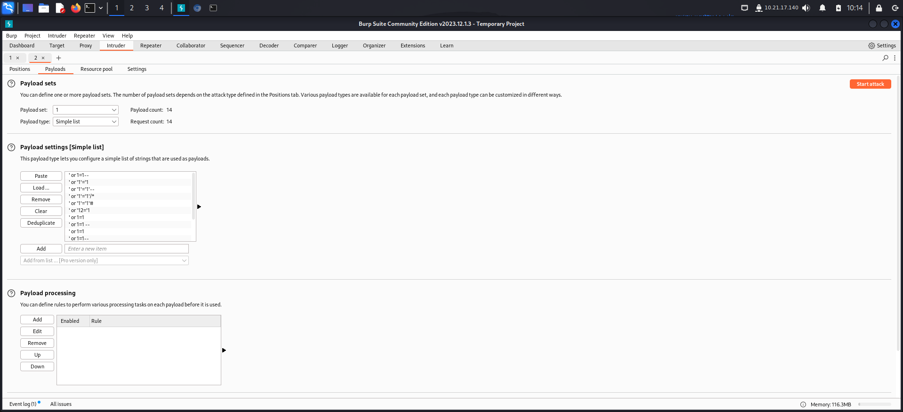
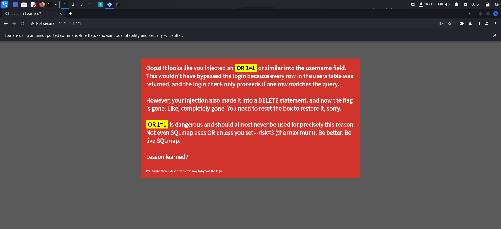
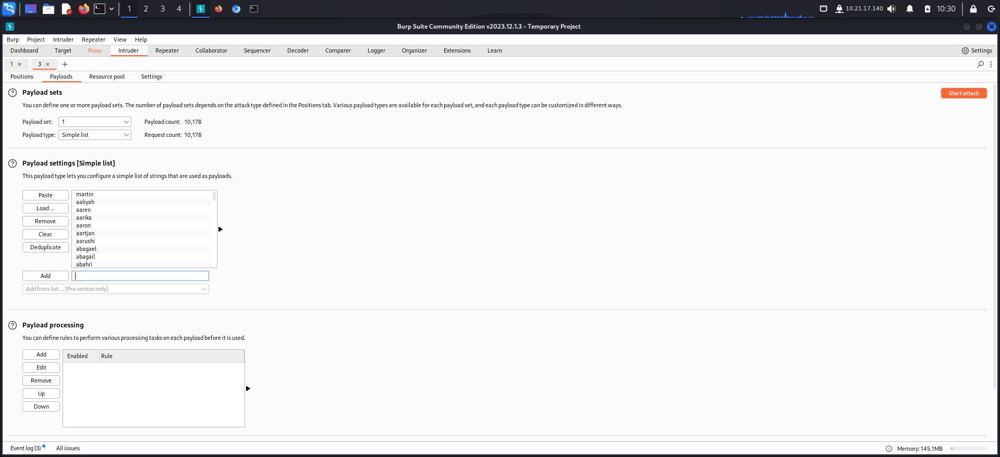
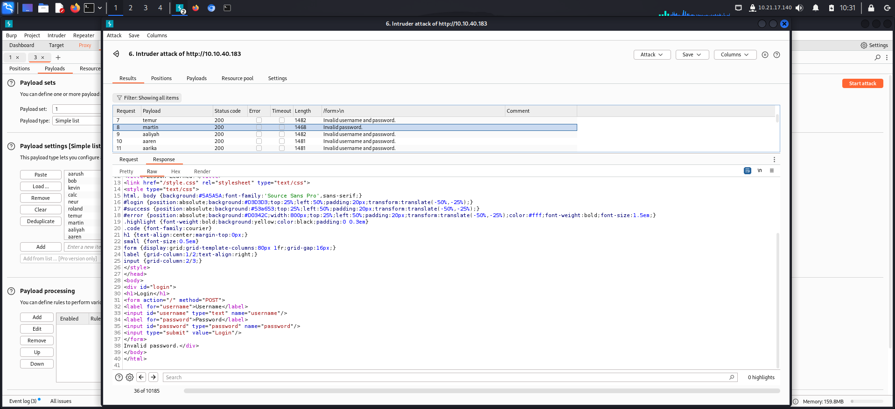
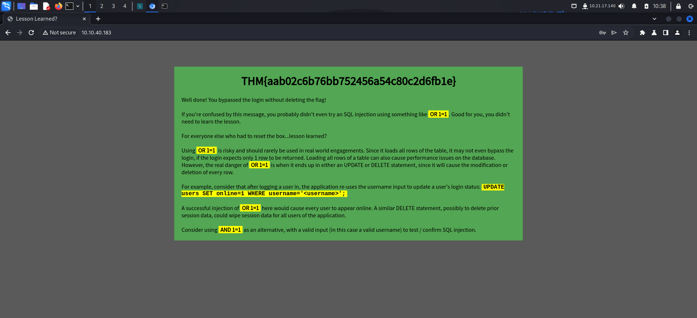
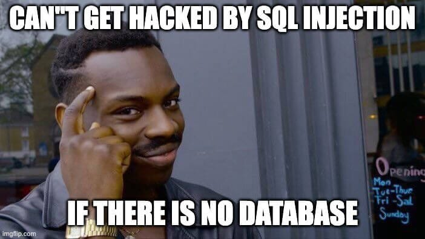

# GETTING STARTED

To access the challenge, click on the link given below:
https://tryhackme.com/r/room/lessonlearned

> [!NOTE] 
> This writeup documents the steps that successfully led to pwnage of the machine. It does not include the dead-end steps encountered during the process (which were numerous). This is just my take on pwning the machine and you are welcome to choose a different path.

# RECONNAISSANCE

I performed an nmap aggressive scan to identify open ports and services running on the target.



# CAPTURING THE FLAG

I found port 80 to be up and running. Hence I visited the target page through my browser.



I entered a default credential to check the response.



The error mentioned that both my username and password were invalid. Since this was a login panel, I tried performing SQL injection. I entered a username, password and captured the request on Burp proxy. I then forwarded this to Burp intruder and added the username field to scope.



I looked for some common sql injection payloads and added these in my payloads section. I then launched the attack.



The following payload returned an error: `' OR '1'='1'--`



I learnt a valuable lesson. Moving on, I reset the box and tried other ways to bypass the login.

This time I tried to brute force a valid username using seclists.





Hence I found a valid username i.e **`martin`**

This time, since I know the username, I use the **`AND`** clause along with a True statement.

```sql
martin' AND ''='' -- -
```

The above payload allowed me to log into the system and get the flag.



# CLOSURE

It was a simple box with a basic yet valuable lesson. Here's a gist of what the box wants you to understand:

> Using `OR 1=1` in SQL injection is risky and should be avoided in real-world engagements. While it can sometimes help expose vulnerabilities, it can also lead to unintended consequences such as multiple-row returns, performance issues, or mass data loss in `UPDATE` or `DELETE` queries. Always sanitize and parameterize inputs to prevent these risks, and use caution when testing SQL injections. A safer approach to testing SQL injection vulnerabilities is by using `AND 1=1` along with a valid input. This avoids unintended side effects by keeping the query conditions more controlled.

That's it from my side! Until next time :)



---
