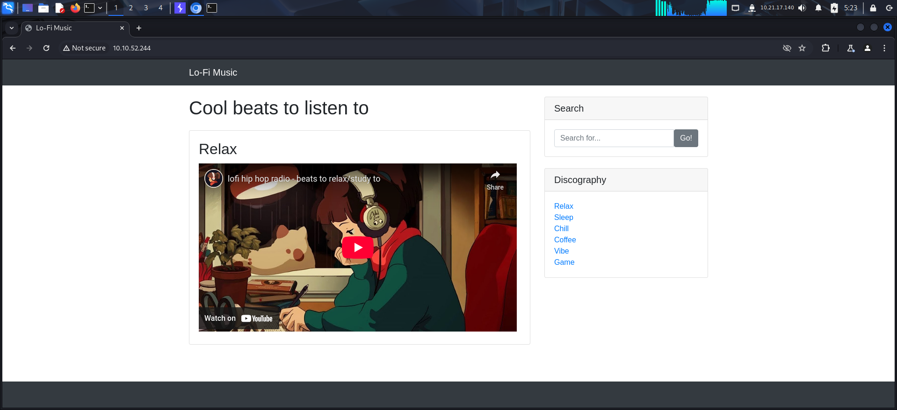
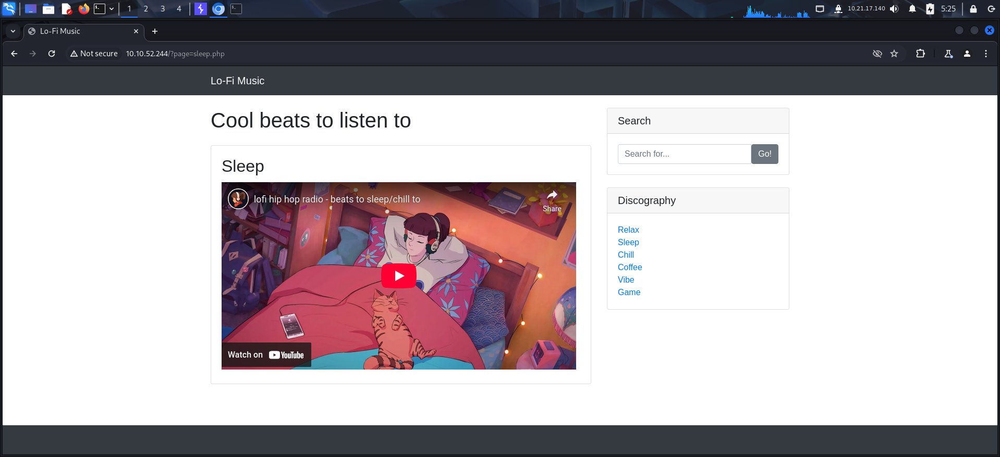
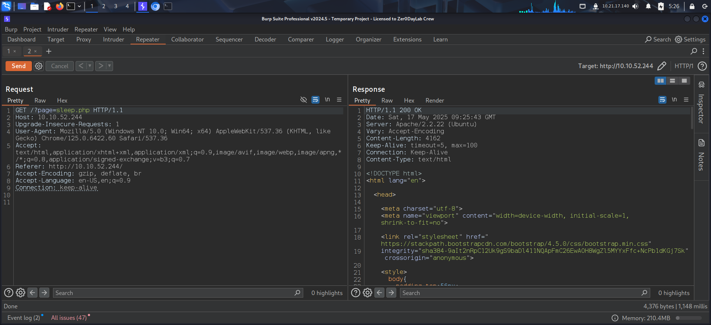
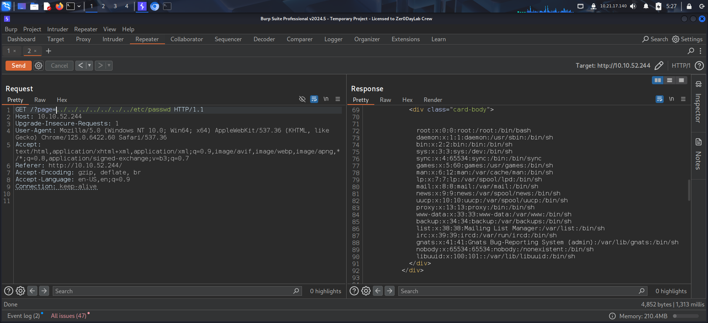
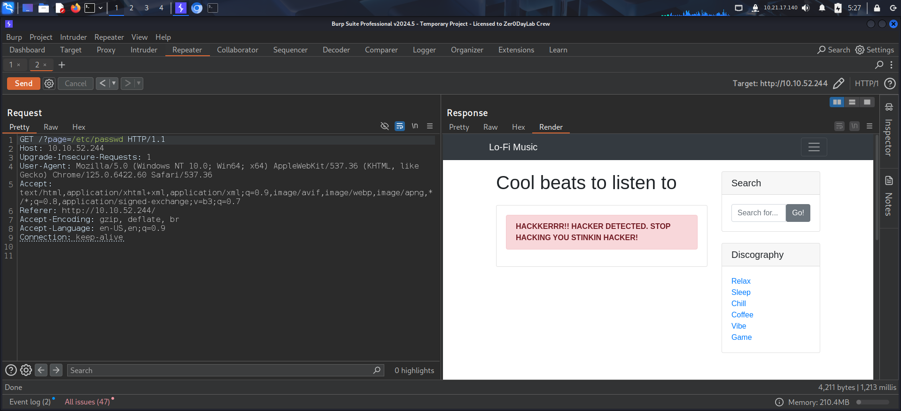
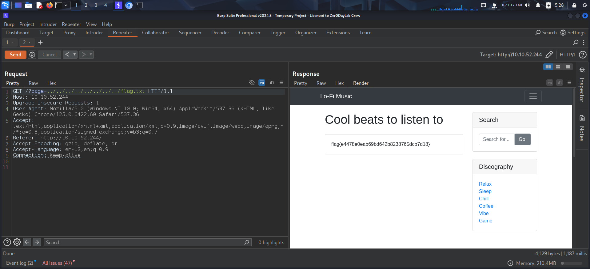

To access the machine, click on the link given below:
- https://tryhackme.com/room/lofi

# INSTRUCTIONS

> Access this challenge by deploying both the vulnerable machine by pressing the green "Start Machine" button located within this task, and the TryHackMe AttackBox by pressing the  "Start AttackBox" button located at the top-right of the page.
> 
> Navigate to the following URL using the AttackBox: `http://MACHINE_IP` and find the flag in the root of the filesystem.

# SOLUTION

I started Burp Suite and accessed the target using Burp's browser. The web application loaded a Youtube video and had links to other videos on the side.

I clicked on a link and analyzed the request on **Burp Suite** by sending it to the **Repeater** tab.

The page was being fetched by passing the name of the page in the URL.

I tried traversing the directory by providing a relative path and managed to read the `/etc/passwd` file.

When I attempted the same using an absolute path, I was blocked.

This confirmed that I could traverse directories by providing a relative path. Since the instructions mentioned that the flag was present in the *root* of the filesystem, I captured it by providing the appropriate path and solved the box.

That's it from my side,
Until next time :)

---
