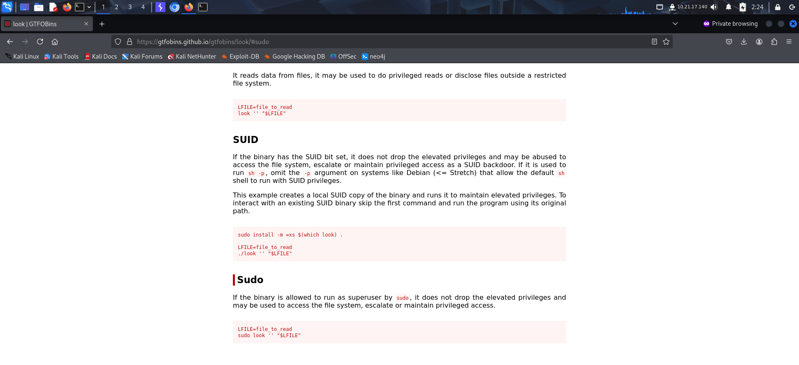

Machine Link: https://tryhackme.com/room/lookup

# RECONNAISSANCE

I performed an **nmap** aggressive scan to identify open ports and the services running on them.

# FOOTHOLD

The **nmap** scan revealed an **http** server running on the target, so I accessed it through my browser and landed on a login page.

I tried logging in using some default credentials and observed a change in response when a valid username was used.

This behavior could be exploited to find valid usernames, so I bruteforced valid usernames using **burpsuite**'s **intruder** from **seclists**.

Hence I successfully found another user. I tried bruteforcing the password of admin but failed. However, I was successfully able to bruteforce the password of *jose*.

Next, I used the valid credentials to login and was redirected to a subdomain. I added the subdomain to my */etc/hosts* file for appropriate resolution.

This seemed like a file system. I viewed each file but found nothing interesting.

I tested the upload functionality by uploading a php script but failed.

Then I found the version of the cms being used and looked for available exploits.

Since there was an exploit available on **Metasploit**, I booted the **metasploit framework** and selected the exploit.

I added the appropriate values and ran the exploit to get a **meterpreter** shell.

I entered shell mode and spawned a tty shell.

I then tried accessing the user flag but failed due to lack of permission. The file system contained some credentials related to the user *think* so I tried switching user using those creds.

However, I failed. I then looked for anything else that could be useful in *think*'s home directory and found a file called *.passwords*

I then looked for binaries with suid bit set.

The **pwm** binary seemed interesting so I executed it to see what it does.

It ran the **id** command and tried extracting passwords from *.passwords* file. I assumed that the whole path of **id** was not being used and hence tried exploiting it. 

I created a **bash** script that echoed the output of **id** command. I used the id of my current user i.e *www-data* (I got it from */etc/passwd*) and replaced the username with *think*. I saved the script as **id**.

I then appended the */tmp* directory at the start of my path variable and ran the **pwm** command to get a list of passwords for the *think* user.

I created a wordlist using these passwords and bruteforced the correct login credentials using **hydra**.

I logged in as *think* and got the user flag from the */home/think* directory.

# PRIVILEGE ESCALATION

I then looked for **sudo** permissions and found I was allowed to run the **look** command. 

I visited **gtfobins** and found a way to use **look** to read the root flag.

# CONCLUSION

Here's a short summary of how I pwned **LOOKUP**:
- I exploited the **cms** vulnerability to get reverse shell as *www-data*.
- I modified the path environment variable and exploited the **pwm** binary containing an suid bit to get passwords of *think* user.
- I captured the user flag from *think*'s home directory.
- I then exploited the **sudo** privileges to read the root flag present in */root* directory.

That's it from my side, until next time :)

---

