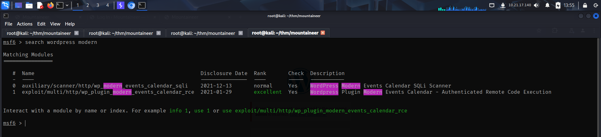
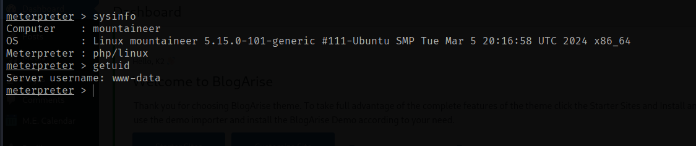
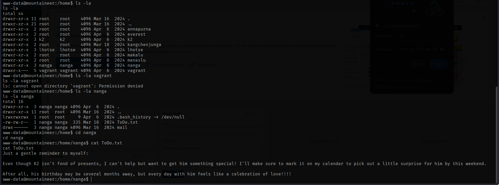
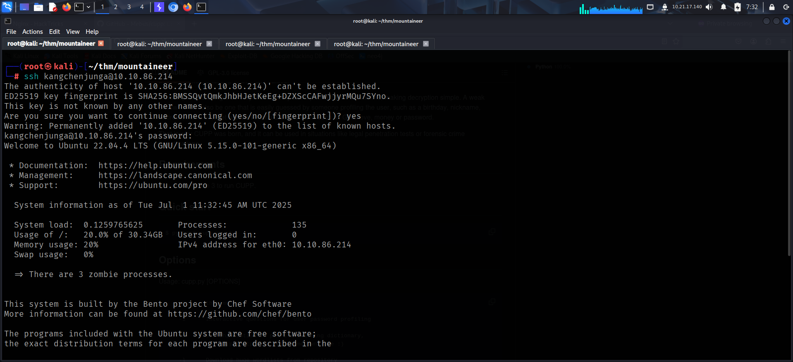

- https://tryhackme.com/room/mountaineerlinux

# SCANNING

I performed an **nmap** aggressive scan and found 2 open ports on the target.

# FOOTHOLD

I accessed the web application running on the target and landed on a default **nginx** page.

I fuzzed it for hidden directories and found a directory called *wordpress*.

I accessed the page and noticed that the resources weren't being loaded properly.

I viewed the *network* tab in my developer's tab to see the requests made by the application and found the domain that was mapped to it.

I mapped the domain to the target IP in my */etc/hosts* file and refreshed the page.

I then fuzzed for other files in the directories and confirmed that this was a wordpress installation.

The `wp-login.php` endpoint was accessible which could allow me to access the dashboard and potentially get a reverse shell.

I then enumerated plugins and users using **wpscan**.

**wpscan** found a bunch of users and interesting plugins. The version of *modern-events-calendar* plugin seemed to have some vulnerabilities.

I found an unauthenticated exploit so I downloaded it on my local system and read its documentation on **exploit-db**.

I ran the exploit but didn't get anything useful.

I then booted the **metasploit** framework and searched for modules related to that plugin.

Here, I found an auxiliary scanner that exploited an **sql injection** vulnerability to query username, passwords. I added the required settings and ran the scanner to find the admin credentials.

However, these credentials did not work.

I then fuzzed for directories and noticed something unusual. **Wordpress** stores image in the `wp-content` directory. There was a separate folder called **`images`**.  This could mean that it probably was an alias that pointed to the actual folder inside `wp-content`.

I referred to **hacktricks** and found a potential misconfiguration on the target.

When I tried the exploiting this, it worked and I was able to read local files.

Reading the `/etc/passwd` file disclosed more users.

I then read the configuration file but did not find anything useful.

I then googled for interesting files that I could read inside the directory and tried looking for files inside `/etc/nginx/sites-available/`.

I used **ffuf** and found a file called `default`.

Reading the file revealed a new subdomain.

I added the subdomain in my `/etc/hosts` file and accessed the endpoint.

I tried the admin credentials but failed to log in using it. I then tried default credentials with the discovered usernames.

Finally, I logged in using **`k2:k2`**

I found a mail that contained a password.

Another mail was about the password that was revealed.

I tried the password with the `k2` user and managed to log in through the `wp-login` endpoint.

With valid credentials, I could now try getting remote code execution through the rce module for the vulnerable plugin on **metasploit**.

I configured the options and ran the exploit to get a **meterpreter** shell.

I got a shell as *www-data*.

# LATERAL MOVEMENT

I then enumerated the contents present inside the user directories and discovered that the flag was located inside the *kangchenjunga*'s home directory.

I found a file called *ToDo.txt* inside *nanga*'s home directory which contained an interesting message.

I also found a **keepass** file inside *lhotse*'s home directory.

I downloaded the file locally and tried opening it. However, it was password protected.

I used **keepass2john** to convert it into **john** crackable format and tried cracking the password using *rockyou.txt*, however, it was taking quite some time to crack it.

With the password cracking running in the background, I tried switching to the user **k2** using the credentials I had previously discovered. I successfully, switched using **`k2:k2`**. After switching the user, I decided to view the mail because of what the *ToDo.txt* said.

I found some interesting information that could be used to create a custom password list.

Hence, I downloaded **CUPP** and ran it in interactive mode.

I filled in the information that was available to me and generated a custom wordlist.

I then restarted password cracking with **john** using the custom wordlist and found the password.

The password allowed me to view the contents inside the file where I found user credentials.

Since, *kangchenjunga* had the local flag, I verified the credentials and logged into the target using **ssh**.

Finally, I captured the local flag.

# PRIVILEGE ESCALATION

My directory also contained a **`.bash_history`** file which contained command history.

I read the file and found the root credentials.

I then switched to root user and captured the root flag from the *`/root`* directory.

That's it from my side !
Until next time :)

---
