To access the room, click on the link given below:
https://tryhackme.com/room/ohsint

I downloaded the image file and viewed its metadata using **exiftool**.

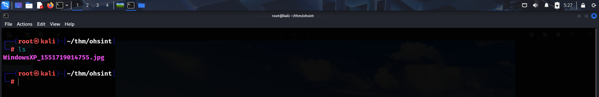

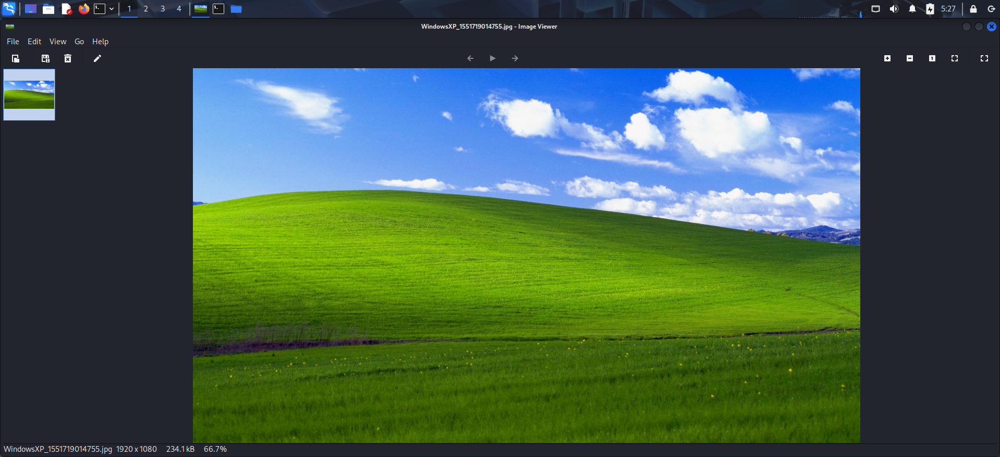

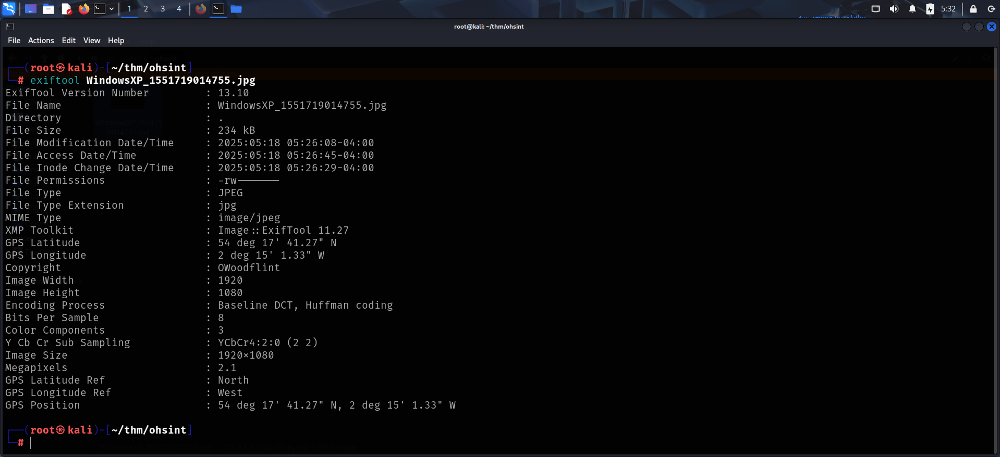

The Copyright seemed to have the owner name, So I googled it and found 3 things:
- Github account
- X account
- Wordpress Blog

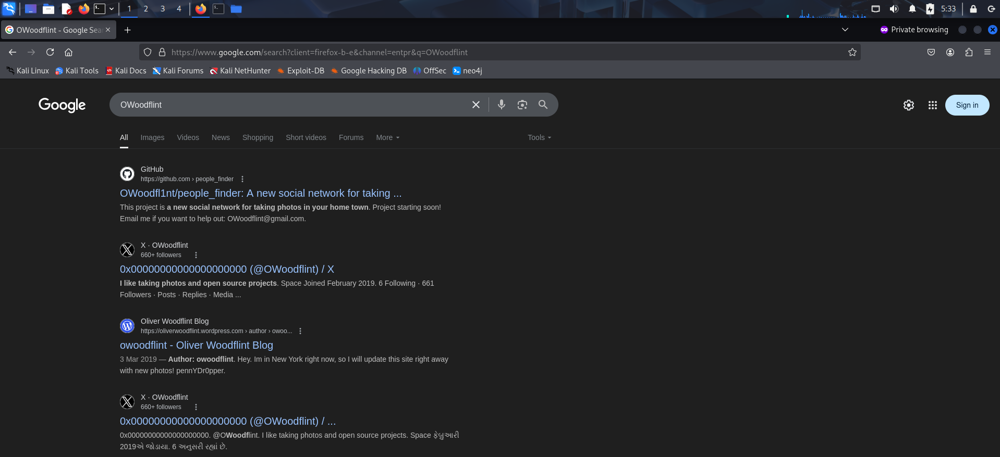

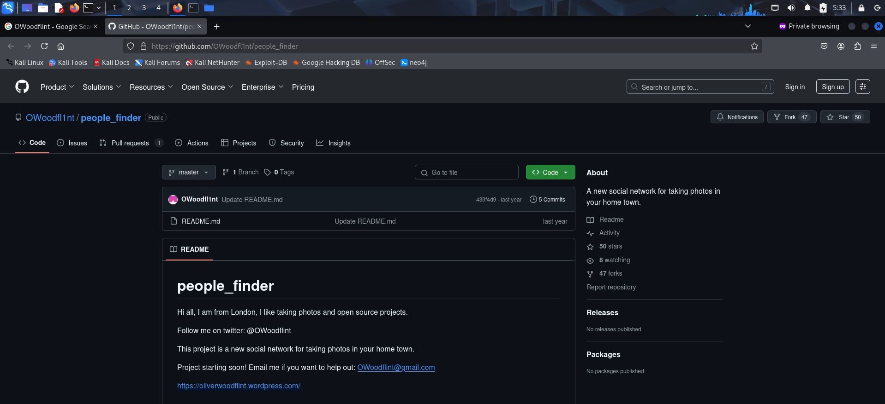

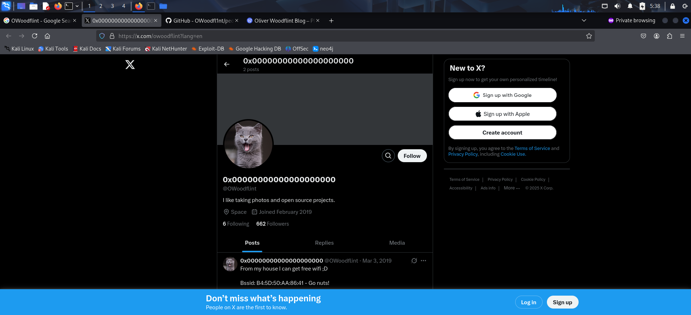

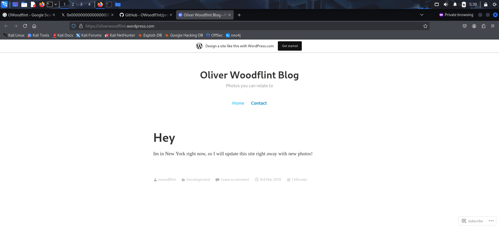

**Q: What is this user's avatar of?**
The X account had a cat avatar. 

**A: Cat**

**Q: What city is this person in?**
The **README** of *people_finder* repository contained the answer to this question.

**A: London**

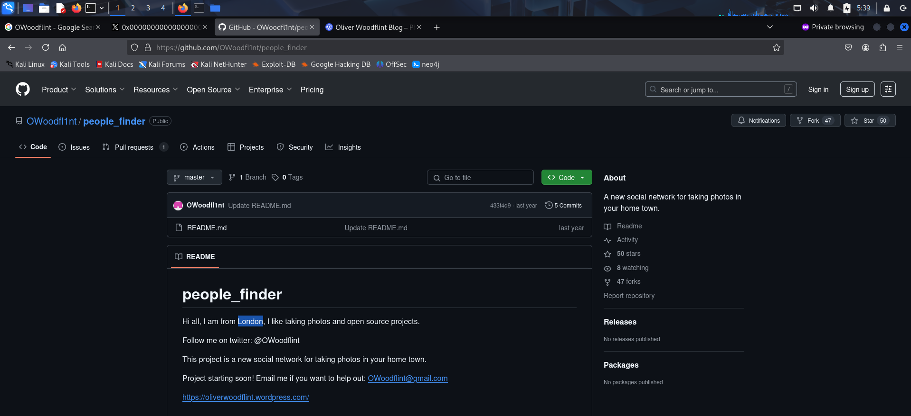

**Q: What is the SSID of the WAP he connected to?**
I copied the BSSID from the post made on **X** and used **wigle.net** to find the **SSID**.

**A: UnileverWiFi**

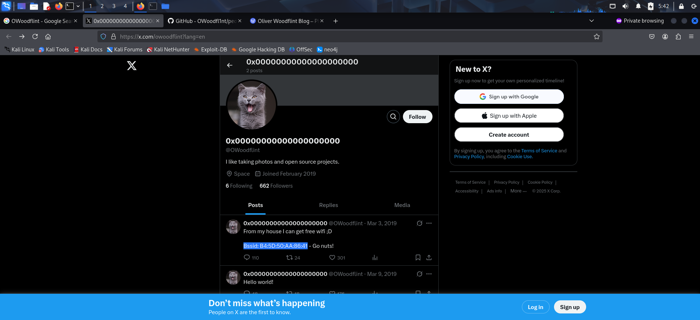

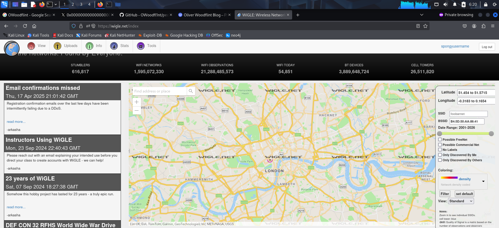

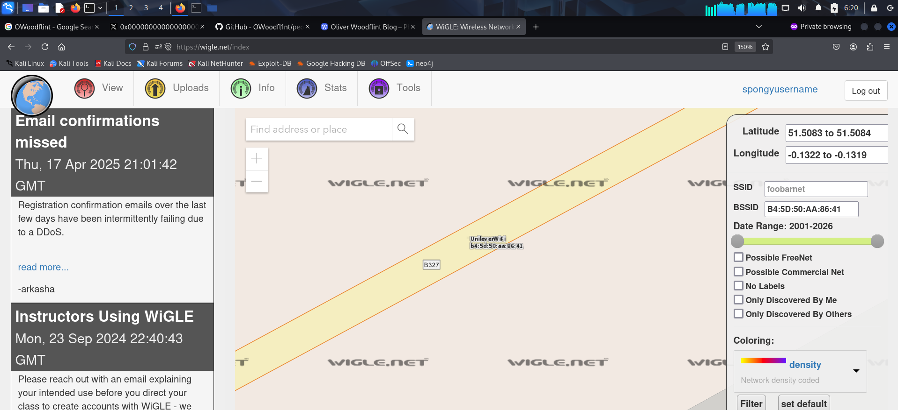

**Q: What is his personal email address?**
The personal email can be found in the **Github** repository.

**A: `OWoodflint@gmail.com`**

**Q: What site did you find his email address on?**
**A: github**

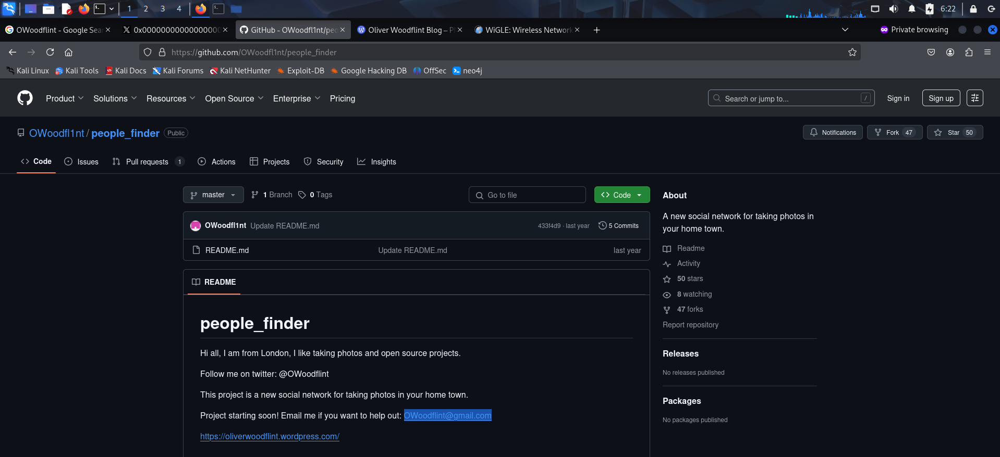

**Q: Where has he gone on holiday?**
The answer to this question can be found on the **Wordpress** site.

**A: New york**

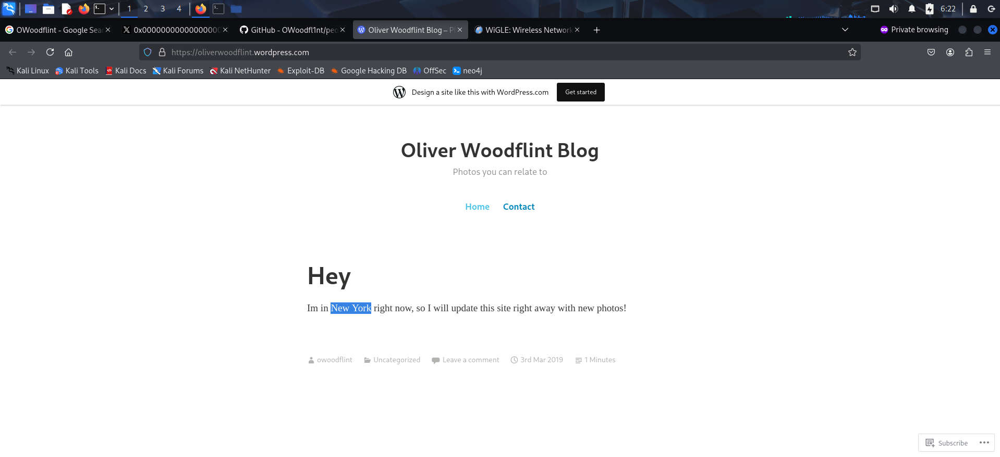

**Q: What is the person's password?**
The **Wordpress** site contains this person's password. It has a white font color and hence isn't directly visible.

**A: pennYDr0pper.!**

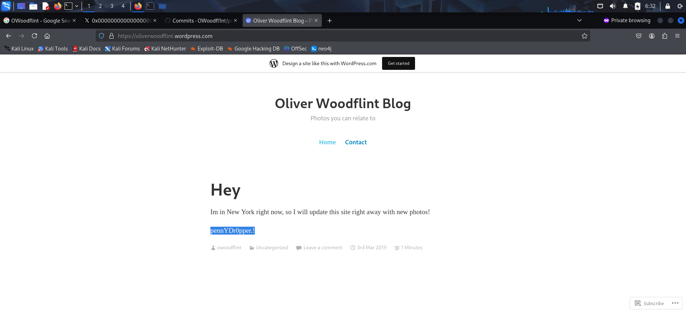

---
