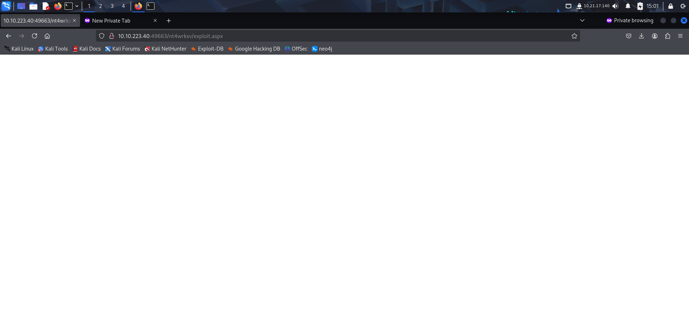

Link to machine : https://tryhackme.com/room/relevant

# RECONAISSANCE

I performed an **nmap** aggressive scan on the target to identify open ports and services running on the target while also performing script scan.

I also ran a vulnerability scan on **smb** using **nmap** and found it was vulnerable to **CVE-2017-0143**

# FOOTHOLD

I accessed the two **http** servers revealed by **nmap** scan and found a default IIS landing page.

Since the **http** pages had nothing interesting, I enumerated **smb** and found an interesting share.

I connected to the share and found a password file.

This file contained base64 encoded credentials.

I tried using them to get access using rdp but failed. I then looked into the vulnerability that I had found earlier while reconnaissance.

The vulnerability lead to remote code execution. So to exploit it, I created an **aspx** payload using **msfvenom**.

I then uploaded the payload on the **smb**server.

From my past experience, I found that sometimes smb shares are hosted on the web server. I tried accessing the share on both the servers and succeeded on the one running on port **49663**. I then started a **netcat** listener and executed the payload through **http** to get a reverse shell.

With shell access, I was able to capture the user flag from *Bob*'s Desktop.

# PRIVILEGE ESCALATION

I then downloaded **winPEAS** on the target and ran it to find misconfigurations that could used for privilege escalation.

However, I found nothing interesting. Next I looked at my privileges and found I had **SeImpersonatePrivilege** enabled.

Users with this privilege enabled could potentially escalate to admin using **dirty potato** or **spoolspoof** exploits. I referred to the below article and downloaded the **printspoofer** exploit.

I transferred the exploit from my local system to the target.

Finally, I ran the exploit to spawn a **powershell** session as **nt authority**.

I then captured the root flag from *Administrator*'s Desktop.

That's it from my side!
Happy hacking

---
