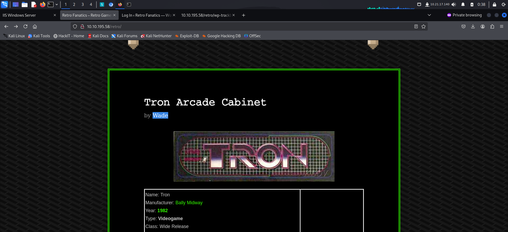
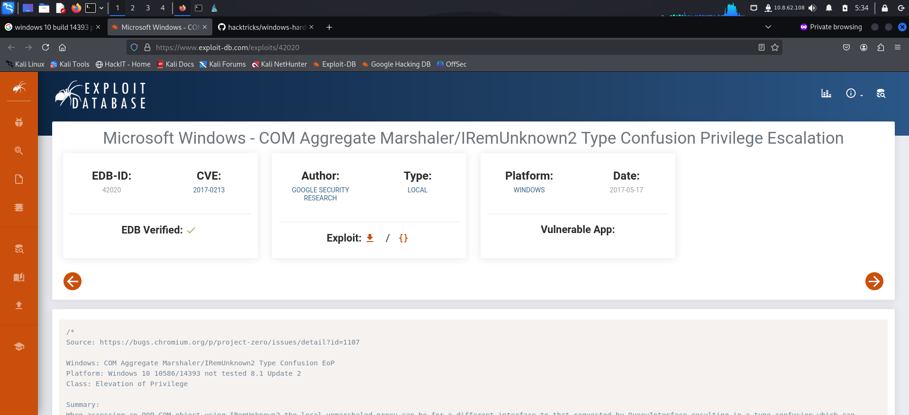

> Welcome to my writeup where I am gonna be pwning the **Retro** machine from **TryHackMe**. This challenge has two flags, and our goal is to capture both. Let’s get started!

# GETTING STARTED

To access the challenge, click on the link given below:
https://tryhackme.com/r/room/retro

> [!NOTE] 
> This writeup documents the steps that successfully led to pwnage of the machine. It does not include the dead-end steps encountered during the process (which were numerous). This is just my take on pwning the machine and you are welcome to choose a different path.

# RECONNAISSANCE

I performed an **nmap** aggressive scan to find open ports and services running on the target.

# FOOTHOLD

The machine had an http service and rdp running on it. I started of by visiting the webpage through my browser.

It was just a default landing page. So I performed directory bruteforce using **ffuf** to find other directories and files.

The **ffuf** scan revealed a page called `/retro`. So I visited it. This page looked like a blog on retro games.

I FUZZED `/retro` using **ffuf** to find interesting files or directories.

The **ffuf** scan discovered a **wordpress** login panel. I tried logging in using a random username and password and got an error saying *invalid username*. 

This error mechanism made it easy to find valid users. I navigated to the `/retro`'s home page and looked for potential usernames. Since the blogs were written by **Wade**, I could try using it as a **username**. I clicked on **Wade** to find information about the author.

I also tried using this username in the login panel. And received an error of *invalid password*.

In the **author's** page, I found downloadable **RSS** data.

I downloaded and viewed the data. One of the files revealed the password of **Wade**.

I logged in and got access to the **wp-admin** panel.

I referred to **hacktricks** for ways to get an RCE from wp-admin. 

> **note:** Since the target is a windows machine, I used a cross platform php-reverse-shell from the below github repo.

I added my reverse shell payload in the **404.php** template so that I could execute it by causing an error.

After updating the php code, I started a reverse shell listener using **nc** and triggered the payload by trying to navigate to a non-existent path.

This gave me a reverse shell.

Alternatively, I also found out that **wade** reused his password. The same credentials could also be used with **rdp**.

**rdp** would provide a graphical access to the system making interaction much easier. So I connected to the target using **xfreerdp**.

On the **Desktop**, I found the **user.txt** file.

# PRIVILEGE ESCALATION

The desktop had **chrome** so I opened it. It had a **cve** in bookmarks so I read about the vulnerability on my local system.

This vulnerability allowed privilege escalation so I searched for POCs so that I could follow the steps to get administrator access.

I found this **github** repo with a POC and tried following the steps.

The recycle bin contained an application that could be vulnerable. So I restored it and followed the steps from the POC.

I got stuck here as I didn't get an option to choose a browser. 
- So I referred to https://muirlandoracle.co.uk/2020/01/06/retro-write-up/ and restarted the machine. 
- Before the exploit, I initialized both chrome and edge browsers. However, this time as well it didn't work. 
- Lastly, I manually navigated to `https://www.verisign.com/repository/CPS` but that didn't work aswell.

As a last resort, I tried looking for kernel exploits.

I found a couple of exploits for the windows build running on the target.

I visited the **`COM Aggregate Priv Exec`** page on **exploit-db**.

I looked for that particular cve's POC.

I then found a **github** repo that contained a binary that could escalate my privileges.

So I downloaded the binary on my local system and transferred it to the target machine.

Upon execution, the exploit spawned another instance of **cmd** as **administrator**.

I captured the **root** flag from **Administrator's** Desktop.

# CONCLUSION

Here's a brief summary of how I pwned **retro**:
- **nmap** scan revealed a webserver running on the target along with **rdp**.
- Directory fuzzing revealed a gaming blog page and a **login** panel.
- Further reconnaissance on the `/retro` revealed a potential username `Wade`. Files present on Wade's profile also revealed his password.
- I then tried these credentials with **rdp** and got a graphical access on the system.
- I captured the user flag from Desktop.
- I tried exploiting the bookmarked cve but it failed due to a bug.
- I then exploited the kernel and got **administrative** access.
- Finally I captured the root flag from **administrator's** desktop.

That's it from my side !
Until next time :)

---