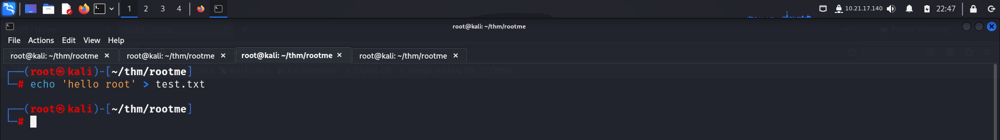
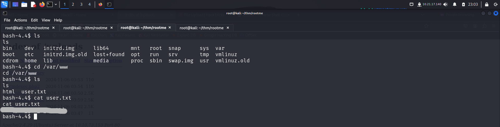
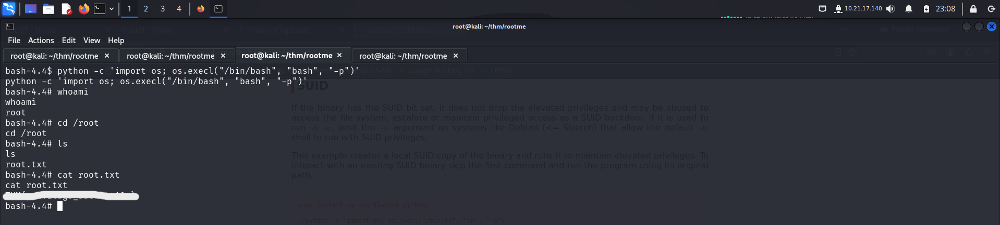

# GETTING STARTED

To access the lab, click on the link given below:-

https://tryhackme.com/r/room/rrootme

> [!NOTE] 
> This writeup documents the steps that successfully led to pwnage of the machine. It does not include the dead-end steps encountered during the process (which were numerous). This is just my take on pwning the machine and you are welcome to choose a different path.

---
# INFORMATION GATHERING

I performed an **nmap** aggressive scan to find open ports and services running on them. It also ran default **nse** scripts and displayed the results.

---
# FOOTHOLD

The **nmap** scan revealed an **http** server running on port 80. So I accessed it from my browser.

The web page didn't reveal anything interesting so I used **ffuf** to find hidden directories.

The directory bruteforce revealed a few directories. I accessed the `/css/` directory. It contained a **css** file for another page called **panel**. **Ffuf** had also discovered this directory. So I accessed `/panel` next.

This seemed like a **file upload** functionality. I created and uploaded a dummy file to try it out.

The directory bruteforce had revealed `/uploads` directory earlier. So I checked it to see if my files were uploaded.

After confirming the upload functionality, I used the **php pentestmonkey** payload to get a reverse shell. I navigated to **revshells** to first configure a payload that would get me a reverse shell. 

I entered my IP and port and saved it in a file called **`revshell.php`**

It blocked my php file. So I looked for ways to bypass this security mechanism and tried a few ways given in **hacktricks**.

I changed the extension of my code to `Php`, `php%20` and finally managed to bypass the security check using **`.php5`**. After the upload was successful, I started my **netcat** listener.

I then navigated to the `/uploads` folder and clicked on my payload to execute it and get a reverse shell.

I spawned a **pty** shell and captured the first flag from `/var/www` directory.

---
# PRIVILEGE ESCALATION

When I checked the binaries with **suid** bit, I found **python** which seemed uncommon.

I visited **gtfobins** and looked for a way to exploit this misconfiguration for a privileged access.

I followed the steps mentioned on the website and got **root** access.

After becoming the **root** user, I had complete control over the system. So I navigated to `/root` directory and captured the final flag.

---
# CONCLUSION

Here's a short summary of how I pwned **root me**:
- I discovered a directory allowing file upload operations by performing a directory brute force attack using **ffuf**.
- I tried uploading a php reverse shell payload but failed due to the target's security configuration.
- I bypassed the file extension check using **`.php5`** extension and executed the reverse shell payload to gain initial access.
- I captured the first flag from `/var/www`.
- I discovered **python** in the programs that has an **suid** bit which was very uncommon.
- I used **gtfobins** to find a way to exploit this misconfiguration and become **root**.
- I then captured the final flag from `/root` directory.

That's it from my side! I hope you learnt something new.

Until next time ;)

---