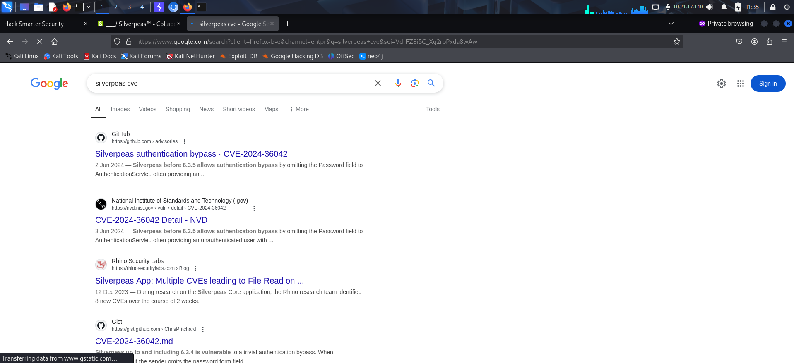
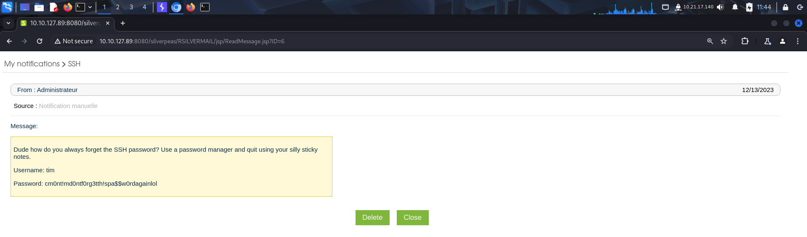

Link to machine: https://tryhackme.com/room/silverplatter

# SCANNING

I performed an **nmap** aggressive scan to find open ports and services running on them.

# FOOTHOLD

The **nmap** scan discovered a web server running on the target. So I accessed it using my browser.

The contact page revealed a username that could be used later.

Reading the source code revealed another directory.

However, even that endpoint revealed nothing interesting. Hence, I then moved onto the other port where an **http** proxy was running. I looked for directories using **ffuf** and found 2 new endpoints.

One endpoint wasn't accessible, however the other one redirected us to a login panel.

I used the username from the contact page and tried logging in using default credentials but failed.

I also tried *Get a new password* but found no interesting functionality.

Hence, I then looked for **cve**'s associated with the name of the cms 'silverpeas' and found an **authentication bypass** vulnerability.

I could bypass authentication by simply removing the password field. So I captured the login request using **burp suite** and removed the password field to log into the web app.

I had a notification of a message sent to me by my manager.

I explored the application.

I recalled reading about a **broken access control** vulnerability on this cms so decided to try it out.

I managed to get the ssh credentials by exploiting **IDOR** vulnerability. I then used it to connect to the target using **ssh**.

Finally, I captured the user flag.

# PRIVILEGE ESCALATION

Running the **id** command revealed that the user *tim* was part of the **adm** group. This group is used for monitoring purpose.

Hence my user would have access to the system **logs**. I looked at the authentication logs in */var/log/* directory and extracted passwords from it.

I checked if the password that I found was a valid credential for **ssh** using **hydra**.

I then logged in as the new user.

I then checked the **sudo** privileges of this user and found that I was allowed to run anything as **root** and had no restrictions.

Hence I simply spawned a **bash** shell as root using **sudo** and captured the root flag from */root* directory.

That's it from my side!
Happy hacking :)

---
